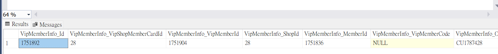
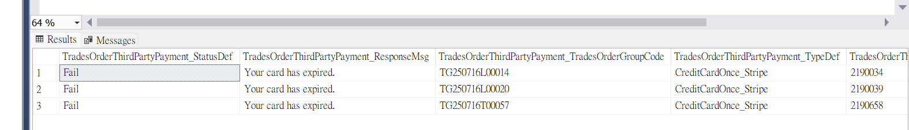
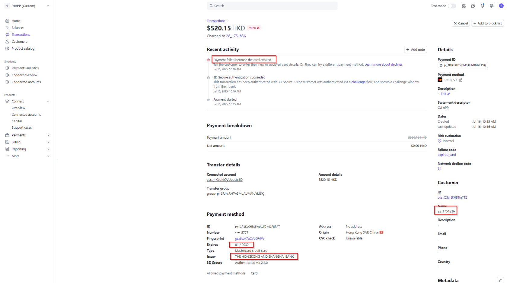
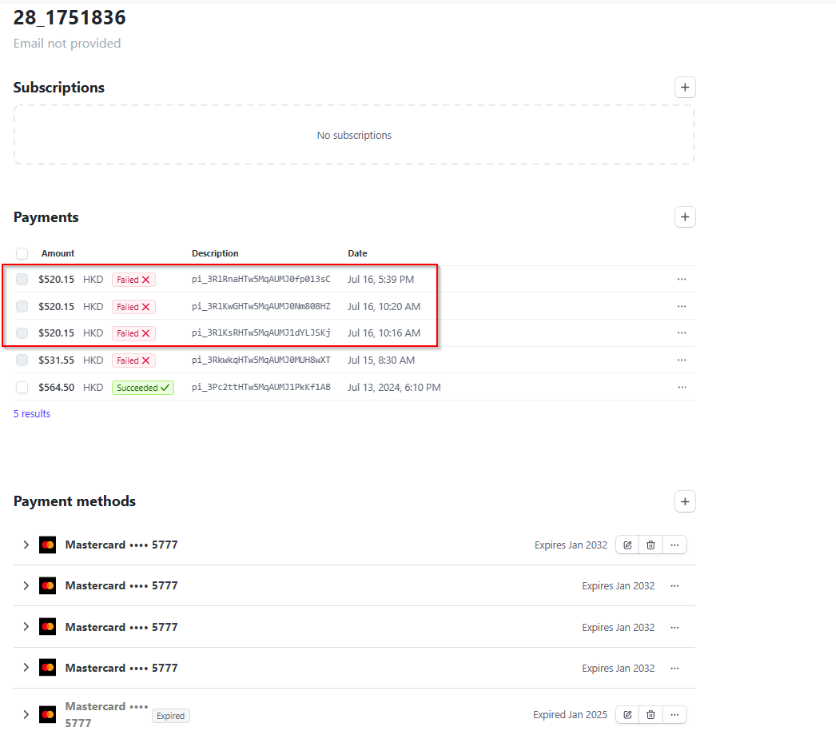
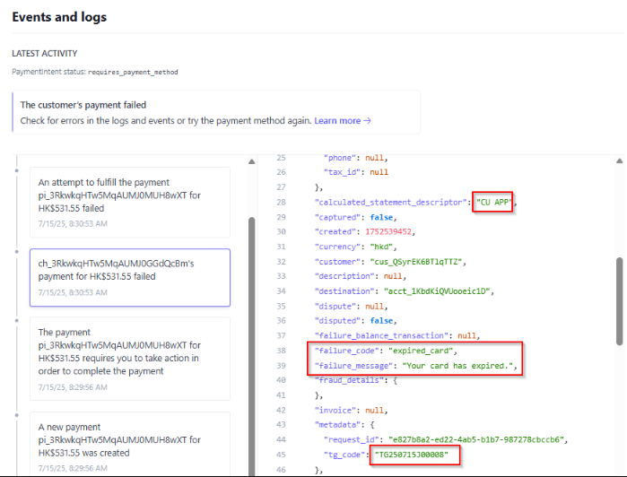
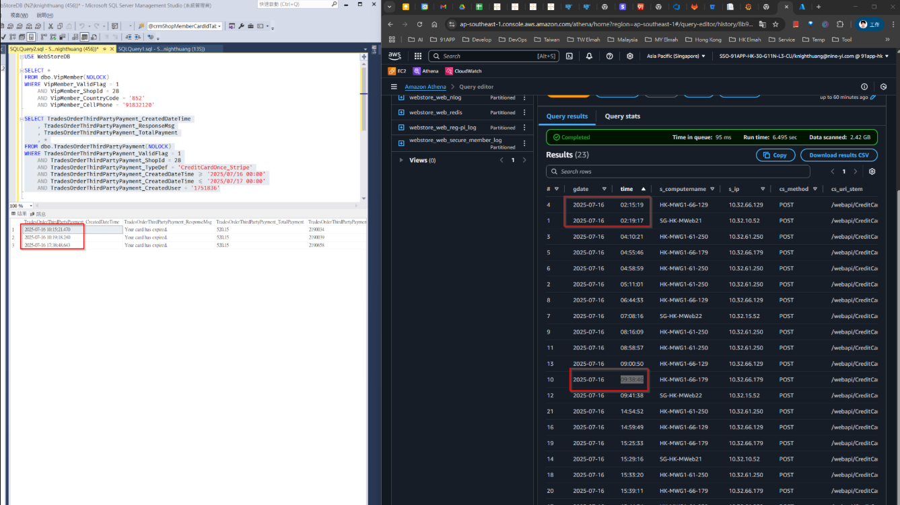
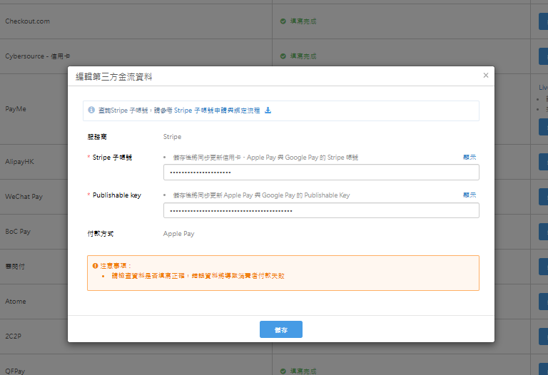

# Stripe 文件

## 目錄
1. [異常案例紀錄](#1-異常案例紀錄)
2. [帳戶類型](#2-帳戶類型)
3. [ApplicationFee / Refund / TransferReversal](#3-applicationfee--refund--transferreversal)
4. [系統使用費 / 金流手續費](#4-系統使用費--金流手續費)
5. [publishableKey](#5-publishablekey)
6. [App 設定值處理](#6-app-設定值處理)
7. [第三方金物流 pk + acct 設定根據帳戶類型差異](#7-第三方金物流-pk--acct-設定根據帳戶類型差異)
8. [快取](#8-快取)
9. [Stripe 後台操作](#9-stripe-後台操作)
10. [帳戶類型與 Key 整理](#10-帳戶類型與-key-整理)
11. [文件](#11-文件)
12. [前台 OAuth](#12-前台-oauth)
13. [信用卡付款](#13-信用卡付款)
14. [記住信用卡](#14-記住信用卡)
15. [切換帳戶](#15-切換帳戶)
16. [卡別](#16-卡別)

<br>

---

## 1. 異常案例紀錄

### 1.1 [HK] 特定消費者無法完成信用卡付款_(28) CU APP

**VSTS**：https://91appinc.visualstudio.com/DailyResource/_workitems/edit/512563

<br>

**客戶序號**：25

<br>

**商店序號**：28

<br>

**商店名稱**：CU APP

<br>

**問題描述**

<br>

商戶回報有一位消費者使用 HSBC Master Card 嘗試付款時失敗，畫面顯示「暫不支援此信用卡，請更換信用卡重新結帳」，無法完成交易。消費者表示該卡在其他網購平台使用正常，在我們平台即使已重新輸入多次仍出現錯誤，顧客表示不理解為何只有在我們平台無法使用，情緒激動，希望協助查明原因，謝謝。

<br>

**會員電話號碼**：+852-91832120

<br>

**訂單時間**：2025/07/16 上午約 11:00 至 12:00 之間

<br>

**信用卡類型**：HSBC MasterCard（付款時有跳轉到HSBC銀行App同意授權)

<br>

#### 1.1.1 確認會員資料

```sql
USE WebStoreDB

SELECT *
FROM VipMemberInfo(NOLOCK)
WHERE VipMemberInfo_ValidFlag = 1
AND VipMemberInfo_CellPhone = '91832120'
AND VipMemberInfo_CountryCode = 852
AND VipMemberInfo_ShopId = 28
```

<br>



<br>

#### 1.1.2 查詢三方消費紀錄

```sql
SELECT *
FROM TradesOrderThirdPartyPayment(NOLOCK)
WHERE TradesOrderThirdPartyPayment_ValidFlag = 1
AND TradesOrderThirdPartyPayment_ShopId = 28
AND TradesOrderThirdPartyPayment_TypeDef = 'CreditCardOnce_Stripe'
and TradesOrderThirdPartyPayment_CreatedDateTime >= '2025/07/16 00:00'
and TradesOrderThirdPartyPayment_CreatedDateTime <= '2025/07/17 00:00'
and TradesOrderThirdPartyPayment_CreatedUser = '1751836' -- MemberId
```

<br>



<br>

#### 1.1.3 Stripe 後台資訊



<br>



<br>



<br>

#### 1.1.4 Athena IIS Log 查看信用卡驗證紀錄



<br>

```sql
SELECT * FROM "hk_prod_webstore"."webstore_web_iislog"
WHERE date = '2025/07/16'
AND cs_uri_stem = '/webapi/CreditCard/Validate'
AND cs_uri_query LIKE '%ShopId=83%';
```

<br>

#### 1.1.5 會員沒有記住信用卡

```sql
select *
from PayTypeExpress(nolock)
where PayTypeExpress_ValidFlag = 1
and PayTypeExpress_ShopId = 28
AND PayTypeExpress_MemberId = 1751836
```

<br>

#### 1.1.6 釐清

交易時間應該是 10:00

<br>

看期限應該是還沒到(2032/01)，不過 Stripe 認定過期

<br>

需要詢問 Stripe 該交易的問題

<br>

### 1.2 已經走到 Cancelled 但最後壓表失敗

**Slack 連結**：https://91app.slack.com/archives/C7T5CTALV/p1738461751955299

<br>

**問題時間軸**

<br>

- **2025-02-02 01:16:55.049** - 綁定支付方式 建立 payment_method / 建立 payment_intent
- **2025-02-02T01:16:58.78072266Z** - WaitingToPay 支付尚未完成 (`"next_action": {redirect_to_url`)，系統正在等待用戶完成 3D Secure 認證
- **2025-02-02T01:21:10.334423269Z** - Query `"requires_action"` 仍需用戶完成 3D Secure 驗證，目前 amount_received = 0，表示尚未扣款成功仍是 waiting to pay
- **2025-02-02T01:27:37.290428613Z** - Query `payment_intent_authentication_failure` 這筆交易未通過 3D Secure 驗證或其他身份驗證機制，回復失敗
- **2025-02-02T01:27:37.350341125** - stripe api Cancel success，後續回 webapi 處理取消操作
- **2025-02-02T01:31:07.879361224Z** - Query 當前支付狀態：`"canceled"`（交易已取消）

<br>

**問題描述**

<br>

在第4點 query 到訂單是驗證失敗後，PMW 回失敗，並且 web api 是走取消邏輯進行第5點的取消，但可能 DB 資料沒有更新成功。

<br>

**目前 DB 狀態**

<br>

- **OrderSlaveFlow**：WaitingTo3DAuth
- **TradesOrderThirdPartyPayment**：WaitingToPay

<br>

**預期處理**

<br>

是否應該是壓成 WaitingToPay 再讓 Re-Check 重跑

<br>

**異常詳情**

<br>

**Elmah Log**：http://elmahdashboard.91app.hk/Log/Details/f5682e60-a253-4acf-8525-e6745c54a8e6

<br>

```
The operation is not valid for the state of the transaction.
Type: System.Transactions.TransactionException
Message: The operation is not valid for the state of the transaction.
Time: 2/2/2025 1:27:37 AM
```

<br>

**異常發生流程**

<br>

1. API 端點 `/webapi/PayChannel/InternalFinishPayment` 處理支付完成請求
2. 進入 `TradesOrderPaymentService.FinishPayment` 方法
3. 嘗試更新 `TradesOrderThirdPartyPaymentRepository.Update()` 以更新第三方支付訂單狀態
4. 異常發生點：
   - EntityFramework 在 `SaveChanges()` 嘗試提交變更時發生 TransactionException
   - 內部 `SQLConnection.Open()` 無法開啟連線，導致 `EntityConnection.OpenStoreConnectionIf()` 失敗
   - SQL 連線池可能存在交易狀態異常或分散式交易無法升級

<br>

**異常相關檔案與程式碼行數**

<br>

- **TradesOrderThirdPartyPaymentRepository.Update()**
  - 檔案：`D:\ws\workspace\yi.webstore.mobilewebmall_master\WebStore\DA\WebStoreDBV2\Repositories\TradesOrderThirdPartyPaymentRepository.cs`
  - 行數：140
  - 異常點：嘗試執行 `SaveChanges()` 更新支付狀態時發生錯誤

- **TradesOrderPaymentService.CancelTradeOrder()**
  - 檔案：`D:\ws\workspace\yi.webstore.mobilewebmall_master\WebStore\Frontend\BLV2\ThirdPartyPay\TradesOrderPaymentService.cs`
  - 行數：546
  - 異常點：交易取消時，調用 `Update()` 導致異常

- **TradesOrderPaymentService.FinishPayment()**
  - 檔案：`D:\ws\workspace\yi.webstore.mobilewebmall_master\WebStore\Frontend\BLV2\ThirdPartyPay\TradesOrderPaymentService.cs`
  - 行數：425
  - 異常點：處理支付完成時，調用 `CancelTradeOrder()`，導致異常

- **PayChannelController.InternalFinishPayment()**
  - 檔案：`D:\ws\workspace\yi.webstore.mobilewebmall_master\WebStore\WebAPI\Controllers\PayChannelController.cs`
  - 行數：128
  - 異常點：API 進入 `FinishPayment()` 方法後發生異常

<br>

**該張單的處理**

<br>

**VSTS**：https://91appinc.visualstudio.com/DailyResource/_workitems/edit/324367

<br>

補還點還券轉單

<br>

**根本問題分析**

<br>

- Stripe 回覆 `"status":"canceled"` 不在 PMW 的預期處理範圍
- 因為 PMW 接到 Stripe 的回覆是 `"status":"canceled"` 會落入 exception 情境
- MWeb 接到 PMW 的回傳結果會落入「由 Console 進行處理」的無窮迴圈情境
- 最後 redis cache 過期之後 webapi 會一直跳無法取得付款流程上下文 `NineYi.WebStore.Frontend.BLV2.PayProcesses.GetPayProcessDataProcessorException`

<br>

### 1.3 App 轉導回來的白頁異常

**Slack 連結**：https://91app.slack.com/?redir=%2Farchives%2FCMY85JQLC%2Fp1742887474296019%3Fname%3DCMY85JQLC%26perma%3D1742887474296019

<br>

**Stripe 公告異常**

<br>


<br>

**每小時 timeout 數量**

<br>


<br>

**單號資訊範例**

<br>

- **商店**：80 Melvita HK
- **訂單號**：TG250325R00077
- **平台**：iOS App
- **付款方式**：信用卡 - VISA
- **下單時間**：2025/03/25 15:43:04

<br>

**問題描述**

<br>

HK 有多間商店反映今天 (3/25) 早上 9 點多～11 點在 Android（Mobile 及 APP 均有發生）使用信用卡無法結帳。消費者按送出後會出現白頁，請團隊協助優先確認原因。

<br>

**反映商店**

<br>

- Eu Yan Sang (12)
- 繽粉 (67)
- CUAPP (28)（備註：CUAPP 沒有 Android App，是在第3方 App 用 MWeb 付款）

<br>

**異常訂單及信用卡資訊**

<br>

- **TG250325Q00033** - HSBC - VISA
- **TG250325E00015** - CHINA CITIC BANK INTERNATIONAL - MASTER
- **TG250325K00083** - STANDARD CHARTERED BANK (HONG - MASTER
- **TG250325L00120** - HANG SENG BANK LIMITED - MASTER
- **TG250325M00006** - HANG SENG BANK LIMITED - MASTER

<br>

**提升告警參考每小時成功率查詢**

<br>

```sql
use WebStoreDB;

WITH A AS(
select Dateadd(SECOND,58,DATEADD(MINUTE,1,DATEADD(HOUR,DATEDIFF(HOUR,0,TradesOrderThirdPartyPayment_CreatedDateTime),0))) AS HOURLY,
	   Sum(CASE WHEN TradesOrderThirdPartyPayment_StatusDef != 'WaitingToPay' AND TradesOrderThirdPartyPayment_StatusDef != 'Hidden' then 1 else 0 end) AS Total_Count,
	   Sum(CASE WHEN TradesOrderThirdPartyPayment_StatusDef = 'Success' or 
					 TradesOrderThirdPartyPayment_StatusDef = 'RePaySuccess' or 
					 TradesOrderThirdPartyPayment_StatusDef = 'AuthSuccess' or 
					 TradesOrderThirdPartyPayment_StatusDef = 'CancelAfterSuccess' THEN 1 ELSE 0 END) AS Success_Count,
	   Sum(CASE WHEN TradesOrderThirdPartyPayment_StatusDef = 'Fail' then 1 else 0 end) AS Fail_Count,
	   Sum(CASE WHEN TradesOrderThirdPartyPayment_StatusDef = 'Timeout' then 1 else 0 end) AS Timeout_Count,
	   Sum(CASE WHEN TradesOrderThirdPartyPayment_StatusDef = 'CancelRequest' then 1 else 0 end) AS CancelRequest_Count
from TradesOrderThirdPartyPayment(nolock)
where TradesOrderThirdPartyPayment_ValidFlag = 1
and TradesOrderThirdPartyPayment_TypeDef = 'CreditCardOnce_Stripe'
and TradesOrderThirdPartyPayment_DateTime BETWEEN '2024-03-23' AND '2024-03-24'
GROUP BY Dateadd(SECOND,58,DATEADD(MINUTE,1,DATEADD(HOUR,DATEDIFF(HOUR,0,TradesOrderThirdPartyPayment_CreatedDateTime),0))))
SELECT HOURLY,
       Total_Count,
	   Success_Count,
	   Fail_Count,
	   Timeout_Count,
	   CancelRequest_Count,
	   Cast(Success_Count*100 / Total_Count as VARCHAR(20)) + '%' AS Etl_Define_SuccessRate
FROM A
```

<br>

---

## 2. 帳戶類型

### Customer vs Standard

<br>

**Customer：** 我們這邊收錢算好費率，用戶只要在osm按按鈕就可以開一個account建立shop

**Standard：** 大型商店，自己去談費率，ex. SASA

<br>

### 帳戶類型清單

<br>

- Custom
- CustomTest
- CustomUAT
- CustomUATTest
- Standard
- StandardUAT

<br>

### 查詢語法

<br>

```sql
select *
from ShopDefault(nolock)
where ShopDefault_ValidFlag = 1
and ShopDefault_ShopId = @shopId
and ShopDefault_Key = 'StripeAccountType'
```

<br>

### 2.4 前台取得帳號設定

```csharp
public StripeSettingsEntity GetShopStripeSetting(long shopId, bool cleanCache = false)
{
    IEnumerable<ShopDefaultEntity> shopDefault = this.ShopDefaultRepository.GetShopDefaultListByGroupTypeDef(shopId, new List<string> { "Stripe" });

    return new StripeSettingsEntity
    {
        StripeAccountType = shopDefault.SingleOrDefault(x => x.Key == "StripeAccountType").NewValue,
        StripeAccountSettingType = shopDefault.SingleOrDefault(x => x.Key == "StripeAccountSettingType").NewValue,
        StripeSubAccount = shopDefault.SingleOrDefault(x => x.Key == "StripeSubAccount").NewValue,
        StripeCustomSubAccount = shopDefault.SingleOrDefault(x => x.Key == "StripeCustomSubAccount").NewValue,
        StripeCustomTestSubAccount = shopDefault.SingleOrDefault(x => x.Key == "StripeCustomTestSubAccount").NewValue,
        EnableCustomDate = shopDefault.SingleOrDefault(x => x.Key == "EnableCustomDate").NewValue,
    };
}
```

<br>

**執行時期的 Account Type**

<br>

```csharp
private string GetRuntimeAccountType()
{
    //// 確保 Account Type 不會因為時間差而有所變動
    if (string.IsNullOrEmpty(this._runtimeStripeAccountType))
    {
        this._runtimeStripeAccountType = this._stripeAccountType;

        //// Account Type 由 Custom 改為 Standard 的條件
        //// EnableCustomDate 未指定時間
        //// EnableCustomDate 未達指定時間
        if (this._runtimeStripeAccountType.StartsWith(StripeAccountTypeConstants.Custom, StringComparison.OrdinalIgnoreCase)
            && (DateTime.TryParse(this.EnableCustomDate, out DateTime enableCustomDate) == false
                || enableCustomDate > DateTime.Now))
        {
            this._runtimeStripeAccountType = this._runtimeStripeAccountType.Replace(StripeAccountTypeConstants.Custom, StripeAccountTypeConstants.Standard);
            this._runtimeStripeAccountType = this._runtimeStripeAccountType.Replace(StripeAccountTypeConstants.Test, string.Empty);
        }
    }

    return this._runtimeStripeAccountType;
}
```

<br>

**是否為 Custom 類型帳號**

<br>

```csharp
public bool IsCustomAccountType() => this.StripeAccountType.StartsWith(StripeAccountTypeConstants.Custom, StringComparison.OrdinalIgnoreCase) == true;
```

<br>

**根據商店帳號類型取得付款流程**

<br>

```csharp
public string GetStripePaymentFlow()
{
    return this.IsCustomAccountType() == true ? "DestinationCharge" : "DirectCharge";
}
```

<br>

**根據商店 Stripe 帳號類型取得子帳號**

<br>

```csharp
public string GetSubAccount()
{
    return this.IsCustomAccountType() == true ? (this.IsTestMode() ? this.StripeCustomTestSubAccount : this.StripeCustomSubAccount) : this.StripeSubAccount;
}
```

<br>

### 2.5 前台 GetStripeApiKey

```csharp
private string GetStripeApiKey(long shopId, string accountType)
{
    switch (accountType)
    {
        case StripeAccountTypeConstants.Custom:
            return this._stripeConfigurations.CustomAcctLiveSecretKey;

        case StripeAccountTypeConstants.CustomTest:
            return this._stripeConfigurations.CustomAcctTestSecretKey;

        case StripeAccountTypeConstants.CustomUAT:
            return this._stripeConfigurations.CustomUATAcctLiveSecretKey;

        case StripeAccountTypeConstants.CustomUATTest:
            return this._stripeConfigurations.CustomUATAcctTestSecretKey;

        case StripeAccountTypeConstants.Standard:
            return this._stripeConfigurations.StandardAcctLiveSecretKey;

        case StripeAccountTypeConstants.StandardUAT:
            return this._stripeConfigurations.StandardUATAcctLiveSecretKey;

        default:
            return this._stripeConfigurations.StandardAcctLiveSecretKey;
    }
}
```

<br>

---

## 3. ApplicationFee / Refund / TransferReversal

### 適用範圍

<br>

- DestinationCharge 專用

<br>

### 功能說明

<br>

**Refund：** 退款給客戶

<br>

**Transfer Reversal：** 從關聯賬戶收回資金到平台賬戶，可以同時指定是否退還相關的 Application Fee，結果會是增加平台餘額，減少目標賬戶餘額

<br>

### 限制條件

<br>

- 對於目標收費（destination charge），撤銷金額不能超過原始收費金額
- 對於轉賬組（transfer_group），只有在目標賬戶有足夠餘額時才能撤銷

<br>

### 實際案例

<br>

一個電商平台，賣家售出商品價值 $100：

<br>

- 平台收取 10% 應用程式費用（$10）
- 轉給賣家 $90

<br>

**情況 1：需要全額撤銷**

<br>

執行 Transfer Reversal：從賣家賬戶撤回 $90，可以選擇是否同時退還 $10 應用程式費用

<br>

**情況 2：部分撤銷**

<br>

執行部分 Transfer Reversal：比如從賣家賬戶撤回 $45，可以選擇是否按比例退還部分應用程式費用

<br>

### 資金流向說明

<br>

- **Refund：** 客戶 ↔ 商家
- **Application Fee Refund：** 平台 → 賣家（僅涉及費用）
- **Transfer Reversal：** 賣家 → 平台（可包括主要金額和費用）

<br>

---

## 4. 系統使用費 / 金流手續費


### 4.1 取得 系統使用費 & 金流手續費位置

<br>

**GetOrderProcessingFeeProcessor**

<br>

### 4.2 取得費率的方式

<br>

#### 系統使用費：SalesFeeInfo

<br>

**影響因素**

<br>

- sourceCategoryId
- SupplierId

<br>

**預設：** decimal salesFeeRate = 0.05m

<br>

**Table**

<br>

- SupplierContract
- SupplierContract_IsDefaultSalesFeeRate
- SupplierContractSalesFeeRate
- SupplierContractSalesFeeRate_Rate

<br>

#### 金流手續費：PayProfileFeeInfo

<br>

**影響因素**

<br>

- shopId
- payprofile
- country
- brand

<br>

**CSP：** csp_GetPayProfileProcessingFee

**撈資料**

```sql
use WebStoreDB

declare @shopId BIGINT = 0,
		@payProfileTypeDef nvarchar(max) = 'GooglePay',
		@cardIssueCountry nvarchar(max) = 'HK',
		@cardBrand nvarchar(max) = 'Visa',
		@now DATETIME = GETDATE();

SELECT PayProfileProcessingFee_ShopId,PayProfileProcessingFee_SupplierFixedFee,PayProfileProcessingFee_SupplierFeeRate,PayProfileProcessingFee_CardIssueCountry,PayProfileProcessingFee_CardBrand,*
FROM dbo.PayProfileProcessingFee WITH (NOLOCK)
WHERE PayProfileProcessingFee_ValidFlag = 1
	AND PayProfileProcessingFee_ShopId = @shopId
	--AND PayProfileProcessingFee_PayProfileTypeDef = @payProfileTypeDef
	--AND PayProfileProcessingFee_CardIssueCountry = @cardIssueCountry
	--AND PayProfileProcessingFee_CardBrand = @cardBrand
	AND PayProfileProcessingFee_StartDateTime <= @now
	--AND PayProfileProcessingFee_EndDateTime >= @now
```

<br>

**最底限會撈 PayProfile**

<br>

- PayProfileProcessingFee_SupplierFeeRate
- PayProfileProcessingFee_SupplierFixedFee

<br>

### 4.3 MWeb 計算費率後帶到 PaymentMiddleware

<br>

**位置：** StripePayChannelService.GetStripeApplicationFee

<br>

將資料帶到 ExtendInfo.application_fee_amount

<br>

**系統使用費：** 加總 SalePageGroup.TotalPayment * salesProcessingFee.Rate（一般是 0.05）

<br>

**運費使用費：** TradesOrderGroup.TradesOrderGroup_TotalFee * salesProcessingFee.Rate

<br>

若是 Custom Type 帳戶類型會再加上金流手續費：

<br>

```
(TradesOrderGroup_TotalPayment * payProfileProcessingFee.Rate) + payProfileProcessingFee.FixedFee
```

<br>

### 4.4 轉單後資料處理

<br>

**轉單 Job：** TransferOrderToERP

<br>

**Step1：** 將WebStoreDB資料轉移至ERPDB暫存表資料表 csp_ImportWebStoreDBTradesOrdersToERPDBSourceTablesByOrderId_Mall

<br>

**Step2：** 壓SalseOrderGroup：dbo.csp_TradesOrderTransToSalesOrderWithFlow_Mall

<br>

**Step3：** 壓SalesOrder：ERPDB.dbo.csp_UpdateDataAfterTradesOrderTransToSalesOrderWithFlow

<br>

#### 帶入參數

<br>

帶 TradesOrderGroupId：

<br>

- @shopPayProfileSupplierFixedFee：PayProfile_SupplierFixedFeePayProfile_SupplierFixedFee 抓這個
- PayProfileProcessingFee_SupplierFixedFee 為主
- @salesOrderGroupPaymentFixedFe
- @cardIssueCountry
- @cardBrand

<br>

#### 資料對應

<br>

執行 UpdateSalesOrderSlaveFeeRateByGroupId 時，會取 ThirdPartyPayment_Info 並 Mapping 為以下：

<br>

- **FeeRate** => SalesOrderSlave_SCMCreditCardFeeRate, SalesOrderSlave_SCMCreditCardFeeRate2
- **SCMSalesFeeRate** => SalesOrderSlave_SCMSalesFeeRate
- **FixedFee** => SalesOrderGroup_PaymentFixedFee

https://bitbucket.org/nineyi/nineyi.databases/pull-requests/7564/diff

<br>

#### 費用單生成

<br>

接著長費用單（ExpenseOrder），費用單（ExpenseOrder）會長其他報表

<br>

### 4.8 手續費退款

#### 4.8.1 判斷是否需要退手續費

<br>

**主要判斷條件**

<br>

```csharp
request.ExtendInfo.IsRefundApplicationFee // Stripe 是否需要退手續費
```

<br>

**檢查條件**

<br>

1. `this.IsSalesOrderFee(refundRequest.RefundRequest_SourceDef)` - 判斷是否為運費
2. `salesOrderSlaveDateTime >= new DateTime(2020, 7, 1) || Config : Charge.SalesOrderFee.Shop`
3. `request.ExtendInfo.ApplicationFeeAmount > 0`

<br>

#### 4.8.2 計算退手續費金額

<br>

**基本計算**

<br>

```csharp
decimal refundApplicationFee = this.CalculateFee(refundAmount, feeRate);
```

<br>

**退貨子單特殊處理**

<br>

若是退貨子單需考慮補收單：

<br>

```csharp
var rechargeAmount = rechargeReceipt.RechargeReceipt_RechargeAmount;
var rechargeAmountFee = this.CalculateFee(rechargeAmount, feeRate);
// 退續費 = TS手續費 - 補收手續費
refundApplicationFee = totalPaymentFee - rechargeAmountFee;
```

<br>

#### 4.8.3 API 調用

<br>

**Stripe API**

<br>

```
[Post("/v1/application_fees/{applicationFeeId}/refunds")]
```

<br>

**文件參考**：https://docs.stripe.com/api/fee_refunds/create

<br>

#### 4.8.4 退款類型差異

<br>

**普通退款 (Refund)**

<br>

- **定義**：將交易金額退還給客戶
- **資金流向**：商家賬戶 → 客戶的支付方式（如信用卡）
- **用途**：客戶要求退款或取消訂單時使用

<br>

**應用程式費用退款 (Application Fee Refund)**

<br>

- **定義**：退還平台從關聯賬戶（如賣家）收取的費用
- **資金流向**：平台賬戶 → 關聯賬戶（賣家）
- **用途**：調整平台和賣家之間的費用分配

<br>

#### 4.8.5 主要區別

<br>

**資金來源和目的地**

<br>

- 普通退款：商家賬戶 → 客戶
- 應用程式費用退款：平台賬戶 → 賣家賬戶

<br>

**影響對象**

<br>

- 普通退款：直接影響客戶
- 應用程式費用退款：影響平台和賣家，不直接影響客戶

<br>

**關聯交易**

<br>

- 普通退款：與客戶的原始支付交易相關
- 應用程式費用退款：與平台收取的費用相關

<br>

#### 4.8.6 使用場景示例

<br>

假設有一筆 $100 的交易，平台收取 10% 的應用程式費用：

<br>

- 客戶支付：$100
- 平台收取應用程式費用：$10
- 賣家收到：$90

<br>

**情況 1：普通退款**

<br>

- 客戶要求全額退款
- 執行普通退款：$100 返還給客戶
- 平台可能同時執行應用程式費用退款：$10 返還給賣家

<br>

**情況 2：僅應用程式費用退款**

<br>

- 平台決定減少收費
- 執行應用程式費用退款：例如 $5 從平台返還給賣家
- 客戶不受影響，交易金額保持不變

<br>

#### 4.8.7 特點與限制

<br>

- **可部分退款**：應用程式費用可以多次部分退款，直到全額退還
- **退款限制**：一旦全額退還，就不能再次退款
- **錯誤處理**：嘗試退還超過原始費用金額會導致錯誤

<br>

#### 4.8.8 在平台經濟中的重要性

<br>

- 允許平台靈活調整其收入模型
- 有助於處理爭議或特殊情況
- 可用於激勵或獎勵表現良好的賣家

<br>

---

## 5. publishableKey

### 5.1 Apple Pay 設定

<br>

**Apple Pay：** Configure the SDK with your Stripe publishable key on app start. This enables your app to make requests to the Stripe API.

<br>

### 5.2 Google Pay 設定

<br>

**Google Pay：** To initialize Stripe in your React Native app, either wrap your payment screen with the StripeProvider component, or use the initStripe initialization method. Only the API publishable key in publishableKey is required. The following example shows how to initialize Stripe using the StripeProvider component.

<br>

### 5.3 publishableKey 功能說明

<br>

publishableKey 是 Stripe SDK 與 Stripe 後台互動的「公開金鑰」。

<br>

Stripe SDK（不論是 Apple Pay、Google Pay 或其他）都需要連接到 Stripe 的伺服器來：

<br>

- **確認商家身份**：確認你是哪一個商家（Merchant）
- **載入付款設定**：根據商家的設定載入相應的付款選項（例如你啟用了 Apple Pay、信用卡等）
- **執行付款操作**：允許產生 PaymentMethod、Token、PaymentIntent 等操作

<br>

而 publishableKey 就是識別你是哪一位商家的方式。

<br>

---

## 6. App 設定值處理

### 6.1 App 設定檔 API

<br>

**API 路徑**：https://shop2.shop.qa1.hk.91dev.tw/webapi/AppNotification/GetMobileAppSettings/2?r=t

<br>

設定值放置於 `ExtendInfo.StripeConfiguration` 節點

<br>


<br>

### 6.2 PublishableKey

<br>

**資料庫密鑰設定**

<br>

- **DB**：WebstoreDB
- **Table**：ShopSecret
- **Group**：Stripe
- **Key**：{accountType}PublishableKey

<br>

### 6.3 帳戶類型

<br>

**資料庫設定**

<br>

- **DB**：WebStore
- **Table**：ShopDefault
- **Column**：ShopDefault_NewValue

<br>

#### 6.3.1 帳戶類型覆寫問題

<br>

有遇過一次帳戶撈出來是 Custom，但根據程式碼邏輯會被覆寫成 Standard。

<br>

**原因**：Entity 的設定邏輯會確認是否開啟 EnableCustomDate

<br>

**釐清 VSTS**：https://91appinc.visualstudio.com/G11n/_workitems/edit/433159

<br>

#### 6.3.2 Google Pay 帳戶確認

<br>

確認 googlepay CutomUATTest 是否「已激活」

<br>

### 6.4 CountryCode

<br>

**資料庫設定**

<br>

- **Table**：shopStaticSetting

<br>

**設定方式**

<br>

- **一般商店**：shopId = 0, groupName = Stripe, key = ConutryCode
- **美金站**：shopId = 125, groupName = Stripe, key = ConutryCode

<br>

### 6.5 Currency

<br>

**資料來源**：Supplier.SalesMarketCuerrency

<br>

## 6.6 快取

<br>

- **APP 設定值 Server 端的快取**：可以透過 r=t 處理

HK_QA : 

2 號店
https://shop2.shop.qa1.hk.91dev.tw/webapi/AppNotification/GetMobileAppSettings/2?lang=zh-TW&shopId=2&r=t

5 號店
https://cccrrrmmm1.shop.qa1.hk.91dev.tw//webapi/AppNotification/GetMobileAppSettings/5?lang=zh-TW&shopId=5&r=t

125 (美金站)
https://usdshop.shop.qa1.hk.91dev.tw/webapi/AppNotification/GetMobileAppSettings/125?lang=en-US&shopId=125&r=t


- **APP 設定值 BFF 快取**：約 5 分鐘左右

<br>

---

## 7. 第三方金物流 pk + acct 設定根據帳戶類型差異

### 7.1 Custom 帳戶類型

<br>


<br>

### 7.2 Standard 帳戶類型

<br>



<br>

---

## 9. Stripe 後台操作

### 9.1 查看 GooglePay / ApplePay 是否 Active

<br>


<br>

### 9.2 查看帳戶資訊

<br>


<br>

### 9.3 查看 apiKey

<br>


<br>

### 9.4 查看 log

<br>


<br>

### 9.5 目前 QA 連結狀況

<br>

shop = 11 CustomUATTest, 在 QA Custom UAT 的 ConnectedAccount
shop = 2  Standard, 在 91APP HK UAT 的 ConnectedAccount, 帳戶名稱為 91APP HK Limited(ShopId2)


<br>

### 9.6 關鍵字

开发人员
API 密钥
令牌

### 9.7 切換測試模式


<br>

---

## 10. 帳戶類型與 Key 整理

### 10.1 HK QA 測試商店配置表

<br>

參考 Notion

https://www.notion.so/STRIPE-24e558dd52a9800fb4cfefcc627101d9

<br>

### 10.2 Secret Key 設定位置

<br>

**Config 檔案路徑**：MachineConfig/Frontend/AppSettings.QA300.config

<br>

### 10.3 帳號整理文件

<br>

**參考文件**：https://docs.google.com/spreadsheets/d/1Wc3SB8I2qlHJ5xw2JzrOuXZVUpKAAHs7OsbJAUVeG0A/edit?gid=0#gid=0

<br>

---

## 11. 文件

### 11.1 Stripe Custom Account 需求規劃

<br>

[Stripe Custom Account-需求規劃](https://docs.google.com/presentation/d/1rf8MKdV2Vh6ofZq6repFjUd-2DUYjhpv9I2ppT0rSYI/edit?slide=id.p#slide=id.p)

<br>

---

## 12. 前台 OAuth

StripeOAuthController

<br>

https://connect.stripe.com/oauth/token?client_secret={secret}&code={code}&grant_type=authorization_code

<br>

---

## 13. 信用卡付款

### 13.1 付款前會先檢查卡號

**檔案路徑**：C:\91APP\NineYi.WebStore.MobileWebMall\WebStore\WebAPI\Controllers\CreditCardController.cs

<br>

```csharp
public CreditCardValidationResponseEntity CreditCardValidation(CreditCardValidationRequestEntity infoDate)
{
    CreditCardValidationResponseEntity resultResponse = null;

    var key = this._stripeConfigurations.StandardAcctLiveSecretKey;

    if (infoDate.ShopId.HasValue && infoDate.ShopId.Value > 0)
    {
        StripeSettingsEntity settings = this._shopDefaultService.GetShopStripeSetting(infoDate.ShopId.Value);
        key = this.GetStripeApiKey(infoDate.ShopId.Value, settings.StripeAccountType);
    }

    var pairs = new List<KeyValuePair<string, string>>
        {
            new KeyValuePair<string, string>("type", infoDate.Type),
            new KeyValuePair<string, string>("card[number]", infoDate.Number),
            new KeyValuePair<string, string>("card[exp_month]", infoDate.ExpiryMonth),
            new KeyValuePair<string, string>("card[exp_year]", infoDate.ExpiryYear),
            new KeyValuePair<string, string>("card[cvc]", infoDate.CVC)
        };

    var content = new FormUrlEncodedContent(pairs);
    var apiUrl = new Uri("https://api.stripe.com/v1/payment_methods");
    httpClient.DefaultRequestHeaders.Accept.Clear();
    httpClient.DefaultRequestHeaders.Authorization = new AuthenticationHeaderValue("Bearer", key);
    httpClient.DefaultRequestHeaders.Accept.Add(new MediaTypeWithQualityHeaderValue("application/json"));

    var result = httpClient.PostAsync(apiUrl, content);
    var response = result.Result.Content.ReadAsStringAsync();
    resultResponse = JsonConvert.DeserializeObject<CreditCardValidationResponseEntity>(response.Result);

    return resultResponse;
}
```

<br>

---

## 14. 記住信用卡

### 14.1 前端透過 checkout / complete API 帶入 Identity

<br>

前端在選擇之前存過的信用卡時，會透過 checkout / complete API 帶入對應的 Identity 參數。

<br>

### 14.2 Shopping / Cart 處理流程

<br>

在購物車處理流程中，系統會準備相關的信用卡資訊。

<br>

### 14.3 GetPayDataProcessor.AssignPaymentMiddlewareCreditCardInfo

<br>

Cart 中有一個 `GetPayDataProcessor.AssignPaymentMiddlewareCreditCardInfo` 處理器，負責分配付款中介軟體的信用卡資訊：

<br>

```csharp
var requestCreditCardInfo = checkoutContext.Request.PaymentMiddlewareCreditCardInfo;
extendInfo.Add("identity", requestCreditCardInfo.Identity);
payProcessContext.ThirdPartyPaymentInfo.ExtendInfo = extendInfo;
```

<br>

### 14.4 MWeb CompleteforNewCart 的 ArrangePayTypeExpressInfoProcessor

<br>

在 MWeb 的 `CompleteforNewCart` 中，有一個 `ArrangePayTypeExpressInfoProcessor`，會將資料塞入 `paytype_express_info`：

<br>

```csharp
case PayProfileTypeDefEnum.CreditCardOnce_Stripe:
{
    var shopId = context.ShoppingCartV2.ShopId;
    var memberId = int.Parse(context.MemberId);
    var identity = this.GetIdentityFromContext(context.ThirdPartyPaymentInfo);

    if (string.IsNullOrWhiteSpace(identity) == false)
    {
        var payTypeExpressEntity =
            this._payTypeExpressService.GetPayTypeExpressList(memberId, context.PayProfileType.ToString(), shopId);

        if (payTypeExpressEntity.Any())
        {
            var sameIdentity = payTypeExpressEntity.Single(i => i.Identity == identity);

            this._logger.Info($"已取得相同 identity 的 payTypeExpress, payTypeExpressId : {sameIdentity.Id}");

            //// 反序列化 Info ，帶入機密的資訊
            var payTypeExpressInfo = this._payTypeExpressService.GetPayTypeExpressInfo(sameIdentity);

            if (payTypeExpressInfo == null)
            {
                throw new ShoppingCartV2Exception(Translation.Backend.Webapi.TradesOrderV2.IncorrectPayTypeExpress, ShoppingCartV2ExceptionTypeEnum.InvalidPayTypeExpress);
            }

            var extendInfo = new Dictionary<string, object>
            {
                { "identity", sameIdentity.Identity },
                { "paytype_express_info", payTypeExpressInfo.ExtendInfo }
            };

            context.ThirdPartyPaymentInfo.ExtendInfo = extendInfo;

            this._logger.Info($"已將 payTypeExpress 放入 context");

            if (context.PayProfileType == PayProfileTypeDefEnum.CreditCardOnce_Stripe)
            {
                //// Stripe 信用卡手續費需要, 記住信用卡結帳仍然要保留 Brand 及 Country, 以 PayTypeExpress 的資訊為主
                context.CreditCardInfo.Brand = payTypeExpressInfo.Association.ToEnum<CreditCardBrandEnum>();
                context.CreditCardInfo.IssueCountryCode = payTypeExpressInfo.ExtendInfo.GetValueOrDefault("country")?.ToString();
            }
        }
    }
}
```

<br>

### 14.5 付款時讀取 paytype_express_info

<br>

最後在付款時，`GetPayExtendInfo` 會讀取 `paytype_express_info` 中的相關資訊進行付款處理。

<br>

---

## 15. 切換帳戶

### 15.1 HK QA 125 Stripe 帳戶異動 (美金站)

<br>

**異動內容**

<br>

StripeSubAccount 變更：

<br>

- **原帳戶**：acct_1OINwsHK7varnAps
- **新帳戶**：acct_1Q7SPiFGfUIK2bE1

<br>

**適用範圍**

<br>

- **環境**：HK QA
- **商店**：125 (美金站)
- **帳戶類型**：Stripe SubAccount

<br>

---

## 16. 卡別

### 16.1 支援的信用卡類型

<br>

Stripe 支援以下主要信用卡類型：

<br>

- **visa** - Visa 卡
- **mastercard** - MasterCard 卡
- **american_express** - American Express 卡
- **union_pay** - 銀聯卡

<br>

---