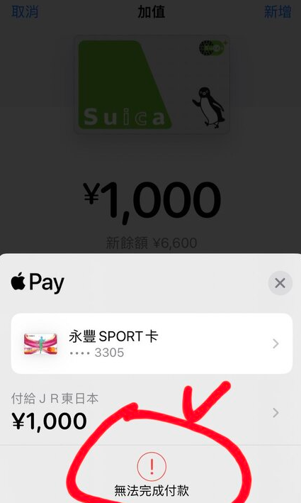
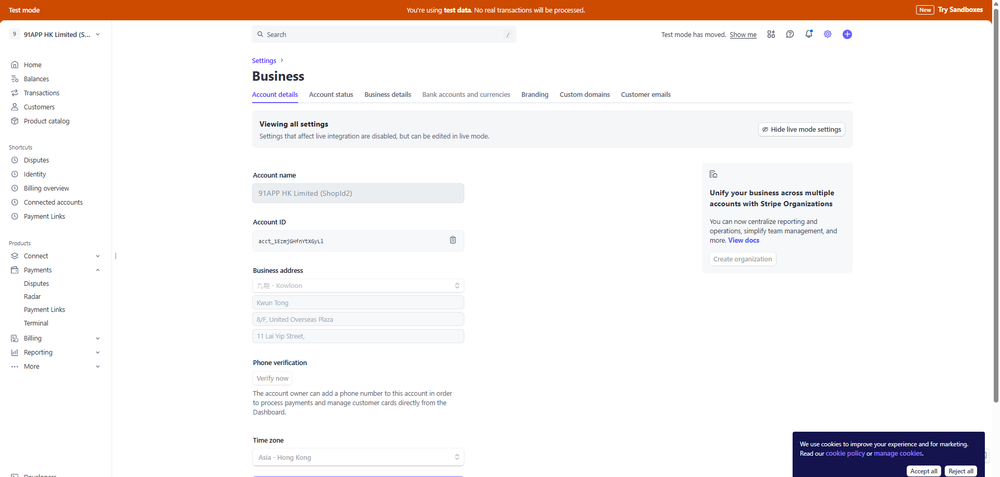

# Stripe 文件

## 目錄
1. [異常案例紀錄](#1-異常案例紀錄)
2. [帳戶類型](#2-帳戶類型)
3. [ApplicationFee / Refund / TransferReversal](#3-applicationfee--refund--transferreversal)
4. [系統使用費 / 金流手續費](#4-系統使用費--金流手續費)
5. [publishableKey](#5-publishablekey)
6. [App 設定值處理](#6-app-設定值處理)
7. [第三方金物流 pk + acct 設定根據帳戶類型差異](#7-第三方金物流-pk--acct-設定根據帳戶類型差異)
8. [快取](#8-快取)
9. [Stripe 後台操作](#9-stripe-後台操作)
10. [帳戶類型與 Key 整理](#10-帳戶類型與-key-整理)

<br>

---

## 1. 異常案例紀錄

### 1.1 [HK] 特定消費者無法完成信用卡付款_(28) CU APP

**VSTS**：https://91appinc.visualstudio.com/DailyResource/_workitems/edit/512563

<br>

**客戶序號**：25

<br>

**商店序號**：28

<br>

**商店名稱**：CU APP

<br>

**問題描述**

<br>

商戶回報有一位消費者使用 HSBC Master Card 嘗試付款時失敗，畫面顯示「暫不支援此信用卡，請更換信用卡重新結帳」，無法完成交易。消費者表示該卡在其他網購平台使用正常，在我們平台即使已重新輸入多次仍出現錯誤，顧客表示不理解為何只有在我們平台無法使用，情緒激動，希望協助查明原因，謝謝。

<br>

**會員電話號碼**：+852-91832120

<br>

**訂單時間**：2025/07/16 上午約 11:00 至 12:00 之間

<br>

**信用卡類型**：HSBC MasterCard（付款時有跳轉到HSBC銀行App同意授權)

<br>

#### 1.1.1 確認會員資料

```sql
USE WebStoreDB

SELECT *
FROM VipMemberInfo(NOLOCK)
WHERE VipMemberInfo_ValidFlag = 1
AND VipMemberInfo_CellPhone = '91832120'
AND VipMemberInfo_CountryCode = 852
AND VipMemberInfo_ShopId = 28
```

<br>


<br>

#### 1.1.2 查詢三方消費紀錄

```sql
SELECT *
FROM TradesOrderThirdPartyPayment(NOLOCK)
WHERE TradesOrderThirdPartyPayment_ValidFlag = 1
AND TradesOrderThirdPartyPayment_ShopId = 28
AND TradesOrderThirdPartyPayment_TypeDef = 'CreditCardOnce_Stripe'
and TradesOrderThirdPartyPayment_CreatedDateTime >= '2025/07/16 00:00'
and TradesOrderThirdPartyPayment_CreatedDateTime <= '2025/07/17 00:00'
and TradesOrderThirdPartyPayment_CreatedUser = '1751836' -- MemberId
```

<br>


<br>

#### 1.1.3 Stripe 後台資訊


<br>



<br>


<br>

#### 1.1.4 Athena IIS Log 查看信用卡驗證紀錄


<br>

```sql
SELECT * FROM "hk_prod_webstore"."webstore_web_iislog"
WHERE date = '2025/07/16'
AND cs_uri_stem = '/webapi/CreditCard/Validate'
AND cs_uri_query LIKE '%ShopId=83%';
```

<br>

#### 1.1.5 會員沒有記住信用卡

```sql
select *
from PayTypeExpress(nolock)
where PayTypeExpress_ValidFlag = 1
and PayTypeExpress_ShopId = 28
AND PayTypeExpress_MemberId = 1751836
```

<br>

#### 1.1.6 釐清

交易時間應該是 10:00

<br>

看期限應該是還沒到(2032/01)，不過 Stripe 認定過期

<br>

需要詢問 Stripe 該交易的問題

<br>

---

## 2. 帳戶類型

### Customer vs Standard

<br>

**Customer：** 我們這邊收錢算好費率，用戶只要在osm按按鈕就可以開一個account建立shop

**Standard：** 大型商店，自己去談費率，ex. SASA

<br>

### 帳戶類型清單

<br>

- Custom
- CustomTest
- CustomUAT
- CustomUATTest
- Standard
- StandardUAT

<br>

### 查詢語法

<br>

```sql
select *
from ShopDefault(nolock)
where ShopDefault_ValidFlag = 1
and ShopDefault_ShopId = @shopId
and ShopDefault_Key = 'StripeAccountType'
```

<br>

---

## 3. ApplicationFee / Refund / TransferReversal

### 適用範圍

<br>

- DestinationCharge 專用

<br>

### 功能說明

<br>

**Refund：** 退款給客戶

<br>

**Transfer Reversal：** 從關聯賬戶收回資金到平台賬戶，可以同時指定是否退還相關的 Application Fee，結果會是增加平台餘額，減少目標賬戶餘額

<br>

### 限制條件

<br>

- 對於目標收費（destination charge），撤銷金額不能超過原始收費金額
- 對於轉賬組（transfer_group），只有在目標賬戶有足夠餘額時才能撤銷

<br>

### 實際案例

<br>

一個電商平台，賣家售出商品價值 $100：

<br>

- 平台收取 10% 應用程式費用（$10）
- 轉給賣家 $90

<br>

**情況 1：需要全額撤銷**

<br>

執行 Transfer Reversal：從賣家賬戶撤回 $90，可以選擇是否同時退還 $10 應用程式費用

<br>

**情況 2：部分撤銷**

<br>

執行部分 Transfer Reversal：比如從賣家賬戶撤回 $45，可以選擇是否按比例退還部分應用程式費用

<br>

### 資金流向說明

<br>

- **Refund：** 客戶 ↔ 商家
- **Application Fee Refund：** 平台 → 賣家（僅涉及費用）
- **Transfer Reversal：** 賣家 → 平台（可包括主要金額和費用）

<br>

---

## 4. 系統使用費 / 金流手續費

### 4.1 取得 系統使用費 & 金流手續費位置

<br>

**GetOrderProcessingFeeProcessor**

<br>

### 4.2 取得費率的方式

<br>

#### 系統使用費：SalesFeeInfo

<br>

**影響因素**

<br>

- sourceCategoryId
- SupplierId

<br>

**預設：** decimal salesFeeRate = 0.05m

<br>

**Table**

<br>

- SupplierContract
- SupplierContract_IsDefaultSalesFeeRate
- SupplierContractSalesFeeRate
- SupplierContractSalesFeeRate_Rate

<br>

#### 金流手續費：PayProfileFeeInfo

<br>

**影響因素**

<br>

- shopId
- payprofile
- country
- brand

<br>

**CSP：** csp_GetPayProfileProcessingFee

<br>

**最底限會撈 PayProfile**

<br>

- PayProfileProcessingFee_SupplierFeeRate
- PayProfileProcessingFee_SupplierFixedFee

<br>

### 4.3 MWeb 計算費率後帶到 PaymentMiddleware

<br>

**位置：** StripePayChannelService.GetStripeApplicationFee

<br>

將資料帶到 ExtendInfo.application_fee_amount

<br>

**系統使用費：** 加總 SalePageGroup.TotalPayment * salesProcessingFee.Rate（一般是 0.05）

<br>

**運費使用費：** TradesOrderGroup.TradesOrderGroup_TotalFee * salesProcessingFee.Rate

<br>

若是 Custom Type 帳戶類型會再加上金流手續費：

<br>

```
(TradesOrderGroup_TotalPayment * payProfileProcessingFee.Rate) + payProfileProcessingFee.FixedFee
```

<br>

### 4.4 轉單後資料處理

<br>

**轉單 Job：** TransferOrderToERP

<br>

**Step1：** 將WebStoreDB資料轉移至ERPDB暫存表資料表 csp_ImportWebStoreDBTradesOrdersToERPDBSourceTablesByOrderId_Mall

<br>

**Step2：** 壓SalseOrderGroup：dbo.csp_TradesOrderTransToSalesOrderWithFlow_Mall

<br>

**Step3：** 壓SalesOrder：ERPDB.dbo.csp_UpdateDataAfterTradesOrderTransToSalesOrderWithFlow

<br>

#### 帶入參數

<br>

帶 TradesOrderGroupId：

<br>

- @shopPayProfileSupplierFixedFee：PayProfile_SupplierFixedFeePayProfile_SupplierFixedFee 抓這個
- PayProfileProcessingFee_SupplierFixedFee 為主
- @salesOrderGroupPaymentFixedFe
- @cardIssueCountry
- @cardBrand

<br>

#### 資料對應

<br>

執行 UpdateSalesOrderSlaveFeeRateByGroupId 時，會取 ThirdPartyPayment_Info 並 Mapping 為以下：

<br>

- **FeeRate** => SalesOrderSlave_SCMCreditCardFeeRate, SalesOrderSlave_SCMCreditCardFeeRate2
- **SCMSalesFeeRate** => SalesOrderSlave_SCMSalesFeeRate
- **FixedFee** => SalesOrderGroup_PaymentFixedFee

<br>

#### 費用單生成

<br>

接著長費用單（ExpenseOrder），費用單（ExpenseOrder）會長其他報表

<br>

---

## 5. publishableKey

### 5.1 Apple Pay 設定

<br>

**Apple Pay：** Configure the SDK with your Stripe publishable key on app start. This enables your app to make requests to the Stripe API.

<br>

### 5.2 Google Pay 設定

<br>

**Google Pay：** To initialize Stripe in your React Native app, either wrap your payment screen with the StripeProvider component, or use the initStripe initialization method. Only the API publishable key in publishableKey is required. The following example shows how to initialize Stripe using the StripeProvider component.

<br>

### 5.3 publishableKey 功能說明

<br>

publishableKey 是 Stripe SDK 與 Stripe 後台互動的「公開金鑰」。

<br>

Stripe SDK（不論是 Apple Pay、Google Pay 或其他）都需要連接到 Stripe 的伺服器來：

<br>

- **確認商家身份**：確認你是哪一個商家（Merchant）
- **載入付款設定**：根據商家的設定載入相應的付款選項（例如你啟用了 Apple Pay、信用卡等）
- **執行付款操作**：允許產生 PaymentMethod、Token、PaymentIntent 等操作

<br>

而 publishableKey 就是識別你是哪一位商家的方式。

<br>

---

## 6. App 設定值處理

### 6.1 App 設定檔 API

<br>

**API 路徑**：https://shop2.shop.qa1.hk.91dev.tw/webapi/AppNotification/GetMobileAppSettings/2?r=t

<br>

設定值放置於 `ExtendInfo.StripeConfiguration` 節點

<br>


<br>

### 6.2 PublishableKey

<br>

**資料庫密鑰設定**

<br>

- **DB**：WebstoreDB
- **Table**：ShopSecret
- **Group**：Stripe
- **Key**：{accountType}PublishableKey

<br>

### 6.3 帳戶類型

<br>

**資料庫設定**

<br>

- **DB**：WebStore
- **Table**：ShopDefault
- **Column**：ShopDefault_NewValue

<br>

#### 6.3.1 帳戶類型覆寫問題

<br>

有遇過一次帳戶撈出來是 Custom，但根據程式碼邏輯會被覆寫成 Standard。

<br>

**原因**：Entity 的設定邏輯會確認是否開啟 EnableCustomDate

<br>

**釐清 VSTS**：https://91appinc.visualstudio.com/G11n/_workitems/edit/433159

<br>

#### 6.3.2 Google Pay 帳戶確認

<br>

確認 googlepay CutomUATTest 是否「已激活」

<br>

### 6.4 CountryCode

<br>

**資料庫設定**

<br>

- **Table**：shopStaticSetting

<br>

**設定方式**

<br>

- **一般商店**：shopId = 0, groupName = Stripe, key = ConutryCode
- **美金站**：shopId = 125, groupName = Stripe, key = ConutryCode

<br>

### 6.5 Currency

<br>

**資料來源**：Supplier.SalesMarketCuerrency

<br>

## 6.6 快取

<br>

- **APP 設定值 Server 端的快取**：可以透過 r=t 處理

HK_QA : 

2 號店
https://shop2.shop.qa1.hk.91dev.tw/webapi/AppNotification/GetMobileAppSettings/2?lang=zh-TW&shopId=2&r=t

5 號店
https://cccrrrmmm1.shop.qa1.hk.91dev.tw//webapi/AppNotification/GetMobileAppSettings/5?lang=zh-TW&shopId=5&r=t

125 (美金站)
https://usdshop.shop.qa1.hk.91dev.tw/webapi/AppNotification/GetMobileAppSettings/125?lang=en-US&shopId=125&r=t


- **APP 設定值 BFF 快取**：約 5 分鐘左右

<br>

---

## 7. 第三方金物流 pk + acct 設定根據帳戶類型差異

### 7.1 Custom 帳戶類型

<br>


<br>

### 7.2 Standard 帳戶類型

<br>


<br>

---

## 9. Stripe 後台操作

### 9.1 查看 GooglePay / ApplePay 是否 Active

<br>


<br>

### 9.2 查看帳戶資訊

<br>



<br>

### 9.3 查看 apiKey

<br>


<br>

### 9.4 查看 log

<br>


<br>

### 9.5 目前 QA 連結狀況

<br>

shop = 11 CustomUATTest, 在 QA Custom UAT 的 ConnectedAccount
shop = 2  Standard, 在 91APP HK UAT 的 ConnectedAccount, 帳戶名稱為 91APP HK Limited(ShopId2)


<br>

### 9.6 關鍵字

开发人员
API 密钥
令牌

### 9.7 切換測試模式


<br>

---

## 10. 帳戶類型與 Key 整理

### 10.1 HK QA 測試商店配置表

<br>

| Mode | Secret Key | Publishable key (用來產生paymentMethod) | AcctId | HK_QA測試商店 | HK_QA測試商店AcctId | HK_QA測試商店要帶ScretKey |
|------|------------|------------------------------------------|--------|---------------|---------------------|---------------------------|
| Standard | Platform | Connected Account | 子帳號 | 2 | acct_1EzmjGHfnYtXGyLl | (91APP HK ( UAT )) sk_test_51F9SOGESCzWmEeCHhUvwjWCX9kaWNxZfByCKGe8JL7lh74V9mIl83BGenMESc90wyDTejZpFAmJb7TnKolHYT4Wg00rjGkGUrd |
| CustomTest | Platform | Platform | 子帳號 | 5 | (Knight Huang) acct_1KWcEYREP0EXjCKm | sk_test_51KWLzbEUxCsaikE27VeDZUIMuP6o6XrHdnw9dsrMbAGQMZBj9kSvAO1qrD6kGU8lh3AFoWEZxX0DrOZZDUcOXAls00n48V6n2I |
| CustomUATTest | Platform | Platform | 子帳號 | 11 | (CustomUATTest) acct_1Q67okR0gqMYbKPN | sk_test_51KWMAXJ1b0MGGnW4ev0miT3a0BfPNHPxP7BxLZJFHK3FUOllrK7r7wAvRnw9dgUkUeRk7jAIcTz3yd274AElw6sw0073oYEDYK |
| StandardUAT | Platform | Connected Account | 子帳號 | 125(美金站) | acct_1Q7SPiFGfUIK2bE1 | (91APP HK Limited) sk_test_51EzmjGHfnYtXGyLlBsqBOKEDpX4DL7sHijDHAtwmoHDZBpiRrCltklTNhRCKrUSGjUtAJuxOZ6GAoG6PX2aq0TYH00w2QKSIR4 |

<br>

### 10.2 Secret Key 設定位置

<br>

**Config 檔案路徑**：MachineConfig/Frontend/AppSettings.QA300.config

<br>

### 10.3 帳號整理文件

<br>

**參考文件**：https://docs.google.com/spreadsheets/d/1Wc3SB8I2qlHJ5xw2JzrOuXZVUpKAAHs7OsbJAUVeG0A/edit?gid=0#gid=0

<br>

---