# Stripe_ApplePay_GooglePay

## 目錄
1. [異常紀錄](#1-異常紀錄)
2. [轉單問題](#2-轉單問題)
3. [PSP (PaymentServiceProfile)](#3-psp-paymentserviceprofile)
4. [PaymentMethodId 傳遞](#4-paymentmethodid-傳遞)
5. [取消按鈕消失的問題](#5-取消按鈕消失的問題)
6. [PublishableKey 位置](#6-publishablekey-位置)
7. [語系](#7-語系)
8. [送審](#8-送審)
9. [付款](#9-付款)
10. [查詢](#10-查詢)
11. [退款](#11-退款)

<br>

---

## 1. 異常紀錄

### 1.1 有1小時前的訂單未轉至ERP

<br>

**1.1.1 WebAPI log**

<br>

```sql
SELECT * FROM "hk_prod_webstore"."webstore_web_nlog"
where 1 =1
--and message like '%TG250702T00022%'
and requestid = '{"message":"202507021716384639'
and date = '2025/07/02'
limit 1000;
```

<br>

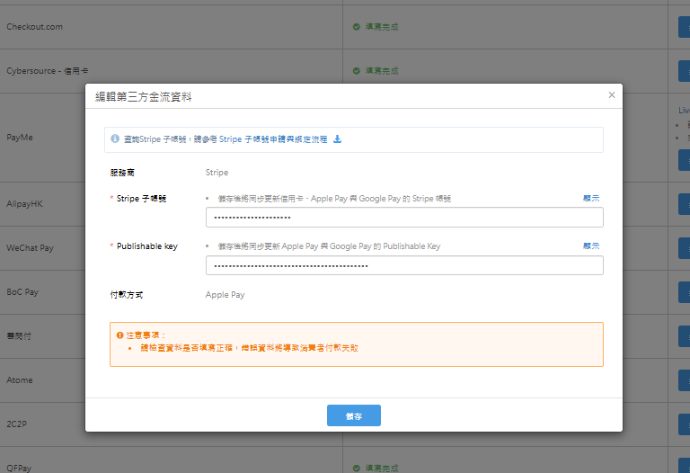

<br>

**1.1.2 DB 狀態**

<br>

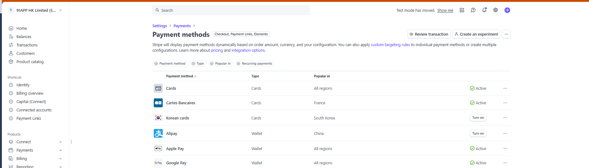

<br>

**1.1.3 Stripe 後台**

<br>

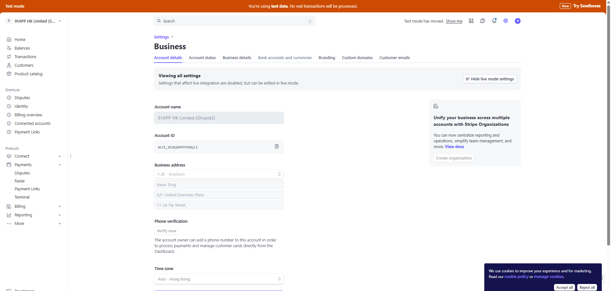

<br>

**1.1.4 壓狀態PR**

<br>

https://bitbucket.org/nineyi/nineyi.database.operation/pull-requests/22492/dif

<br>

**1.1.5 Paymentmiddleware**

<br>

```
/api/v1.0/pay/ApplePay_Stripe/TG250702T00022
RESPONSE BODY:\n{\n  \"request_id\":
```

<br>

### 1.2 ApplePay 沒有憑證

<br>

ApplePay 沒有憑證，會跳「Apple Pay 無法使用」的 pop up

<br>

### 1.3 需要回傳 ClientSecret 給 SDK

<br>

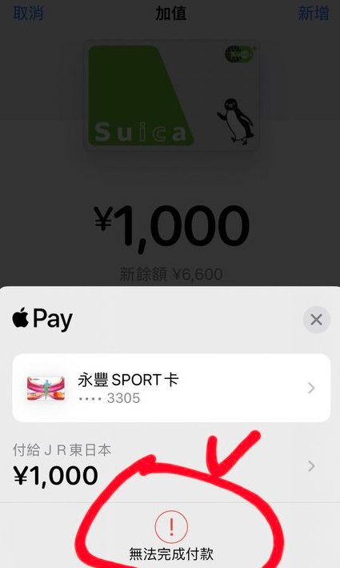

<br>

#### 原因

<br>

如果不回傳，使用者會在 ApplePay UI 看到紅色驚嘆號付款失敗，但實際上在後台是有成單的，這應該是會被投訴

<br>

#### 實現邏輯

<br>

結帳完成後，PMW 會把 ClientSecret 帶給 MWeb，並使用方法：`StripePayChannelService.ChangeExtendInfoAfterPaymentResult`，附加在 `context.ThirdPartyPayment.ExtendInfo` 節點，`CompleteForNewCart` 回給前端完成付款流程

<br>

#### 相關討論串

<br>

https://91app.slack.com/archives/C017G0YFPPH/p1727083602646129

<br>

### 1.4 APP 拿不到 Key (會被我們處理)

<br>

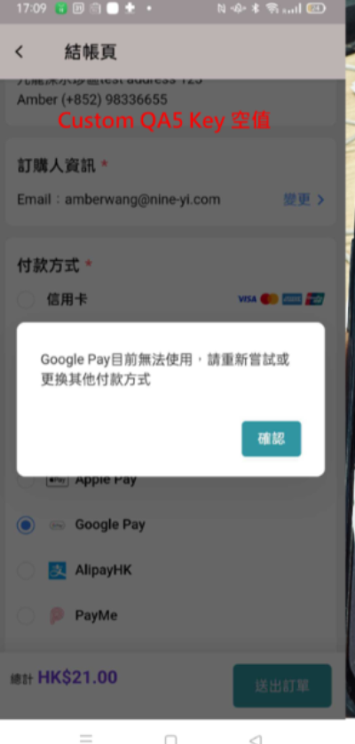

<br>

### 1.5 APP 拿到 Key 但有誤( Google API )

<br>

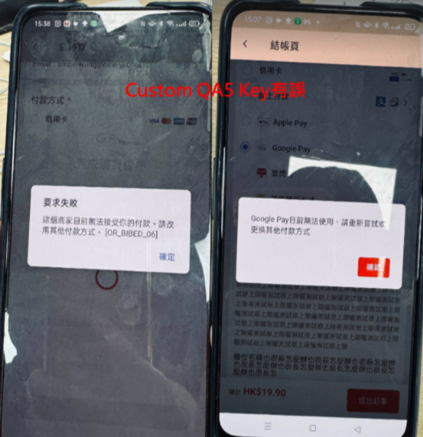

<br>

### 1.6 APP 拿到 Key 但不是這個帳戶的 Key ( Stripe API)

<br>

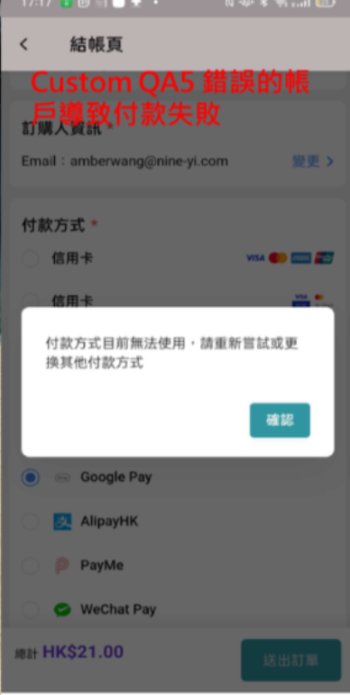

<br>

### 1.7 Google / Apple Pay + Stripe SDK 錢包與綁卡錯誤流程

<br>

1. isAvailable（檢查是否可用）
2. 執行支付（跳支付彈窗）

<br>

不管是台灣或香港的邏輯都是在 isAvailable = false 時會回傳ERROR_NO_CARD ，台灣也會在沒綁卡時走到這一步

<br>

但 Stripe 的 SDK 似乎不認為沒有卡是一種 不可用狀態 ，會直接執行第二步跳出彈窗，也就是說 Stripe 有下載 Google Pay 沒卡的情境沒有錯誤流程。

<br>

### 1.8 Payment middleware 請求付款失敗

<br>

走到這個檢核是已經有TG了，所以轉導P1正常，因一台車只會有一個K值

<br>

### 1.9 GooglePay 錯誤碼

<br>

- **OR_BIBED_11**：APP 尚未通過 GooglePay API 審核
- **OR_BIBED_06**：Stripe 測試 Key 不能使用於 GooglePay 正式模式 / Key 錯誤

<br>

### 1.10 舊版 App 進購物車會 Crash

<br>

會 crash 的只有 build 到大概兩週多前andy/stripe-google-pay的版本會 crash 。

<br>

而用 develop branch build 舊版（只走 TapPay） 以及 build andy/stripe-google-pay 大概一週前的版本理論上都不應該 crash ，如果後續有疑慮可以用 gitsha 查查是哪版的 code

<br>

### 1.11 正式模式未審核通過

<br>

發現 publishable key 是正確的，會拿到 OR_BIBED_11 錯誤，後續釐清正式模式下， 商店 App 需要經過 Google Console 審核流程開通

<br>

### 1.12 QA 正式環境2號店在送審完成後，發現還是會遇到錯誤，錯誤碼為 OR_BIBED_06，後來查閱文件發現應是 Key 與 GooglePay 的模式對不起來

<br>

MWeb 會根據 Stripe PublishableKey 開頭是否為 pk_test_% = Test 或 pk_live_% = Live 來通知 Andorid APP 決定 SDK 使用測試或正式模式，若 publishable Key 有變，會抓取 Config 預設值 Stripe.DefaultMode

<br>

---

## 2. 轉單問題

### 2.1 釐清

<br>

一般金流轉單會在對應的金流 Process 註冊 TransferOrderProcessor，例如 RegisterGooglePayProcess 就會有，但 RegisterApplePayProcess 並未獨立處理轉單 Processor，而是寫在 CreateApplePayRequestProcessor 這個付款 Processor 內部，原邏輯是 PaymentConfirm（確認授權結果）後建立 TransferOrderToErp

<br>

### 2.2 作法

<br>

CreateApplePayRequestProcessor 內部會切 PSP，若為 PaymentMiddleware 則會新增我們自己的轉單 Task

<br>

**PR**：https://bitbucket.org/nineyi/nineyi.webstore.mobilewebmall/pull-requests/43190/overview

<br>

---

## 3. PSP (PaymentServiceProfile)

### 3.1 說明簡報參考

<br>

https://docs.google.com/presentation/d/1cFJPCnIvn5Xd0Vs8l0wYP82uhw_jfvYkf5A__RcQ8-w/edit?slide=id.g2c3bcb5dadc_2_0#slide=id.g2c3bcb5dadc_2_0

<br>

### 3.2 PaymentServiceProvider DB 設定處理

<br>

| 金流 | 商店 | 設定內容 |
|------|------|----------|
| ApplePay | 0 | {"PaymentServiceProvider":"NCCC","AppVer": null,"Acquiring":"NCCC"} |
| ApplePay | 1 | {"PaymentServiceProvider":"TapPay", "AppVer": "24.3.0","Acquiring":"808"} |
| ApplePay | 2 | {"PaymentServiceProvider":"TapPay", "AppVer": "24.4.0","Acquiring":"822"} |
| GooglePay | 0 | {"PaymentServiceProvider":"TapPay","AppVer":null,"Acquiring":"NCCC"} |
| GooglePay | 1 | {"PaymentServiceProvider":"TapPay","AppVer":null,"Acquiring":"808"} |

<br>

**ShopStaticSetting 格式**：PaymentServiceProviderProfile/ApplePay/0

<br>

**AppVer為null表示不指定**

<br>

### 3.3 資料儲存

<br>

| 項目 | 說明 |
|------|------|
| **Table** | ShopStaticSetting |
| **PSP 撈取站台** | Shopping, context.Data.CheckoutPaymentServiceProvider |
| **MWeb 節點** | context.CheckoutPaymentServiceProvider |
| **相關 API** | pay-set，邏輯是若金流選項為 ApplePay / GooglePay 則會進入是否要取得 PSP Profile 的判斷式，目前版本 > 24.4.0 則會去 DB 撈取當下的 PSP Profile |
| **版本說明** | 目前使用 24.13 版才可正常付款，PSPPayProfile 版本須更新為 24.13 |

<br>

### 3.4 APP 版本

<br>

如果過舊（24.4 以前）不會抓 PSP，有可能導致預設的 NCCC 傳入

<br>

```csharp
private async Task SetCheckoutPaymentServiceProvider(CheckoutContext context, string key, CheckoutPaymentServiceProviderEntity checkoutPSP)
{
    var profile = await GetPaymentServiceProviderProfile(context.ShopId, key);
    if (profile == null)
    {
        return;
    }

    var userClientTrack = context.Data.UserClientTrack;
    if (userClientTrack.IsApp == false
        || profile!.AppVer == null
        || IsAppVerSupported())
    {
        checkoutPSP.PaymentServiceProvider = profile!.PaymentServiceProvider;
        checkoutPSP.Acquiring = profile!.Acquiring;
    }

    bool IsAppVerSupported()
    {
        return string.IsNullOrWhiteSpace(userClientTrack.AppVersion) == false &&
        Version.TryParse(userClientTrack.AppVersion, out _) &&
        userClientTrack.CheckAppVersionIsUnsupported(profile!.AppVer!) == false;
    }
}
```

<br>

### 3.5 History

<br>

#### 3.5.1 案件說明

<br>
VSTS :　https://91appinc.visualstudio.com/G11n/_workitems/edit/453982
2024/12/23 Luke 反應 4 & 12 店偶發出現戳到 TW ApplePay Decrypt 的結帳需求

<br>

**Elmah**：http://elmahdashboard.91app.hk/Log/Details/a4e8cba2-f1a1-4398-8e1d-d1c63774b2bb

<br>

無法取得 Apple Pay Decrypt 結果，回傳狀態：ProtocolError

<br>

#### 3.5.2 釐清過程

<br>

**Athena 查詢**

<br>

```sql
-- 4 店的錯誤
select * from "hk_prod_webstore"."webstore_web_nlog"
where date = '2024/12/23'
and controller = 'tradesOrderLite'
and action = 'CompleteForNewCart'
and requestid = '{"message":"202412230856540938'
limit 100;

-- 12 店的錯誤
select * from "hk_prod_webstore"."webstore_web_nlog"
where date = '2024/12/21'
and controller = 'tradesOrderLite'
and action = 'CompleteForNewCart'
and requestid = '{"message":"202412211334273896'
limit 100;
```

<br>

可以得到 MemberId：'2216075','2275917'

<br>

查 TradesOrderGroup_TrackAppVersion 後發現，4號店隨機找一張 ApplePay 成功的單：

<br>

- **TradesOrderGroup_TrackAppVersion**：24.13.0
- **TG**：TG241223A00010

<br>

而 Luke 反應以上有問題的單查看 TradesOrderGroup_TrackAppVersion 都是 24.11.5

測試 HK 2 號店 24.11.5，選了 Apple Pay，前端 JSI 會傳來, paymentServiceProvider: NCCC, 前端有個三元判斷

有 : 就帶後端給的  `paymentServiceProvider`
沒有 : (null or undefined or '') 就是預設帶 PaymentServiceProviderEnum.NCCC
<br>

**結論**：為版本不該出現 ApplePay 的問題
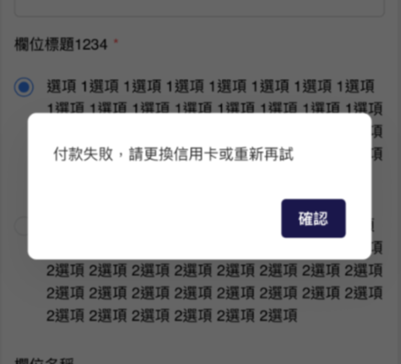

<br>

---

## 4. PaymentMethodId 傳遞

### 4.1 Shopping / Cart 新增節點用來接前端給的 PaymentMethodId

<br>

**Shopping**：PaymentMiddlewareCreditCardInfoEntity.ExtendInfo

<br>

**Cart**：TradesOrderThirdPartyPaymentInfoEntity.ExtendInfo

<br>

### 4.2 實現邏輯

<br>

- **Checkout / Complete**：前端會在 PaymentMiddlewareCreditCardInfoEntity.ExtendInfo 帶上 paymentMethodId

<br>

- **Cart 處理**：在 GetPayDataProcessor.AssignPayProcessFlowTypeAsync 判斷是 GooglePay 後從 ExtendInfo 去 Resolve 出 paymentMethodId ==> payment_method，放在 checkoutContext.OldPayProcessContext.ThirdPartyPaymentInfo.ExtendInfo

<br>

- **前台付款**：GetMobileWalletPayExtendInfo 取出送到 PMW

<br>

---

## 5. 取消按鈕消失的問題

### 5.1 釐清

<br>

OrderSlaveFlow 有個欄位是 CanCancel，當初似乎為了解決待付款就跑出取消按鈕而在 StripePayChannelService 新增「若是 G/A Pay 要多壓一次大表狀態」的邏輯，導致後來取消按鈕都長不出來

<br>

### 5.2 解法

<br>

因為跨國本身就會在 Query 後根據結果壓大表狀態，因此應是讓 Stripe G/A Pay 從成立訂單就走跨國的邏輯

<br>

#### 5.2.1 移除多壓狀態邏輯

<br>

移除該判斷式避免「永遠長不出按鈕」且「多壓一次大表」

<br>

**PR**：https://bitbucket.org/nineyi/nineyi.webstore.mobilewebmall/pull-requests/43855/overview

<br>

#### 5.2.2 修改成立訂單邏輯

<br>

在成立訂單時（CreateTradesOrderProcessor）修改 Stripe GooglePay / ApplePay 進入跨國的判斷式，讓該出現取消按鈕時才出現

<br>

---

## 6. PublishableKey 位置

### 6.1 先確認帳戶類型

<br>

```sql
select ShopDefault_ShopId,ShopDefault_GroupTypeDef,ShopDefault_Key,ShopDefault_NewValue,*
from ShopDefault(nolock)
where ShopDefault_ValidFlag = 1
and ShopDefault_ShopId = 125  -- 幾號店??? 
and ShopDefault_GroupTypeDef = 'Stripe'
```

<br>

### 6.2 再根據帳戶類型找出 pk

<br>

```sql
DECLARE @secretKey VARCHAR(50) = '', -- {帳戶類型}PublishableKey 例如 : StandardUATPublishableKey
        @shopId BIGINT = ; -- 商店ID

-- 修改前 
select ShopSecret_ShopId,ShopSecret_Key,ShopSecret_Value,*
from ShopSecret(nolock)
where ShopSecret_GroupName = 'Stripe' 
and ShopSecret_ShopId = @shopId
and ShopSecret_Key = @secretKey
and ShopSecret_ValidFlag = 1
```

<br>

### 6.3 帳戶類型差異

<br>

- **Standard**：會根據商店有所不同, 使用連結帳戶的 pk + acct
- **Custom**：shopId = 0，只會帶一把

<br>

---

## 7. 語系

### 7.1 手機系統的設定語系

<br>

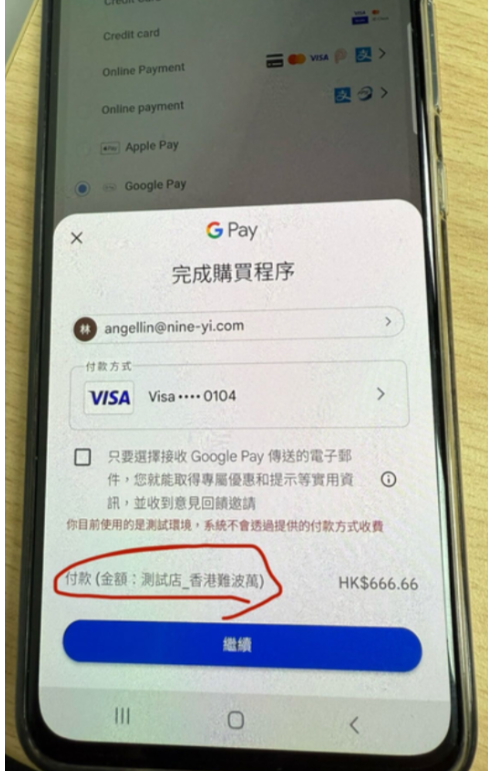

<br>

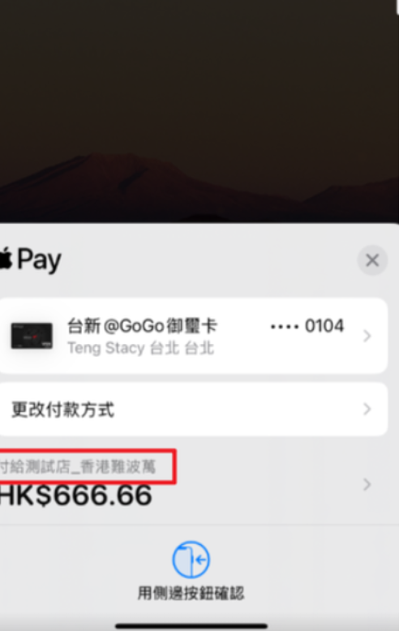

<br>

---

## 8. 送審

### 8.1 文件

<br>

https://docs.google.com/presentation/d/1PXPrk2DKekFbgzDn7W6oruFWn9ww0lHvJ3vntn5bZfQ/edit#slide=id.gc728790f86_0_5

<br>

### 8.2 錯誤碼

<br>

**OR_BIBED_11**：This merchant has not completed registration to use Google Pay API. Please go to console (https://pay.google.com/business/console) to verify.

<br>

You haven't completed the process to register your app for the Google Pay API. Review Request production access for more information.

<br>

### 8.3 送審確認

<br>

1. 確認跨國跟台灣流程差異
2. 第三方金物流要啟用中間狀態
3. HK AM 開單給 OD, 工作天大概7~14天
4. GOOGLEPAY送審是 APPRD Build 測試模式 APP, 人工進去結帳截圖給OD登入Google Console完成作業

<br>

### 8.4 History

<br>

#### 8.4.1 送審成功後在 GOOGLEPAY 顯示失敗

<br>

**原因**：SDK 啟用有分 Test Mode / Live Mode 會需要對應 publishable key

<br>

**解法**：後端在 MobileAppSettingService 的 Extendinfo 中的 StripeConfiguration 新增 Mode : Test / Live 節點

<br>

1. andyliu 先拔 BFF code ，24.13.0 正式流程中完全不使用 StripeAccountType 節點。(可能是雖然不能結帳但至少可以截圖?)

<br>

要截圖還是走 AndyLiu 開的 branch。

<br>

2. 下個版本再使用 StripeAccountType 節點，據此節點判定走 Test 還是 Prod，若沒吃到節點則仍是測試環境 Test，正式環境 Prod。

<br>

#### 8.4.2 46 號店審核沒過

<br>

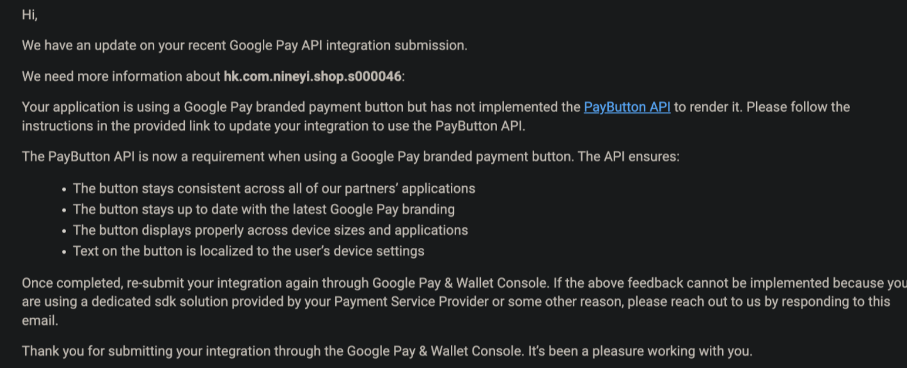

<br>

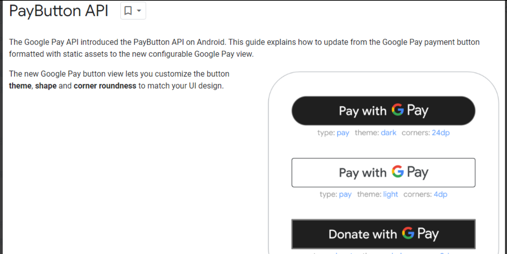

<br>

**參考文件**：https://developers.google.com/pay/api/android/guides/resources/pay-button-api

<br>

**原因**：看不到 Google Pay 按鈕

<br>

**處理**：這個按鈕的改動會連同 TW 一起調整

<br>

**VSTS**：https://91appinc.visualstudio.com/G11n/_workitems/edit/448676

<br>

---

## 9. 付款

Middleware Pay Response

```json
{
  "request_id": "791025f2-bc7e-4bf8-a69b-c2269318b065",
  "return_code": "0000",
  "return_message": "Success",
  "transaction_id": "pi_3PpiJTHfnYtXGyLl1wSvBM8U",
  "tg_code": "TGCodeForTest",
  "payment_action": null,
  "extend_info": {
    "payment_intent_id": "pi_3PpiJTHfnYtXGyLl1wSvBM8U",
    "charge_id": "ch_3PpiJTHfnYtXGyLl1z1oy8qa",
    "payment_method": "pm_1PpiIdHfnYtXGyLlQ8cs4g5x",
    "client_secret": "pi_3PpiJTHfnYtXGyLl1wSvBM8U_secret_kALJFnCt1XEnt6FYjIfCixES6"
  }
}
```

<br>

---

## 10. 查詢

Middleware Query Response

```json
{
  "request_id": "91cd098e-0c05-4ee1-9462-12a28be57dab",
  "return_code": "0000",
  "return_message": "succeeded",
  "transaction_id": "pi_3PpiJTHfnYtXGyLl1wSvBM8U",
  "extend_info": {
    "payment_intent_id": "pi_3PpiJTHfnYtXGyLl1wSvBM8U",
    "charge_id": "ch_3PpiJTHfnYtXGyLl1z1oy8qa"
  }
}
```

<br>

---

## 11. 退款

Middleware Refund Response

```json
{
  "request_id": "9e84c95b-2ec0-46ae-8282-5e8a01897ddf",
  "transaction_id": "re_3PpiJTHfnYtXGyLl1RwXH0r8",
  "return_code": "0000",
  "return_message": "success",
  "extend_info": null
}
```

<br>

---