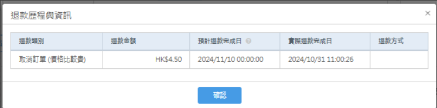
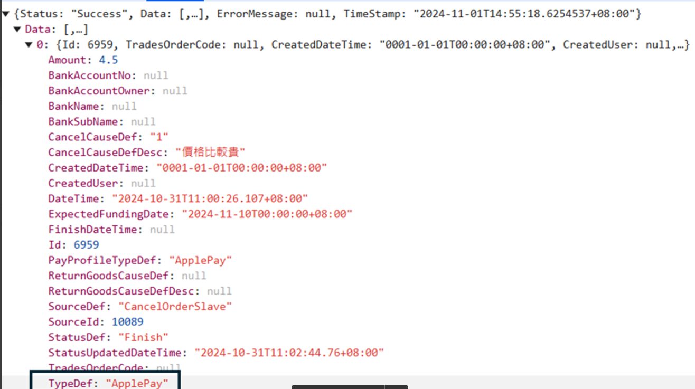
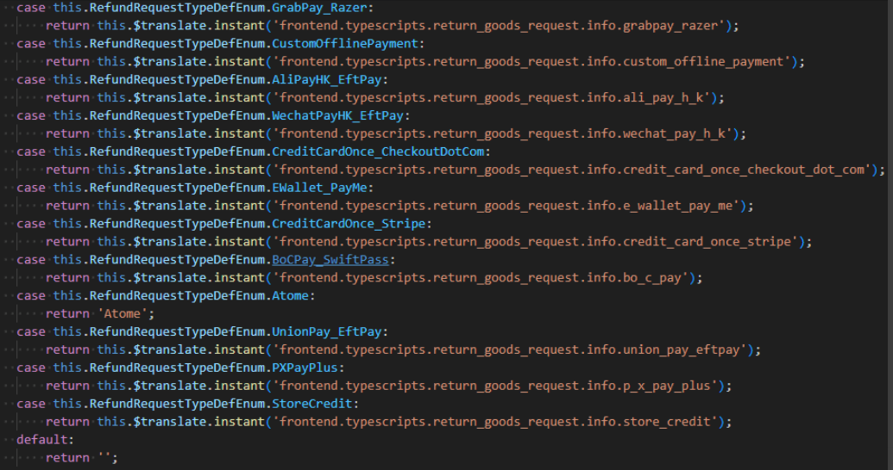
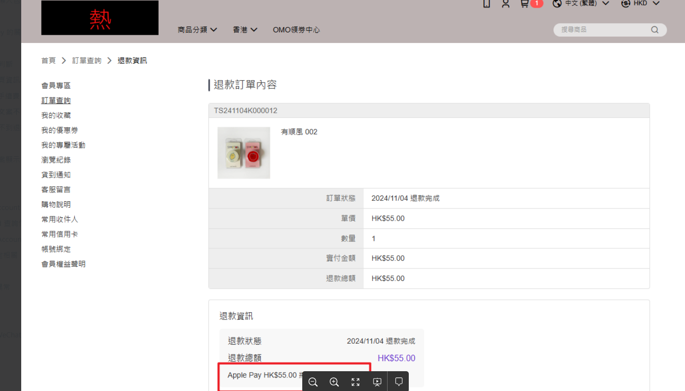
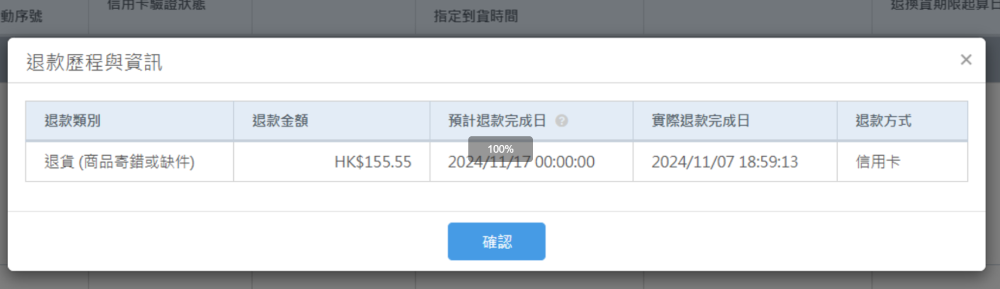

# 逆流程文件

## 目錄
1. [LocationPickup 退貨](#1-locationpickup-退貨)
2. [退款通知信](#2-退款通知信)
3. [退款歷程會看不到退款方式](#3-退款歷程會看不到退款方式)
4. [退款方式顯示文案不同步問題](#4-退款方式顯示文案不同步問題)
5. [退款進度條文案顯示](#5-退款進度條文案顯示)
6. [關帳](#6-關帳)

<br>

---

## 1. LocationPickup 退貨

### 1.1 問題描述

<br>

**Issue**：退款後會被壓成RefundRequestType : CreditCard,導致撈不到單無法完成退款作業

<br>

**PR**：https://bitbucket.org/nineyi/nineyi.scm.apiv2/pull-requests/11317/diff

<br>

---

## 2. 退款通知信

### 2.1 NMQ

<br>

**CreateShopRefundStatisticsEmailTask**

<br>

### 2.2 參考塞 Task 語法可做測試

<br>

**PR**：https://bitbucket.org/nineyi/nineyi.database.operation/pull-requests/19346/diff

<br>

### 2.3 NMQ 撈取退款單條件

<br>

**退款狀態**：
- RefundRequestFail
- RefundRequestGrouping
- RefundRequestProcessing

<br>

**付款方法**：

<br>

```
payment.PaymentRequest_PaymentProcessingMethodDef = DirectToBank
```

<br>

### 2.4 修改 DirectToBank

<br>

**Config**：https://bitbucket.org/nineyi/nineyi.configuration/pull-requests/4029/diff

<br>

**前台Processor**：ArrangeDataProcessor：https://bitbucket.org/nineyi/nineyi.webstore.mobilewebmall/pull-requests/43742/overview

<br>

**PaymentProcessingMethod**

<br>

```csharp
/// <summary>
/// 判斷預設的支付處理方式
/// </summary>
/// <param name="context">支付處理上下文</param>
/// <returns>支付處理方式</returns>
private void DetermineDefaultPaymentProcessingMethod(PayProcessContextEntity context)
{
    //// 讀取 DirectToBank Config，將付款處理方式設定為直收付
    var directToBankPayType = this._configService.GetAppSetting("PayType.DirectToBank", string.Empty);
    var directToBankPayTypeList = directToBankPayType.Split(',').ToList();
    if (directToBankPayTypeList.Contains(context.PayProfileType.ToString()) ||
        (Enum.IsDefined(typeof(BE.PayProfile.PayProfileTypeDefEnum), context.PayProfileType) &&
         BE.PayProfile.PayProfileTypeDefEnum.DirectToBankThirdPartyPayType.HasFlag(context.PayProfileType)))
    {
        context.PaymentProcessingMethod = PaymentProcessingMethodEnum.DirectToBank.ToString();
    }
    //// 讀取 ThroughPSP Config，將付款處理方式設定為代收付
    var throughPSPPayType = this._configService.GetAppSetting("PayType.ThroughPSP", string.Empty);
    var throughPSPPayTypeList = throughPSPPayType.Split(',').ToList();
    if (throughPSPPayTypeList.Contains(context.PayProfileType.ToString()) ||
        (Enum.IsDefined(typeof(BE.PayProfile.PayProfileTypeDefEnum), context.PayProfileType) &&
         BE.PayProfile.PayProfileTypeDefEnum.ThroughPSPThirdPartyPayType.HasFlag(context.PayProfileType)))
    {
        context.PaymentProcessingMethod = PaymentProcessingMethodEnum.ThroughPSP.ToString();
    }
}
```

<br>

---

## 3. 退款歷程會看不到退款方式

### 3.1 問題截圖

<br>



<br>



<br>

### 3.2 相關檔案

<br>

**檔案路徑**：C:\91APP\NineYi.Sms\WebSite\WebSite\TypeScripts\Modules\Order\orderSlaveFlowDataList.controller.ts 的 GetRefundType 這一段

<br>



<br>

---

## 4. 退款方式顯示文案不同步問題

### 4.1 前台退款訂單內容頁

<br>



<br>

### 4.2 OSM 消費者訂單查詢 / 退貨訂單的退貨申請資訊

<br>



<br>

### 4.3 處理方式

<br>

最後統一使用信用卡

<br>

---

## 5. 退款進度條文案顯示

### 5.1 節點設定

<br>

**HasRefundInfo**

<br>

```csharp
if (paramsEntity.HasRefundInfo == false)
{
    entity.MainMessage = string.Format("{0} " + Translation.Backend.Service.MemberTradesOrderSlaveReturnGoodsFlow.StartRefundProcessing, paramsEntity.OrderSlaveFlowUpdatedDateTime.ToString("yyyy/MM/dd"));
    entity.SubMessage = Translation.Backend.Service.MemberTradesOrderSlaveReturnGoodsFlow.RefillRefundInfo;
}
```

<br>

### 5.2 顯示邏輯分岐程式碼

<br>

```csharp
slave.FlowStatusMessageInfo = memberTradesOrderSlaveFlowService.GetMemberTradesOrderSlaveFlowStatusMessage(paramsEntity);

case MemberTradesOrderOrderSlaveFlowStatusForUserEnum.RefundProcessing:
{
    //// 退款中
    //// 如果是信用卡的退款訂單，不判斷退款單狀態直接顯示處理工作天
    if (paramsEntity.RefundTypeDef == RefundRequestTypeDefEnum.CreditCard ||
        paramsEntity.RefundTypeDef == RefundRequestTypeDefEnum.CreditCardOnce_Stripe ||
        paramsEntity.RefundTypeDef == RefundRequestTypeDefEnum.CreditCardOnce_CheckoutDotCom)
    {
        entity.MainMessage = string.Format("{0} " + Translation.Backend.Service.MemberTradesOrderSlaveReturnGoodsFlow.StartRefundProcessing, paramsEntity.OrderSlaveFlowUpdatedDateTime.ToString("yyyy/MM/dd"));

        if (SettingHelper.DefaultCountry == "TW")
        {
            entity.SubMessage = Translation.Backend.Service.MemberTradesOrderSlaveReturnGoodsFlow.SpendWorkingDays;
        }

        break;
    }
    //// 如果是退款中並且退款單中沒有匯款資訊要顯示提示文字，前端會轉成文字連結
    if (paramsEntity.HasRefundInfo == false)
    {
        entity.MainMessage = string.Format("{0} " + Translation.Backend.Service.MemberTradesOrderSlaveReturnGoodsFlow.StartRefundProcessing, paramsEntity.OrderSlaveFlowUpdatedDateTime.ToString("yyyy/MM/dd"));
        entity.SubMessage = Translation.Backend.Service.MemberTradesOrderSlaveReturnGoodsFlow.RefillRefundInfo;
    }
    else
    {
        entity.MainMessage = StringUtility.PeacefulFormat("{0} " + Translation.Backend.Service.MemberTradesOrderSlaveReturnGoodsFlow.StartRefundProcessing, paramsEntity.OrderSlaveFlowUpdatedDateTime.ToString("yyyy/MM/dd"));

        if (SettingHelper.DefaultCountry == "TW")
        {
            entity.SubMessage = Translation.Backend.Service.MemberTradesOrderSlaveReturnGoodsFlow.SpendWorkingDays;
        }
    }

    break;
}
```

<br>

### 5.3 API

<br>

**訂單GetList**

<br>

https://shop2.shop.qa1.hk.91dev.tw/webapi/MemberTradesOrder/GetList?shopId=2&startIndex=0&maxCount=5&lang=zh-HK

<br>

### 5.4 PR

<br>

https://bitbucket.org/nineyi/nineyi.webstore.mobilewebmall/pull-requests/43918/diff

<br>

---

## 6. 關帳

### 6.1 前台處理

<br>

有分取消 & 退貨

<br>

**PR**：https://bitbucket.org/nineyi/nineyi.webstore.mobilewebmall/pull-requests/43859/diff

<br>

### 6.2 是否蒐集退款資訊

<br>

**路徑**：C:\91APP\NineYi.WebStore.MobileWebMall\WebStore\Frontend\BLV2\MemberTradesOrders\MemberTradesOrderSlaveReturnGoodsFlowService.cs

<br>

```csharp
case MemberTradesOrderOrderSlaveFlowStatusForUserEnum.RefundProcessing:
```

<br>

### 6.3 相關參數

<br>

- **TG241028T00009**
- **paramsEntity.HasRefundInfo == false**
- **IsRefundInfoCollectingEnabled**

<br>

### 6.4 後台

<br>

https://bitbucket.org/nineyi/nineyi.sms/pull-requests/34400

<br>