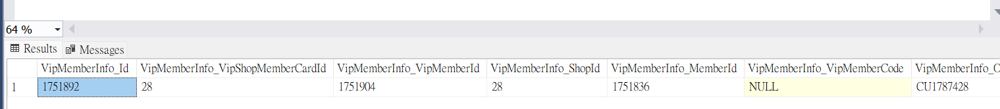
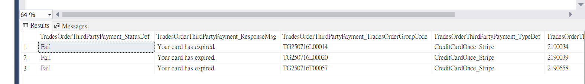
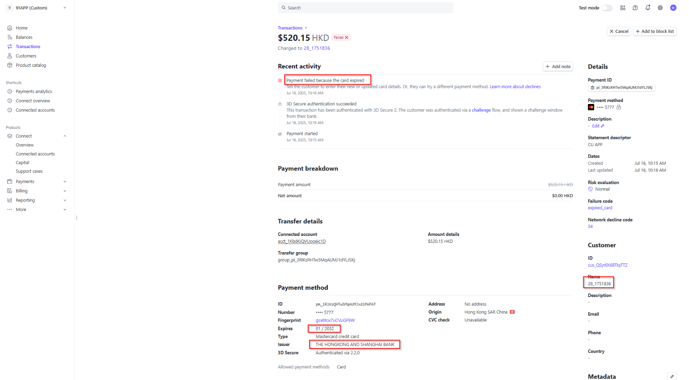
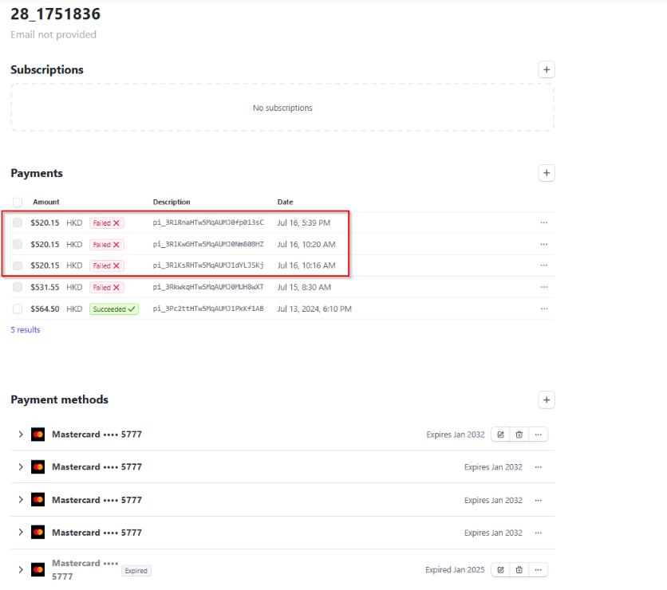
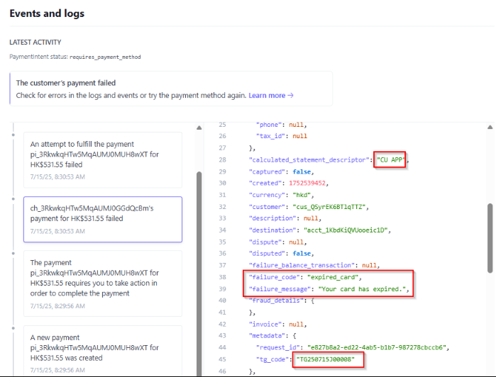
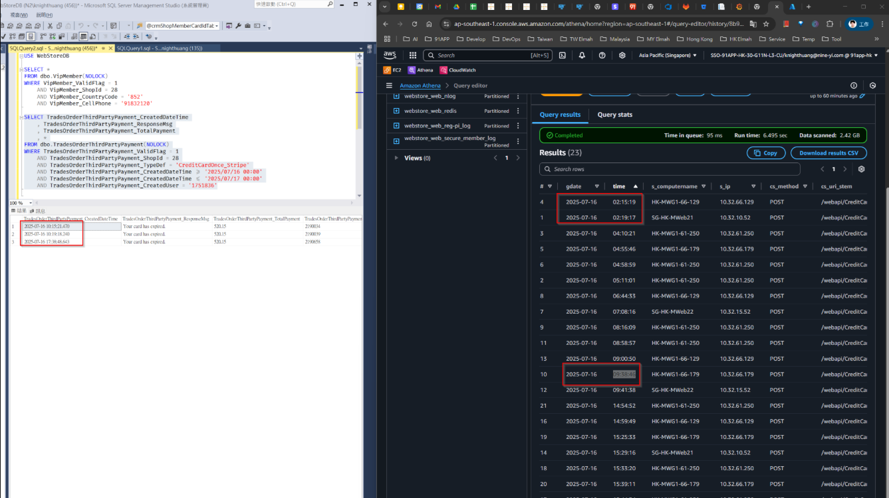

# Stripe 文件

## 目錄
1. [異常案例紀錄](#1-異常案例紀錄)

<br>

---

## 1. 異常案例紀錄

### 1.1 [HK] 特定消費者無法完成信用卡付款_(28) CU APP

**VSTS**：https://91appinc.visualstudio.com/DailyResource/_workitems/edit/512563

<br>

**客戶序號**：25

<br>

**商店序號**：28

<br>

**商店名稱**：CU APP

<br>

**問題描述**

<br>

商戶回報有一位消費者使用 HSBC Master Card 嘗試付款時失敗，畫面顯示「暫不支援此信用卡，請更換信用卡重新結帳」，無法完成交易。消費者表示該卡在其他網購平台使用正常，在我們平台即使已重新輸入多次仍出現錯誤，顧客表示不理解為何只有在我們平台無法使用，情緒激動，希望協助查明原因，謝謝。

<br>

**會員電話號碼**：+852-91832120

<br>

**訂單時間**：2025/07/16 上午約 11:00 至 12:00 之間

<br>

**信用卡類型**：HSBC MasterCard（付款時有跳轉到HSBC銀行App同意授權)

<br>

#### 1.1.1 確認會員資料

```sql
USE WebStoreDB

SELECT *
FROM VipMemberInfo(NOLOCK)
WHERE VipMemberInfo_ValidFlag = 1
AND VipMemberInfo_CellPhone = '91832120'
AND VipMemberInfo_CountryCode = 852
AND VipMemberInfo_ShopId = 28
```

<br>



<br>

#### 1.1.2 查詢三方消費紀錄

```sql
SELECT *
FROM TradesOrderThirdPartyPayment(NOLOCK)
WHERE TradesOrderThirdPartyPayment_ValidFlag = 1
AND TradesOrderThirdPartyPayment_ShopId = 28
AND TradesOrderThirdPartyPayment_TypeDef = 'CreditCardOnce_Stripe'
and TradesOrderThirdPartyPayment_CreatedDateTime >= '2025/07/16 00:00'
and TradesOrderThirdPartyPayment_CreatedDateTime <= '2025/07/17 00:00'
and TradesOrderThirdPartyPayment_CreatedUser = '1751836' -- MemberId
```

<br>



<br>

#### 1.1.3 Stripe 後台資訊



<br>



<br>



<br>

#### 1.1.4 Athena IIS Log 查看信用卡驗證紀錄



<br>

```sql
SELECT * FROM "hk_prod_webstore"."webstore_web_iislog"
WHERE date = '2025/07/16'
AND cs_uri_stem = '/webapi/CreditCard/Validate'
AND cs_uri_query LIKE '%ShopId=83%';
```

<br>

#### 1.1.5 會員沒有記住信用卡

```sql
select *
from PayTypeExpress(nolock)
where PayTypeExpress_ValidFlag = 1
and PayTypeExpress_ShopId = 28
AND PayTypeExpress_MemberId = 1751836
```

<br>

#### 1.1.6 釐清

交易時間應該是 10:00

<br>

看期限應該是還沒到(2032/01)，不過 Stripe 認定過期

<br>

需要詢問 Stripe 該交易的問題

<br>