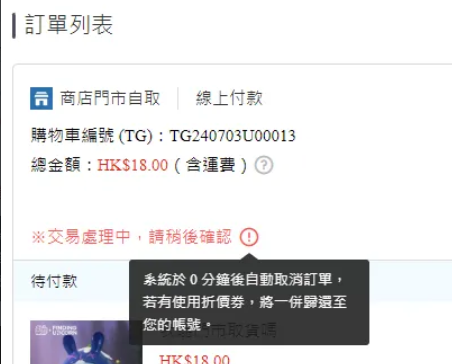

# MWeb 文件

## 目錄
1. [關鍵字](#1-關鍵字)
2. [Timeout 開關](#2-timeout-開關)
3. [商品頁付款說明](#3-商品頁付款說明)
4. [pay-set 選不到 radio button](#4-pay-set-選不到-radio-button)
5. [商品頁顯示付款方式的順序問題](#5-商品頁顯示付款方式的順序問題)
6. [訂單列表頁的 toolTips](#6-訂單列表頁的-tooltips)
7. [購物車支援卡別 icon](#7-購物車支援卡別-icon)
8. [前台金流排序](#8-前台金流排序)
9. [進度條異常出現 SubMessage](#9-進度條異常出現-submessage)
10. [商品頁付款方式出現](#10-商品頁付款方式出現)
11. [3.5頁跳轉](#11-35頁跳轉)
12. [3.5頁跳轉文案](#12-35頁跳轉文案)
13. [iOS轉導](#13-ios轉導)

<br>

---

## 1. 關鍵字

RegisterThirdPartyProcess
TradesOrderPaymentService
PaymentMiddlewareService
PayChannelHelper
QFPayPayChannelService
StripePayChannelService.cs
RegisterThirdPartyFinishProcess 付款後轉倒流程

頁面轉導
C:\91APP\NineYi.WebStore.MobileWebMall\WebStore\Frontend\MobileWebMallV2\Controllers\PayChannelController.cs => PayChannelReturn

GetSalePageV2ProcessContext
this.GetProcessorList<ISalePageV2Processor>("GetSalePageV2EntityProcess");
GetSalePageDataProcessor
GetPayTypeProcessor
GetPayTypeDescriptionProcessor

<br>

---

## 2. Timeout 開關

**Config 設定**：

<br>

```xml
<!--單一Domain開關，上線觀察無異常後拔除-->
<add key="Dev.ShopOwnSsoDomainEnabled" value="true"/>

<add key="Dev.PayChannel.FinishPayment.RequestInterval" value="90" />
<add key="Dev.PayChannel.FinishPayment.PaymentTimeout" value="1800" />
<add key="Dev.PayChannel.PaymentTimeout.Default" value="1800" />
<add key="Dev.PayChannel.PaymentTimeout.CreditCardOnce_Stripe" value="1800" />
<add key="Dev.PayChannel.PaymentTimeout.CreditCardOnce_CheckoutDotCom" value="1800" />
<add key="Dev.PayChannel.PaymentTimeout.CreditCardOnce_Razer" value="3600" />
<add key="Dev.PayChannel.PaymentTimeout.CreditCardOnce_Razer" value="3600" />
```

<br>

**程式碼使用**：

<br>

```csharp
int timeoutTimeInSeconds = this._payChannelConfigurations.GetTimeoutTimeInSeconds(context.PayProfileType);
```

<br>

**設定格式**：

<br>

```
PayChannel.PaymentTimeout.{payType}
```

<br>

**支援的付款類型**：

<br>

- TwoCTwoP

<br>

---

## 3. 商品頁付款說明

**URL**：

<br>

https://shop2.shop.qa1.hk.91dev.tw/SalePage/Index/59578

<br>

**Console Log**：

<br>

```javascript
window.ServerRenderData.SalePageIndexViewModel.PayProfileTypeList
```

<br>

**API**：

<br>

https://shop2.shop.qa1.hk.91dev.tw/webapi/salepageV2/GetSalePageV2Info/2/59578?shopId=2&lang=zh-HK

<br>

**處理流程**：

<br>

- **GetSalePageV2ProcessContext**
- **this.GetProcessorList<ISalePageV2Processor>("GetSalePageV2EntityProcess")**
- **GetSalePageDataProcessor**
- **GetPayTypeProcessor**
- **GetPayTypeDescriptionProcessor** >> 這個!!

<br>

---

## 4. pay-set 選不到 radio button

**(PickupShoppingCartCheckoutTypeProcessor / ShoppingCartClientPayTypeEntity)**

<br>

**問題原因**：Paytype 沒加完

<br>

**相關連結**：https://gitlab.91app.com/commerce-cloud/nine1.cart/-/merge_requests/2188/diffs?commit_id=73a880b7a0c43e3ae6a8c453b6c8c89378d5b399

<br>

---

## 5. 商品頁顯示付款方式的順序問題

**API**：

<br>

```
"/v1/Salepage/GetMainDetail"
```

<br>

**程式碼流程**：

<br>

```csharp
salePagePayType.ShippingTypes = getMainDetailresult.Data.ShippingTypes;
var salePagePayTypeItem = saleProduct.SalePage.SalePagePayType.OrderByDescending(i => i.SalePagePayType_UpdatedDateTime).FirstOrDefault();
var payShippingType = this._paymentLogisticsService.GetPayShippingTypeList(shopId);
```

<br>

**DB 查詢**：

<br>

**PayProfile 資料表**：

<br>

```sql
select *
from PayProfile(nolock)
where PayProfile_ValidFlag = 1
order by PayProfile_DisplaySort;
```

<br>

**排序方式**：

<br>

```csharp
.OrderBy(a => a.PayProfile_DisplaySort);
```

<br>

---

## 6. 訂單列表頁的 toolTips



<br>

**處理流程**：

<br>

**1. 確認系統於 0 分鐘後自動取消訂單，若有使用折價券，將一併歸還至您的帳號。搜尋**

<br>

**2. 語系設定**：

<br>

```
系統於 {0} 分鐘後自動取消訂單，若有使用折價券，將一併歸還至您的帳號。
==> languagetool ==> third_party_payment_tooltip_msg_2
```

<br>

**3. 前端實作**：

<br>

```javascript
toolTipData: this.$translate.instant('frontend.typescripts.trades_order.detail.third_party_payment_tooltip_msg_2', { val0: this.PaymentTimeOut / 60 })
```

<br>

**4. 追朔 this.PaymentTimeOut 怎麼塞的**：

<br>

```javascript
this.PaymentTimeOut = result.Data.PayInfo.PaymentTimeOut; // ==> result 怎麼來的
GetDetail ==> this.MemberTradesOrderService.GetDetail(TGId)
var url = this.config.webapiUrl + '/MemberTradesOrder/GetDetail/' + TGId;
```

<br>

**5. 後端實作**：

<br>

**MemberTradesOrderController >> GetDetail**：

<br>

```csharp
var tgDetail = this._memberTradesOrderService.GetMemberTradesOrderDetail(tgId, cleanCache);
this.ArrangePayInfo(tgDetailContext);
//// 取得PaymentTimeout資訊
payInfo.PaymentTimeOut = this._payChannelConfigurations.GetPaymentTimeout(tgDetailContext.PayInfo.PayProfileTypeDef);

public int? GetPaymentTimeout(PayProfileTypeDefEnum payType)
{
    var isShowPaymentTimeout =
        Enum.IsDefined(typeof(MemberTradesOrderGroupPaymentInfoAllowEnum), payType.ToString());

    if (isShowPaymentTimeout == true)
    {
        return this.GetTimeoutTimeInSeconds(payType);
    }
    else
    {
        return default(int?);
    }
}
```

<br>

---

## 7. 購物車支援卡別 icon

**注意事項**：

<br>

購物車支援卡別 icon 需要考慮會不會第三方後台會有所變動

<br>

**檔案位置**：

<br>

```
src/BusinessLogic/Nine1.Shopping.BL.BE/CartProcessor/ShoppingCartClientPayTypeEntity.cs
```

<br>

**程式碼範例**：

<br>

```csharp
/// <summary>
/// 信用卡卡別
/// </summary>
public List<string> SupportedCardBrandList
{
    case nameof(StatisticsTypeDefEnum.CreditCardOnce_Cybersource):
    {
        return new List<string>
        {
            nameof(CreditCardBrandEnum.Visa),
            nameof(CreditCardBrandEnum.MasterCard),
            nameof(CreditCardBrandEnum.UnionPay)
        };
    }
}
```

<br>

---

## 8. 前台金流排序

**說明**：

<br>

前台的金流排序另外有邏輯在處理，`PayProfile_DisplaySort` 在前台其實沒有在使用

<br>

**相關類別**：

<br>

- **NineYi.WebStore.Frontend.BLV2.SalePages.PayProfileTypeDefComparer**
- **NineYi.WebStore.Frontend.BLV2.ShoppingCartsV2.StatisticsTypeDefComparer**

<br>

```CSHARP
///=============================前台也有OrderBy===========================================
public SalePageV2ProcessContext GetSalePageV2ProcessContext
	var salePageAdditionalProcessors = this.GetProcessorList<ISalePageV2Processor>("GetSalePageV2EntityProcess");
			processor.Value.Process(salePageV2ProcessContext);
				/// 取得付款方式處理流程Processor
				public void Process(SalePageV2ProcessContext context)
					salePagePayTypeList = this.GetSalePagePayType(salePageId, shopId.Value).ToList();
						 salePagePaytypes = salePagePaytypes
															.OrderBy(i => i.SalePagePayType_PayProfileTypeDef, new PayProfileTypeDefComparer(this.configService, this._shopStaticSettingService, shopId))
															.ThenBy(i => i.SalePagePayType_Id).ToList();
															_sortedPayProfileTypeDefTW


/// =============後來遇到Boost消失事件=======================================

 
/// e04 兇手在這 : csp_RemoveSalePagePayTypeAndRelatedShippingType , Valid Flag被拿掉
```

---

## 9. 進度條異常出現 SubMessage

**錯誤原因節點**：

<br>

```csharp
slave.FlowStatusMessageInfo = memberTradesOrderSlaveFlowService.GetMemberTradesOrderSlaveFlowStatusMessage(paramsEntity);
```

<br>

**問題程式碼**：

<br>

```csharp
case MemberTradesOrderOrderSlaveFlowStatusForUserEnum.RefundProcessing:
{
    //// 退款中
    //// 如果是信用卡的退款訂單，不判斷退款單狀態直接顯示處理工作天
    if (paramsEntity.RefundTypeDef == RefundRequestTypeDefEnum.CreditCard ||
        paramsEntity.RefundTypeDef == RefundRequestTypeDefEnum.CreditCardOnce_Stripe ||
        paramsEntity.RefundTypeDef == RefundRequestTypeDefEnum.CreditCardOnce_CheckoutDotCom)
    {
        entity.MainMessage = string.Format("{0} " + Translation.Backend.Service.MemberTradesOrderSlaveReturnGoodsFlow.StartRefundProcessing, paramsEntity.OrderSlaveFlowUpdatedDateTime.ToString("yyyy/MM/dd"));

        if (SettingHelper.DefaultCountry == "TW")
        {
            entity.SubMessage = Translation.Backend.Service.MemberTradesOrderSlaveReturnGoodsFlow.SpendWorkingDays;
        }

        break;
    }
    //// 如果是退款中並且退款單中沒有匯款資訊要顯示提示文字，前端會轉成文字連結
    if (paramsEntity.HasRefundInfo == false)
    {
        entity.MainMessage = string.Format("{0} " + Translation.Backend.Service.MemberTradesOrderSlaveReturnGoodsFlow.StartRefundProcessing, paramsEntity.OrderSlaveFlowUpdatedDateTime.ToString("yyyy/MM/dd"));
        entity.SubMessage = Translation.Backend.Service.MemberTradesOrderSlaveReturnGoodsFlow.RefillRefundInfo;
    }
    else
    {
        entity.MainMessage = StringUtility.PeacefulFormat("{0} " + Translation.Backend.Service.MemberTradesOrderSlaveReturnGoodsFlow.StartRefundProcessing, paramsEntity.OrderSlaveFlowUpdatedDateTime.ToString("yyyy/MM/dd"));

        if (SettingHelper.DefaultCountry == "TW")
        {
            entity.SubMessage = Translation.Backend.Service.MemberTradesOrderSlaveReturnGoodsFlow.SpendWorkingDays;
        }
    }

    break;
}
```

<br>

**修法**：

<br>

因為 GetList 的時候

<br>

**API**：https://shop2.shop.qa1.hk.91dev.tw/webapi/MemberTradesOrder/GetList?shopId=2&startIndex=0&maxCount=5&lang=zh-HK

<br>

**處理器**：

<br>

```csharp
getMemberTradesOrderProcessFlow.Add(typeof(GetMemberTradesOrderRefundProcessor), "取得退款進度條資訊");

item.HasRefundInfo = this.CheckRefundInfo(refundRequestEntity);
```

<br>

**CheckRefundInfo 方法**：

<br>

```csharp
//// Line Pay/CathayPay/PX Pay/街口支付/ icash Pay 刷退不需銀行資料
if (refundType == RefundRequestTypeDefEnum.LinePay ||
    refundType == RefundRequestTypeDefEnum.CathayPay ||
    refundType == RefundRequestTypeDefEnum.PXPay ||
    refundType == RefundRequestTypeDefEnum.JKOPay ||
    refundType == RefundRequestTypeDefEnum.EWallet_PayMe ||
    refundType == RefundRequestTypeDefEnum.Aftee ||
    refundType == RefundRequestTypeDefEnum.icashPay ||
    refundType == RefundRequestTypeDefEnum.AliPayHK_EftPay ||
    refundType == RefundRequestTypeDefEnum.WechatPayHK_EftPay ||
    refundType == RefundRequestTypeDefEnum.EasyWallet ||
    refundType == RefundRequestTypeDefEnum.PoyaPay ||
    refundType == RefundRequestTypeDefEnum.CreditCardOnce_Razer ||
    refundType == RefundRequestTypeDefEnum.CreditCardInstallment_Razer ||
    refundType == RefundRequestTypeDefEnum.OnlineBanking_Razer ||
    refundType == RefundRequestTypeDefEnum.Boost_Razer ||
    refundType == RefundRequestTypeDefEnum.TNG_Razer ||
    refundType == RefundRequestTypeDefEnum.GrabPay_Razer ||
    refundType == RefundRequestTypeDefEnum.BoCPay_SwiftPass ||
    refundType == RefundRequestTypeDefEnum.Atome ||
    refundType == RefundRequestTypeDefEnum.UnionPay_EftPay ||
    refundType == RefundRequestTypeDefEnum.PXPayPlus ||
    refundType == RefundRequestTypeDefEnum.PlusPay ||
    refundType == RefundRequestTypeDefEnum.Wallet ||
    refundType == RefundRequestTypeDefEnum.CreditCardOnce_AsiaPay ||
    refundType == RefundRequestTypeDefEnum.TNG_AsiaPay ||
    refundType == RefundRequestTypeDefEnum.GrabPay_AsiaPay ||
    refundType == RefundRequestTypeDefEnum.OpenWallet ||
    refundType == RefundRequestTypeDefEnum.FamilyMartOnlinePay ||
    refundType == RefundRequestTypeDefEnum.RazerPay ||
    refundType == RefundRequestTypeDefEnum.CreditCardOnce_Cybersource ||
    refundType == RefundRequestTypeDefEnum.QFPay ||
    refundType == RefundRequestTypeDefEnum.StoreCredit)
{
    return true;
}

if(refundType == RefundRequestTypeDefEnum.GooglePay ||
    refundType == RefundRequestTypeDefEnum.ApplePay)
{
    if(SettingHelper.DefaultCountry == "HK")
    {
        return true;
    }
    else
    {
        return false;
    }
}
```

<br>

---

## 10. 商品頁付款方式出現

**說明**：

<br>

這個頁面是從 v1 轉導到 v2，到 Router.config 確認

<br>

**處理流程**：

<br>

去 salepagev2 看會發現它會有一串 Processor，其中一個就是取得 SalePagePayType

<br>

可以看到 table 內有相關資料

<br>

**相關介面和方法**：

<br>

```csharp
ISalePageV2Processor
public void Process(SalePageV2ProcessContext context)
{
    GetSalePagePayProfileTypeEntityList
}
```

<br>

---

## 11. 3.5頁跳轉

**說明**：

<br>

確認 PayChannelController.PayChannelReturn 是往後走的 3.5 頁

<br>

**處理流程**：

<br>

會走 Finish Payment，根據 query 拿到的 returnCode 做對應的處理：

<br>

**Success**：

<br>

```csharp
RedirectResult /V2/Pay/Finish/?k={paymentResult.TradeOrderGroupUniqueKey}&shopId={shopId}
```

<br>

**Failed**：

<br>

```csharp
Nothing
```

<br>

**Expired**：

<br>

```csharp
ViewBag.Error = paymentResult.Message;
ViewBag.ErrorRedirectUrl = $"/V2/ShoppingCart/Index?shopId={shopId}&err=PaymentFail";
```

<br>

**WaitingToPay**：

<br>

```csharp
Nothing
```

<br>

**其他**：

<br>

```csharp
ViewBag.Error = paymentResult.Message;
ViewBag.ErrorRedirectUrl = $"/V2/TradesOrder/TradesOrderList?shopId={shopId}&err=PaymentWaitingToPay";
```

<br>

**Exception**：

<br>

```csharp
this._logger.Error(ex, "Exception has occurred - Message: " + ex.Message);
ViewBag.Error = Translation.Backend.V2.PayChannel.PaymentInConfirmation;
ViewBag.ErrorRedirectUrl = $"/V2/TradesOrder/TradesOrderList?shopId={shopId}&err=PaymentException";
```

<br>

---

## 12. 3.5頁跳轉文案

**Translation**：

<br>

```csharp
/// <summary>
/// 交易進行中，請至訂單查詢確認訂單狀況
/// </summary>
public static string OrderInProcessing { get { return GetString("order_in_processing"); }}

/// <summary>
/// 付款確認中，請至訂單查詢確認訂單狀況
/// </summary>
public static string PaymentInConfirmation { get { return GetString("payment_in_confirmation"); }}
```

<br>

**使用範圍**：

<br>

用這個 key 的只有跨國

<br>

**Key 設定**：

<br>

```
module: backend.v2.pay_channel
Translation.Backend.V2.PayChannel.PaymentInConfirmation
key: payment_in_confirmation
```

<br>

---

## 13. iOS轉導


https://91app.slack.com/archives/C017G0YFPPH/p1705658106066449

**Config 設定**：

<br>

**QA**：

<br>

```
https://payment-middleware-api-internal.qa1.hk.91dev.tw/api/v1.0
```

<br>

**QA2**：

<br>

```
http://payment-middleware-api-internal.qa1.hk.91dev.tw/api/v1.0
```

<br>

**Ingress**：

<br>

```
http
```

<br>

**Domain.WebStore.AppPayProcess**：

<br>

**qa1**：

<br>

```
https://appservice.qa1.hk.91dev.tw
```

<br>

**qa2**：

<br>

```
https://appservice.qa2.hk.91dev.tw
```

<br>

**URL 設定**：

<br>

**qa1**：

<br>

```
/V2/PayChannel/{payMethod}/{payChannel}/{context.TradesOrderGroup.TradesOrderGroup_Code}
Query = $"shopId={shopId}&k={context.UniqueKey}&lang={locale}"
```

<br>

**qa2**：

<br>

```
/V2/PayChannel/{payMethod}/{payChannel}/{context.TradesOrderGroup.TradesOrderGroup_Code}"
Query = $"shopId={shopId}&k={context.UniqueKey}&lang={locale}"
```

<br>

**Scheme 設定**：

<br>

**qa1**：

<br>

```
{appInitPath}-s{shopId:D6}://thirdpartypayconfirm?url={encodedUri}
```

<br>

**qa2**：

<br>

```
/V2/PayChannel/{payMethod}/{payChannel}/{context.TradesOrderGroup.TradesOrderGroup_Code}"
Query = $"shopId={shopId}&k={context.UniqueKey}&lang={locale}"
```

<br>

**給 app 的 URL 取值**：

<br>

**QA1/QA2**：

<br>

```csharp
/// <summary>
/// 更新第三方轉導資訊
/// </summary>
/// <param name="context">付款流程上下文</param>
/// <param name="paymentResult">查詢付款狀態結果</param>
public void UpdateProcessContextForRedirect(PayProcessContextEntity context, PaymentResultEntity paymentResult)
{
    //// 中斷後續付款流程處理器，轉導付款完成後由第三方付款結束流程接續處理
    context.IsFinish = true;
    context.Is3DSecure = false;
    context.ThirdPartyPaymentInfo = new TradesOrderThirdPartyPaymentInfoEntity
    {
        TransactionId = paymentResult.TransactionId,
        AppPaymentUrl = paymentResult.RedirectWebUrl,
        WebPaymentUrl = paymentResult.RedirectWebUrl
    };
}
```

<br>

---