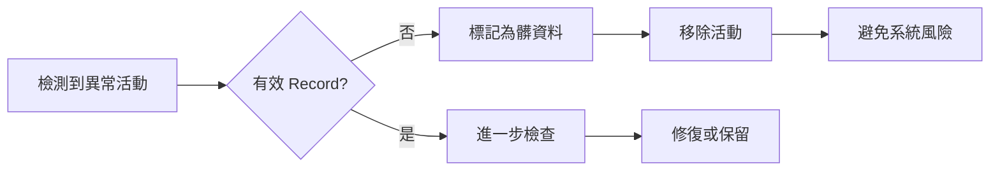
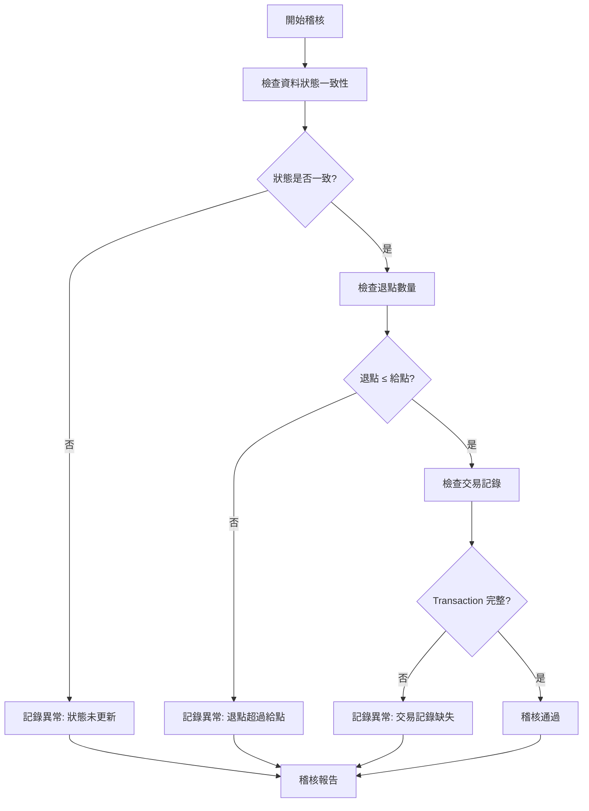
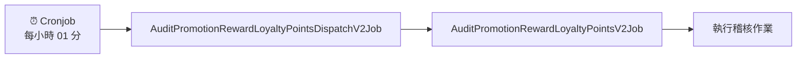
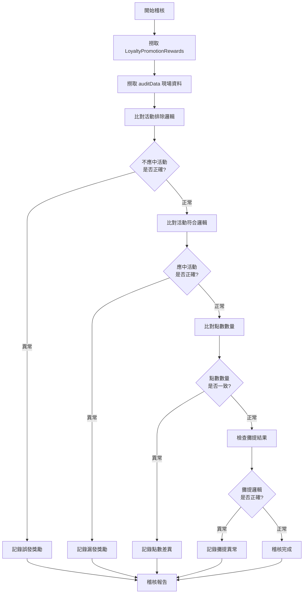
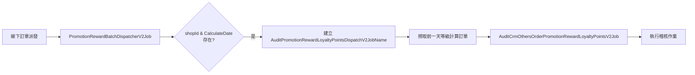
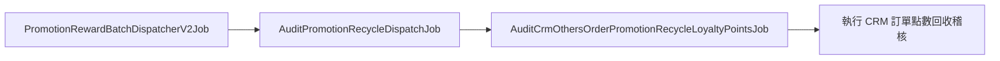
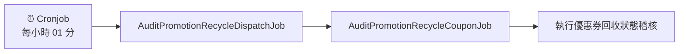

# 稽核文件

## 目錄
1. [CheckPromotionRuleRecordJob](#1-checkpromotionrulerecordjob)
2. [BatchAuditLoyaltyPointsJob](#2-batchauditloyaltypointsjob)
3. [AuditPromotionRewardLoyaltyPointsV2Job.cs](#3-auditpromotionrewardloyaltypointsv2jobcs)
4. [AuditCrmOthersOrderPromotionRewardLoyaltyPointsV2Job](#4-auditcrmothersorderpromotionrewardloyaltypointsv2job)
5. [AuditPromotionRewardLoyaltyPointsDispatchV2Job](#5-auditpromotionrewardloyaltypointsdispatchv2job)
6. [AuditPromotionRecycleLoyaltyPoints](#6-auditpromotionrecycleloyaltypoints)
7. [PromotionRecycleReCalculatePointsRecordAuditor](#7-promotionrecyclerecalculatepointsrecordauditor)
8. [PromotionRecycleCouponDDBStatusAuditor](#8-promotionrecyclecouponddbstatusauditor)
9. [AuditPromotionRecycleCouponJob](#9-auditpromotionrecyclecouponjob)
10. [BatchAuditLoyaltyPoints](#10-batchauditloyaltypoints)

<br>

---

## 1. CheckPromotionRuleRecordJob

### 📋 概述

檢查進行中活動的 RuleRecord 完整性，確保促銷引擎運作正常。

### ⚙️ 輸入參數

| 參數名稱 | 說明 | 格式範例 |
|---------|------|----------|
| `StartDatetime` | 活動時間區間起始 | `2025-03-07T02:00` |
| `EndDatetime` | 活動時間區間結束 | `2025-03-20T02:45` |

### 📄 測試資料範例

```json
{"Data": "{\"StartDatetime\":\"2025-03-07T02:00\",\"EndDatetime\":\"2025-03-20T02:45\"}"}
```

### 🔎 檢查範圍與項目

#### 📊 檢查資料來源

| 資料表 | 檢查範圍 | 說明 |
|--------|----------|------|
| **PromotionEngine** | 指定時間區間內尚未結束的活動 | 活動主表資料 |
| **PromotionRuleRecord** | 每檔活動最新一筆規則記錄 | 活動規則設定 |

#### ✅ 檢核項目清單

1. **🗃️ RuleRecord 存在性**
   - 檢查活動是否有對應的規則記錄

2. **🔑 S3 Key 完整性**
   - 驗證最新 RuleRecord 是否包含 S3 Key

3. **☁️ S3 資料可用性**
   - 確認 S3 檔案實際存在且可存取

4. **🏷️ ProductScope 標籤解析**
   - 解析 ProductScope 並驗證 OuterIdTag 能正確取得 promotionTagId

5. **🔗 資料一致性比對**
   - 比對 S3 的 `S3ProductSkuOuterIds` 與 `PromotionTagSlave_TargetTypeCode`

### ⚠️ 問題處理機制

#### 🚨 異常情況處理

當檢核發現問題活動時：

- **⚠️ 風險評估**: 新增/編輯活動時必定會上傳 S3 並產生對應 Record
- **🗑️ 資料清理**: 若無有效 Record 則視為髒資料，應移除該活動
- **🛡️ 風險防護**: 防止購物車無法進入等系統異常

#### 📋 處理流程



<br>

---

## 2. BatchAuditLoyaltyPointsJob

<br>

### 🔄 2.1 AuditRecycleLoyaltyPointsV2Service

#### 📋 服務概述

負責稽核忠誠點數回收程序的完整性，確保點數回收邏輯與資料庫狀態一致

<br>

#### 📋 觸發條件與時間

1. PromotionRewardBatchDispatcherV2Job 線下訂單派發線下訂單回收點道具稽核當下 + 10/.5hr, source : AuditOfflineRecycleLoyaltyPointsV2
2. AuditRecycleLoyaltyPointsV2 每小時 05 分 稽核前一小時
3. PromotionRewardLoyaltyPointsV2 每小時 01 分 稽核前一小時

<br>

#### 🚨 異常案例分析

**MY 環境 Prod 異常訊息範例:**

```log
[MY][Prod]
點數紀錄稽核異常
ServiceName: AuditRecycleLoyaltyPointsV2Service
ShopId: 200017
異常項目:
MS250703M00020A|8354 查無紀錄

點數回收稽核錯誤：DDB 已還點而狀態未更新 IDs：8354_MG250703M00002_MS250703M00020A_0
```

<br>

#### 💡 快速處理指引

| 步驟 | 操作說明 |
|------|----------|
| **1. 關聯性檢查** | 通常伴隨 `RecycleLoyaltyPointsV2` 觸發 |
| **2. 失敗記錄查詢** | 先查詢是否有 `RecycleLoyaltyPointsV2` 失敗紀錄 |
| **3. 根因分析** | 分析失敗原因並確定修復方案 |

<br>

#### ⚙️ 核心運算邏輯

**實際回收點數計算公式:**

```csharp
// 依活動 ID 取得實際回收點數
var actualRecyclePoints = detailEntities.Sum(detail => detail.LoyaltyPoint) - insufficientPoints;
```

<br>

#### 🔍 稽核檢查項目

##### ❌ 檢查一：資料狀態不一致

**錯誤訊息:** `點數回收稽核錯誤：DDB 已還點而狀態未更新 IDs`

**檢查條件:**
```csharp
detail.Status != nameof(RewardDetailStatusEnum.NoReward) &&
detail.IsRecycle == false &&
detail.Status != nameof(RewardDetailStatusEnum.Recycle) &&
detail.Status != nameof(RewardDetailStatusEnum.Cancel)
```

**說明:** 檢測 DynamoDB 中已執行還點但狀態欄位未正確更新的資料

<br>

##### ⚠️ 檢查二：退點數量異常

**錯誤訊息:** `點數回收稽核錯誤：DDB 發現退點超過給點數量 IDs`

**檢查邏輯:**
```csharp
record.GivingPoints < record.RecyclePoints
```

**說明:** 確保回收點數不超過原始發放點數

<br>

##### 🔗 檢查三：交易記錄完整性

**檢查欄位:**

| 欄位名稱 | 說明 | 必要性 |
|----------|------|--------|
| `LoyaltyPointTransactionOccurTypeId` | 交易發生類型 ID | ✅ 必須存在 |
| `LoyaltyPointTransactionEventTypeDef` | 交易事件類型定義 | ✅ 必須存在 |
| `VipmemberId` | VIP 會員 ID | ✅ 必須存在 |

**異常處理:** 如果缺少任一 Transaction 記錄即觸發稽核異常

<br>

#### 📊 稽核流程圖



<br>

---

## 🎯 3. AuditPromotionRewardLoyaltyPointsV2Job - 促銷獎勵點數稽核作業 V2

### 📋 服務概述

針對促銷活動獎勵點數進行完整性稽核，確保點數發放邏輯正確性與資料一致性。

### ⚙️ 觸發機制

#### 🔄 觸發流程



| 階段 | 服務名稱 | 觸發時機 | 說明 |
|------|----------|----------|------|
| **1** | `Cronjob` | 每小時 01 分 | 定時排程觸發 |
| **2** | `AuditPromotionRewardLoyaltyPointsDispatchV2Job` | 被 Cronjob 觸發 | 派發稽核作業 |
| **3** | `AuditPromotionRewardLoyaltyPointsV2Job` | 被 Dispatch 觸發 | 執行實際稽核 |

### 🛍️ 線上訂單稽核邏輯

#### 📊 Dispatch 選取規則

| 參數 | 說明 | 資料來源 |
|------|------|----------|
| **時間範圍** | 執行時間前 2 小時內的訂單 | `salesOrderGroup` |
| **有效性檢查** | 檢查 `SalesOrderGroup.IsValid` | 資料庫直接查詢 |
| **訂單時間** | `salesOrderGroup.SalesOrderGroupDateTime` | 訂單群組時間戳記 |

#### 🔍 資料撈取邏輯

- **SalesOrderSlaves**: 稽核時直接從資料庫撈取最新資料
- **驗證機制**: 確保訂單群組狀態有效性

### 📄 測試資料範例

```json
//// tw qa
{"Data":"{\"Id\":\"ee932cc0-b476-4cc1-96d5-d7fb1900418c\",\"IdempotencyKey\":\"TG250411L00004\",\"EventName\":\"OrderCreated\",\"EventArgs\":{\"Market\":null,\"ShopId\":5},\"Source\":{\"ShopId\":5,\"PayType\":\"CreditCardOnce_Stripe\",\"TSCount\":1,\"MemberId\":32909,\"CellPhone\":\"88888888\",\"OrderCode\":\"TG250411L00004\",\"UserAgent\":\"Mozilla/5.0 (Windows NT 10.0; Win64; x64) AppleWebKit/537.36 (KHTML, like Gecko) Chrome/134.0.0.0 Safari/537.36\",\"CountryCode\":\"852\",\"HttpReferer\":\"https://cccrrrmmm1.shop.qa1.hk.91dev.tw/V2/ShoppingCart/Index?shopId=5\",\"TotalAmount\":200.0,\"CurrencyCode\":\"HKD\",\"OrderDateTime\":\"2025-04-11T02:20:41.7973958+00:00\"},\"SourceType\":\"Orders\",\"SourceKey\":\"TG250411L00004\",\"CreatedAt\":\"2025-04-11T02:20:42.6189354+00:00\"}"}

//// hk qa
{"Data":"{\"FirstTriggerTime\":\"2025-04-11T14:06:20.4337541+08:00\",\"Id\":\"3ab621a0-2c4a-47e5-9c0e-0d86086c9b46\",\"SourceType\":\"Orders\",\"EventName\":\"OrderCreated\",\"IdempotencyKey\":\"TG250411Q00001\",\"Version\":null,\"SourceKey\":\"TG250411Q00001\",\"CreatedAt\":\"2025-04-11T06:05:52.9052972+00:00\",\"EventArgs\":{},\"Source\":{\"ShopId\":2,\"MemberId\":33132,\"OrderCode\":\"TG250411Q00001\",\"TotalAmount\":721000.0,\"CurrencyCode\":\"HKD\",\"OrderDateTime\":\"2025-04-11T14:05:51.7550714+08:00\",\"PayType\":\"CreditCardOnce_Stripe\",\"CellPhone\":\"934565786\"}}"}
```

### 🔍 3.1 PromotionRewardLoyaltyPointsRecordAuditor - 點數記錄稽核器

#### 📋 稽核機制

**資料比對邏輯:** 使用 `LoyaltyPromotionRewards` 記錄與 `auditData` 現場撈取資料進行交叉驗證

#### ✅ 稽核項目清單

| 稽核類型 | 檢查內容 | 預期結果 | 異常處理 |
|----------|----------|----------|----------|
| **🚫 活動排除檢查** | 不應符合活動條件的訂單 | 未獲得點數獎勵 | 記錄誤發獎勵異常 |
| **✅ 活動符合檢查** | 應符合活動條件的訂單 | 正確獲得點數獎勵 | 記錄漏發獎勵異常 |
| **🔢 點數數量檢查** | 應發放點數 vs 實際發放點數 | 數量完全一致 | 記錄點數差異異常 |
| **📊 攤提結果檢查** | 多檔活動點數攤提計算 | 攤提邏輯正確 | 記錄攤提異常 |

#### 🔄 稽核流程圖



<br>

---

## 🏪 4. AuditCrmOthersOrderPromotionRewardLoyaltyPointsV2Job - CRM 線下訂單獎勵點數稽核

### 📋 服務概述

專門針對 CRM 線下訂單的促銷獎勵點數進行稽核，確保線下交易的點數發放正確性。

### ⚙️ 觸發機制

#### 🔄 觸發流程



#### 📊 觸發條件

| 階段 | 服務名稱 | 觸發條件 | 說明 |
|------|----------|----------|------|
| **1** | `PromotionRewardBatchDispatcherV2Job` | 線下訂單派發時 | 檢查是否有 `shopId` & `CalculateDate` |
| **2** | `AuditPromotionRewardLoyaltyPointsDispatchV2JobName` | 條件符合時建立 | 取得 `shopId` 進行訂單撈取 |
| **3** | `AuditCrmOthersOrderPromotionRewardLoyaltyPointsV2Job` | 撈取到訂單後 | 執行稽核 (不論是否有進行中活動) |

#### ⚡ 重要特性

- **時間範圍**: 撈取前一天等級計算訂單
- **執行條件**: 不管是否有進行中活動都會執行稽核
- **觸發依據**: 基於 `shopId` 和 `CalculateDate` 參數

<br>

---

## 5. AuditPromotionRewardLoyaltyPointsDispatchV2Job

### 📋 服務概述

負責派發促銷獎勵點數稽核作業，支援線上和線下兩種不同的觸發機制。

### 🛍️ 線上訂單處理

#### ⏰ 觸發時機

**Cronjob 定時觸發**: 每小時 01 分執行

#### 📊 訂單選取邏輯

| 參數 | 說明 | 資料來源 |
|------|------|----------|
| **時間範圍** | 執行時間前 2 小時內的訂單 | `salesOrderGroup` |
| **有效性檢查** | 檢查 `SalesOrderGroup.IsValid` | 資料庫驗證 |

#### 🔍 資料對應關係

```
ShopId => salesOrderGroup.ShopId
MemberId => salesOrderGroup.MemberId  
OrderCode => salesOrderGroup.TradesOrderGroupCode
OrderDateTime => salesOrderGroup.OrderDateTime
```

### 🏪 線下訂單處理

#### 🔄 觸發來源

**由 `PromotionRewardBatchDispatcherV2Job` 觸發**

#### 📊 資料對應關係

| 目標欄位 | 資料來源 | 說明 |
|----------|----------|------|
| `ShopId` | `CrmSalesOrderShopId` | 商店 ID |
| `CrmMemberId` | `CrmSalesOrderCrmMemberId` | CRM 會員 ID |
| `CrmSalesOrderId` | `CrmSalesOrderId` | CRM 訂單 ID |
| `TradesOrderFinishDatetime` | `CrmSalesOrderTradesOrderFinishDateTime` | 交易完成時間 |

### 📄 測試資料範例

```json
{"Data":"{\"ExecuteTime\":\"2025-08-14T02:20:41.7973958+00:00\",\"IsCrmOthersOrder\":true,\"ShopId\":2}"}
{"Data":"{\"ExecuteTime\":\"2025-03-18T11:32\",\"ShopId\":2,\"IsCrmOthersOrder\":true}"}
{"Data":"{\"ExecuteTime\":\"2025-03-18T11:32\",\"ShopId\":2,\"IsCrmOthersOrder\":true}"}
{"ExecuteTime":"2025-04-11T00:01:15.6443120+08:00"}
{"Data":"{\"ExecuteTime\":\"2025-04-11T00:01:15.6443120+08:00\"}"}
```

<br>

---

## 6. AuditPromotionRecycleLoyaltyPoints / AuditPromotionRecycleCouponJob

由 AuditPromotionRecycleDispatchJob 派發

### 6.1 Task Data

**測試資料範例**

<br>

```json
{"Data":"{\"ShopId\":2,\"TSCode\":\"TS250903T000003\",\"EventName\":\"\",\"TriggerDatetime\":\"2025-09-03T19:01:30.7072732+08:00\",\"OrderCreateDate\":\"2025-09-03T17:41:45.45\",\"PromotionId\":0,\"PromotionEngineType\":\"\",\"PendingRetryCount\":0,\"CrmSalesOrderSlaveId\":0,\"OrderTypeDefEnum\":\"ECom\",\"MemberId\":0,\"S3Key\":\"\"}"}

{"Data":"{\"ShopId\":2,\"TSCode\":\"TS250917K000001\",\"EventName\":\"\",\"TriggerDatetime\":\"2025-09-17T11:01:27.0909998+08:00\",\"OrderCreateDate\":\"2025-09-17T09:06:37.407\",\"PromotionId\":0,\"PromotionEngineType\":\"\",\"PendingRetryCount\":0,\"CrmSalesOrderSlaveId\":0,\"OrderTypeDefEnum\":\"ECom\",\"MemberId\":0,\"S3Key\":\"\"}"}

```json
{"Data":"{\"ShopId\":2,\"TSCode\":\"TS250918Q000001\",\"EventName\":\"\",\"TriggerDatetime\":\"2025-09-18T16:01:16.3509765+08:00\",\"OrderCreateDate\":\"2025-09-18T14:08:35.017\",\"PromotionId\":0,\"PromotionEngineType\":\"\",\"PendingRetryCount\":0,\"CrmSalesOrderSlaveId\":0,\"OrderTypeDefEnum\":\"ECom\",\"MemberId\":0,\"S3Key\":\"\"}"}
```

<br>


### 🛍️ 6.2 線上訂單處理邏輯

#### ⏰ 時間範圍設定

**資料撈取範圍**: 執行時間前兩小時內的訂單

#### 📋 訂單類型與條件

| 訂單類型 | 資料表 | 時間欄位 | 狀態條件 |
|----------|--------|----------|----------|
| **🚫 取消訂單** | `CancelOrderSlave` | `CancelOrderSlave_UpdatedDateTime` | 狀態為 `Finish` |
| **📦 退貨訂單** | `ReturnGoodsOrderSlave` | `ReturnGoodsOrderSlaveStatusUpdatedDateTime` | 狀態為 `Finish` |

#### 🔍 查詢邏輯說明

- **取消訂單 (`cancelTsCodes`)**:
  - 查詢 `CancelOrderSlave` 表
  - 以 `CancelOrderSlave_UpdatedDateTime` 為時間基準
  - 篩選前兩小時內狀態為 `Finish` 的記錄

- **退貨訂單**:
  - 查詢 `ReturnGoodsOrderSlave` 表  
  - 以 `ReturnGoodsOrderSlaveStatusUpdatedDateTime` 為時間基準
  - 篩選前兩小時內狀態為 `Finish` 的記錄

<br>

---

## 7. AuditCrmOthersOrderPromotionRecycleLoyaltyPointsJob

#### 🔄 觸發流程



| 階段 | 服務名稱 | 說明 |
|------|----------|------|
| **1** | `PromotionRewardBatchDispatcherV2Job` | 線下訂單批次處理觸發 |
| **2** | `AuditPromotionRecycleDispatchJob` | 回收稽核派發作業 |
| **3** | `AuditCrmOthersOrderPromotionRecycleLoyaltyPointsJob` | 執行實際 CRM 訂單點數回收稽核 |

<br>

---

## 8. PromotionRecycleReCalculatePointsRecordAuditor

### 📋 服務概述

稽核促銷點數重新計算記錄的正確性，確保點數重算邏輯與實際記錄一致。

### ⚙️ 觸發來源

#### 🛍️ 線上觸發

**定時觸發**: 每小時 01 分執行
- `AuditPromotionRecycleDispatchJob` ➜ `AuditPromotionRecycleLoyaltyPointsJob`

#### 🏪 線下觸發

**等級計算觸發**: 等級計算完成後執行
- `等級計算` ➜ `AuditCrmOthersOrderPromotionRecycleLoyaltyPointsJob`

<br>

---

## 9. PromotionRecycleCouponDDBStatusAuditor

#### 🛍️ 線上觸發

**定時觸發**: 每小時 01 分執行

#### 🔄 觸發流程



<br>

---

## 10. BatchAuditLoyaltyPoints

#### 🔄 處理架構

**主要處理器**: `LoyaltyPointWorker`

#### ⏰ 執行時機

**點數回收稽核**: 每小時 01 分執行

### 🛠️ 服務類別

| 服務類型 | 服務名稱 | 適用環境 | 說明 |
|----------|----------|----------|------|
| **🛍️ 線上服務** | `AuditRecycleLoyaltyPointsV2Service` | 線上訂單 | 處理電商平台訂單的點數稽核 |
| **🏪 線下服務** | `AuditOfflineRecycleLoyaltyPointsV2Service` | 線下訂單 | 處理實體店面訂單的點數稽核 |
| **🎁 道具服務** | `BaseAuditLoyaltyPointsService.cs` | 道具相關 | 處理虛擬道具相關的點數稽核 |