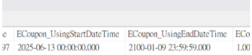

# Coupon 文件

## 目錄
1. [為什麼主檔 UsingEndatetime 時間很怪](#1-為什麼主檔-usingendatetime-時間很怪)
2. [CouponAPI InsertCoupon](#2-couponapi-insertcoupon)
3. [卡太久券過期](#3-卡太久券過期)
4. [回饋活動券資訊 - 購物車 UI 開發紀錄](#4-回饋活動券資訊---購物車-ui-開發紀錄)

<br>

---

## 1. 為什麼主檔 UsingEndatetime 時間很怪



<br>

因為不是預產券，所以其實要看子檔發送當下的時間作為 StartDatetime，+ 10 天作為 EndDatetime

<br>

---

## 2. CouponAPI InsertCoupon

### Payload

<br>

```json
{
    "Id": 0,
    "VerificationToken": "",
    "ShopId": 2,
    "Name": "1",
    "Description": "1",
    "PurposeDef": "Marketing",
    "TypeDef": "Code",
    "StartDateTime": "2025-06-12T16:00:00.000Z",
    "EndDateTime": "2099-12-31T15:59:00.000Z",
    "UsingStartDateTime": "2025-06-12T04:00:00.000Z",
    "UsingEndDateTime": "2025-06-13T04:00:00.000Z",
    "DiscountPrice": 1,
    "TotalDiscountPrice": 100,
    "TotalQty": 1,
    "QtyLimit": 100,
    "Code": null,
    "IsSingleCode": true,
    "CreatedDateTime": "2025-06-12T02:25:33.331Z",
    "CreatedUser": "",
    "IsAppDrawOut": true,
    "IsWebDrawOut": true,
    "IsLocationWizardDrawOut": false,
    "HasGenerateCode": false,
    "Status": "Unstarted",
    "MaxDiscountLimit": 70,
    "HasUsingMinPrice": false,
    "UsingMinPrice": 0,
    "IsOnline": true,
    "IsOffline": false,
    "BarCodeTypeDef": "",
    "IsUsingCustomVerificationCode": false,
    "CustomVerificationCodeNumber": 0,
    "IsSingleCustomVerificationCode": false,
    "SingleCustomVerificationCode": "",
    "ECouponCustomVerificationCodeSourceList": [],
    "ExchangePointCost": 0,
    "DiscountTypeDef": "ByPrice",
    "DiscountPercent": 1,
    "ECouponPromotionTagMapping": null,
    "TicketDisplayText": "1",
    "OuterPromotionCode": "",
    "Image": null,
    "CustomInfo": null,
    "ECouponMemberTier": null,
    "UseDurationType": "Relative",
    "UseAfterDay": 0,
    "UseDurationDay": 10,
    "IsOfferBySystem": true,
    "CustomSingleCode": "",
    "IsUsingCustomSingleCode": false,
    "SalePageIdList": [],
    "IsExchangeLocation": false,
    "ExchangeLocationIdList": [],
    "CalculateTypeDef": "Promotion",
    "PieceThreshold": null,
    "PromotionShippingMappingList": null,
    "MultiMonthECoupon": null,
    "IsFromDuplicate": false,
    "SourceDuplicateECouponId": 0,
    "RemindCount": 0,
    "CatalogIds": [],
    "ECouponCustomId": 0,
    "IsOuter": false,
    "OuterUrl": "",
    "IsShowTotalQty": false,
    "MaxQtyPerDispatch": 0,
    "MaxDispatchCount": 0,
    "IsTransferable": false,
    "MemberCollectionIdList": [],
    "MemberCollectionDisplayName": "",
    "OrderMaxDiscountRate": 0.5,
    "IsVisibleOnSalePage": false,
    "SalePagePromoDisplayName": "",
    "IsStackable": false,
    "CombinedPromotions": null,
    "ECouponModes": [
        "PromotionReward"
    ]
}
```

<br>

---

## 3. 卡太久券過期

發券若被退貨卡住太久可能會導致拿到券不能使用，因為排程執行時間會一直往後壓，導致 Coupon 的 UsingEndDatetime 過期

<br>

---

## 4. 回饋活動券資訊 - 購物車 UI 開發紀錄

### 4.1 購物車 API

<br>

```
/api/carts/create
```

<br>

### 4.2 新增節點與規格

<br>

#### 活動回饋券資訊列表

<br>

**參數名稱：** PromotionRewardCouponInfoList

<br>

#### 單筆回饋券內容

<br>

- **CouponId（long）** 優惠券 ID
- **TicketDisplayText（string）** 券面顯示文字
- **DiscountAmount（decimal）** 折抵金額
- **DiscountRate（decimal）** 折數（可選，例：0.9 表示九折, 免運 0）
- **DisplayTypeDef（enum）** 券種

<br>

#### DisplayTypeDef 券種說明

<br>

**顯示用券種**

<br>

- **Discount：** 折價券
- **Gift：** 贈品券
- **Custom：** 自訂券
- **Shipping：** 運費券

<br>

#### 券種節點名稱調整

<br>

**節點名稱：** DiscountTypeDef

<br>

**說明**

<br>

| DiscountTypeDef | 說明 |
|-----------------|------|
| FreeShippingByPrice | 運費折現 |
| FreeShippingByPercent | 運費打折 |
| ByPercent | 折價券(打折) |
| ByPrice | 折價券(折現) |
| Gift | 贈品券 |
| FreeShipping | 免運 |
| Custom | 自訂券 |

<br>

若券種為 Custom，可搭配欄位 CustomName 呈現自訂券種名稱。

<br>

### 4.3 coupon-info 測試資料

<br>

```json
{
  "couponIdList": [
    29125,
    29085,
    28545,
    28547,
    28561,
    28562,
    28641,
    21792,
    21794,
    21795,
    21823,
    21824,
    21825
  ]
}
```

<br>

### 4.4 自訂券資料 table

<br>

**Table Name：** ECouponCustom

<br>