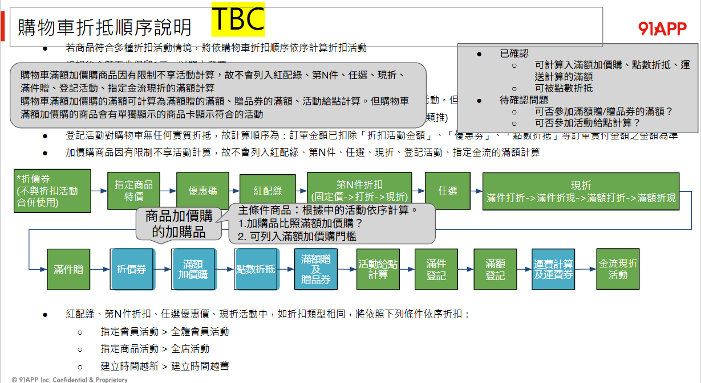

`https://promotion-api-frontend-internal.qa1.hk.91dev.tw`
`/api/cart-calculate`
- `/api/basket-calculate`

## 回饋活動加入全新的活動類型需實作

新增回饋活動類型時需要實作的檔案列表

 

- **PromotionConditionTypeEnum.cs**
- **PromotionEngineTypeDefEnum.cs**
- **PromotionEngineForCartEntity.cs**
- **PromotionEngineRuleEntity.cs**
- **新增 PromotionRewardCouponRuleEntity.cs**
- **套件升級**
- **ProcessRepository.cs**
- **S3LocationRepository.cs**
- **PromotionEngineService.cs**
- **新增 RewardReachPriceWithCouponRuleService.cs**
- **PromotionRuleRepository.cs**
- **Program.cs**
- **PromotionTagOuterIdRepository.cs**
- **S3OuterIdRepository.cs**

 

## 關於 Priority

#### GetProcessGroupList

拉出 group list 會有 priority，最後面是 bottom group

####　CalculateByProcessGroupAsync

會 order by priority 依序計算

 

#### CreateGroupContext

每個 group 會 GetProcessRuleList，把每個 group 的活動類型都拉出來，且活動類型也都有 priority，到引擎處理步驟，這邊會先設定進去 `groupContext.ProcessRuleList`

 

#### LoadRules

這邊會依據活動類型設定的 priority 設定 `rule.Priority`，最後促購引擎依據 priority 排序 如果排序相同就依據 Id , for loop 依序計算

 
 

## 活動類型的說明

#### 🔹 一、折價券（不與折扣活動合併使用）

意義：
折價券是一種「一次性抵用券」，通常用於推廣或回饋會員。
它直接減少結帳金額，但為了避免重複折扣，常設為「不與其他活動併用」。

折扣邏輯：

結帳金額 – 折價券面額
（不再進行後續折扣活動）

例子：
你有一張「全館滿 1000 折 200」折價券。
若購物車金額為 $1200，折完後直接是 $1000，
而不再參加「滿額打 9 折」或「第 N 件半價」等其他活動。

#### 🔹 二、優惠碼（Promo Code）

意義：
用來「觸發」或「解鎖」某些特定活動或價格。
例如季節活動、VIP 活動、或內部測試活動。

折扣邏輯：
輸入正確優惠碼 → 開啟指定活動（例如現折、免運、特定商品打折）。

例子：
結帳時輸入 SUMMER10 → 全館商品 9 折。
若沒輸入就不享優惠。

#### 🔹 三、紅配綠（商品組合活動）

意義：
將兩種（或多種）商品搭配一起以優惠價出售。
常見於「A+B 組合價」或「指定品項搭配購」。

折扣邏輯：
特定商品搭配後，整組固定一個組合價（覆蓋原單價）。

例子：
紅茶 $80、綠茶 $80，
若一起買，組合價 $120（相當於平均每件 $60）。

#### 🔹 四、第 N 件折扣（固定價 → 打折 → 現折）

意義：
針對同品項多件購買提供階梯式優惠。
例如「第 2 件半價」或「第 3 件 $99」。

折扣邏輯：

固定價：第 N 件改成指定金額

打折：第 N 件依比例折扣

現折：第 N 件直接減多少金額

例子：
T-shirt 原價 $500
活動：第 2 件半價 → 第二件只要 $250
總價：$500 + $250 = $750。

#### 🔹 五、任選（Mix & Match）

意義：
顧客自由選擇多個商品湊成一組，達條件即享優惠。

折扣邏輯：
滿 N 件後，每件以固定價、或整組打折。

例子：
任選三件 1000 元（原價單件 400 元）。
買 3 件後，平均單價降為 $333.33。

#### 🔹 六、現折（滿件折 → 滿件折現 → 滿額折 → 滿額折現）

意義：
這類是購物車層級活動，針對整體件數或金額給折扣。
它常是「最後一層」的整體價值優惠。

折扣邏輯：

滿件折：滿 3 件打 9 折

滿件折現：滿 3 件折 $100

滿額折：滿 $2000 打 9 折

滿額折現：滿 $2000 折 $200

例子：
購物車總額 $2500，滿 $2000 折 $200 → 結帳金額 $2300。

#### 🔹 七、滿件贈

意義：
買到一定件數，贈送指定商品。
（屬於「贈品型權益」，不直接折價。）

折扣邏輯：
達門檻即送，不改價格。

例子：
滿 3 件送杯子。
買 3 件衣服，就會自動加進贈品「品牌杯子」。

#### 🔹 八、抵價券（購物車現金券）

意義：
等同「抵用券」或「購物金」，直接折抵應付金額。
不同於「折價券」，它通常可與其他活動併用。

折扣邏輯：

結帳金額 – 抵價券面額

例子：
購物金 $100，可直接用在折扣後的小計上。
若折扣後金額 $950 → 抵掉 $100 → 實付 $850。

#### 🔹 九、加價購

意義：
達成特定門檻後，可用更低價格購買指定商品。
是一種「額外購買權」。

折扣邏輯：
當滿額條件成立後，系統開放加價購商品以特價加入購物車。

例子：
滿 $1000 可加購行李袋 $199（原價 $499）。
若消費未滿 1000，就無法以 199 購買。

#### 🔹 十、點數折抵

意義：
會員用累積的點數直接抵現金。
屬於支付型折抵。

折扣邏輯：

每 1 點 = $1
結帳金額 – 點數折抵金額

例子：
小計 $1200，使用 200 點 → 實付 $1000。

#### 🔹 十一、滿額贈

意義：
滿一定金額贈送商品或回饋。
通常與「滿件贈」並列，但門檻以金額為準。

折扣邏輯：
達門檻即送，不改金額。

例子：
滿 $2000 送品牌環保袋。
買 $2200 商品 → 自動獲贈環保袋。

#### 🔹 十二、活動給點計算

意義：
根據實際付款金額回饋會員點數。
點數多用於下次購物折抵或會員等級計算。

折扣邏輯：

回饋點數 = 可回饋金額 × 回饋比例

例子：
可回饋金額 $1000，比例 5% → 回饋 50 點。

#### 🔹 十三、滿件登記／滿額登記

意義：
用於後續抽獎或登錄活動（例如上傳發票、贈獎追蹤）。
不折價，但會紀錄會員參加資格。

例子：
滿 3 件即可登記抽 Dyson 吹風機。
系統會自動上傳登記紀錄。

#### 🔹 十四、運費計算

意義：
依最終應付金額或件數計算運費，並判斷是否免運。
放在最後是因為折扣後金額才準。

折扣邏輯：

若折扣後金額 ≥ 免運門檻 → 運費 $0

否則 → 運費依店家設定（如 $60）

例子：
免運門檻 $999，折扣後金額 $950 → 運費 $60。

#### 🔹 十五、指定金物流活動

意義：
與付款方式或物流方式綁定的活動，
例如「用 LINE Pay 滿 500 折 50」、「超商取貨享 95 折」。

折扣邏輯：
符合條件即折抵，通常依實付金額計算。

例子：
用 LINE Pay 結帳滿 $500 折 $50 → 實付 $450。
用信用卡結帳則不適用。

## 順序

#### 滿件贈放太早，會算錯件數

- 「滿 3 件送杯子」 → 滿件贈活動
- 「任選 3 件 1000 元」 → 任選活動

1️⃣ 如果先跑滿件贈

系統看到「A、B、C 共 3 件」 → ✅ 滿件贈成立 → 給贈品。

2️⃣ 接著跑「任選 3 件 1000 元」活動，系統會把這三件歸為一組「任選活動組」，有時會標記成「已享任選優惠，不再參加其他贈品活動」

→ 結果就變成「贈品應該不給」，但因為你早就給了，就產生錯誤

=> 任選的計算行為會影響滿件贈的件數判定!

某些進階邏輯會要求贈品要以「特定活動後仍有效的商品」為基準計件。如果任選後將某些商品標記為「活動商品（已優惠價處理）」，
那這些商品不應再列入滿件贈的統計。若滿件贈在任選之前執行，就會誤把那些「已打任選優惠」的商品也算進件數裡。

滿件贈雖然只看件數，但「哪些商品算進件數」是在任選活動確定後才會穩定。如果你在任選之前就跑滿件贈，之後任選活動可能會重新分組、排除或標記商品，使前面算出的贈品資格失效或錯誤

已經把商品群組與參與狀態穩定下來，滿件贈依據最終商品清單來判斷，後面滿額贈再看折扣後金額。

#### 紅配綠（搭配/組合價、Mix & Match）為何在那麼前面

會改變「哪些品項被視為一組」、「套用特定組合價」，屬定價結構，所以要在門檻類活動之前完成。若先跑滿件/滿額，後來才把商品重組，門檻結果會翻盤。

#### 固定價 / 比例折 / 現折

| 類型      | 意義          | 計算方式                         | 對金額的影響      |
| ------- | ----------- | ---------------------------- | ----------- |
| 固定價（覆寫） | 把原價直接改成指定價格 | `$Price = 固定值`               | 改變基準價（新的起點） |
| 比例折（%）  | 按百分比打折      | `$Price = Price × (1 - 折扣%)` | 根據基準價計算折扣   |
| 現折（-$）  | 直接減掉金額      | `$Price = Price - 固定金額`      | 最後再直接減金額    |

「固定價」：改變了起點
「比例折」：依據當前價算百分比
「現折」：最後再直接扣錢

#### 固定架要在前面

✅ 正確順序（固定 → 比例 → 現折）

- 原價：$500
- 固定價：$250  (覆寫)
- 打9折：$225
- 現折$20：$205

結果清晰、順序合理。

❌ 錯誤順序（比例 → 現折 → 固定）

- 原價：$500
- 打9折：$450
- 現折$20：$430
- 固定價$250：$250（覆蓋掉前面折扣）

→ 造成折扣「重複吃掉」或「失效」。

#### 比例 → 現折?

**➤ 正確順序：先比例 → 再現折**

假設原價是 $1000有兩個折扣：

- 打 9 折（比例折）
- 再折 $100（現折）

$1000 × 0.9 = $900
$900 - 100 = $800

最終價格：$800 ✅
實際折扣率：20%

**➤ 順序反過來：先現折 → 再比例**

$1000 - 100 = $900
$900 × 0.9 = $810

最終價格：$810 ❌
實際折扣率：19%

➡️ 結果相差 $10，看似小，但在大量訂單、疊加活動時會累積誤差。
更重要的是，顧客與行銷團隊會覺得「我不是說再折 $100 嗎？為什麼打完折再折變少了？」

符合顧客對「折上折」的直覺

#### 先判條件、再給權益（贈品/點數），最後才算物流與金流活動

因為運費、金流回饋往往跟「應付金額、配送方式、付款方式」綁在一起，必須在所有折抵之後。

#### 先滿件贈 再滿額贈

- 希望滿額贈的贈品不影響滿件的判斷多送

| 階段  | 條件   | 是否穩定       | 結果          |
| --- | ---- | ---------- | ----------- |
| 滿件贈 | 件數固定 | 穩定         | 判斷一次即可，不需重算 |
| 滿額贈 | 金額可變 | 需後續折扣穩定後再算 | 減少錯誤與重算     |

這樣流程乾淨：
1️⃣ 商品層折扣完後，件數已確定。
2️⃣ 再判斷滿件贈，因為它不會受後續金額影響。
3️⃣ 最後再跑滿額贈，因為它要看折扣後金額。

❌ 若順序反過來：滿額贈在前

就會出現這種狀況：

系統算出折扣前金額 $2500 → ✅ 滿額送袋子。
接著折價券 -$800 → 剩 $1700。
客戶實際不達滿額 → 應撤贈。
若系統沒撤 → 成本錯；若有撤 → 客戶覺得「剛剛明明有送，怎麼又不見？」

這叫「贈品閃爍問題（Gift Flicker）」，是實務上最常造成客服爭議與行銷錯帳的狀況

## 如果呼叫 base

- since & until
- IsSalesChannelMatched
- IsUserScopeMatched
- IsBirthdayMonthEnabled (context.Consumer.Tags == CurrentBirthdayMonth)
- IsConsumerTagMatched (首購)
- matchUserScopes

活動指定會員等級

促購前台

PromotionEngineRuleBaseService.cs => DeserializePromotionRule
=> //// 取得活動指定會員等級

## 為什麼現金折價放最後

1️⃣ 不應影響上層活動的「滿額計算」

若現折提早套用，會導致滿額活動（如滿1000折100）計算錯誤。
例：

原價 $1050

若先現折 $50 → 變成 $1000

滿額活動門檻 $1000，可能會被誤判「剛好」或「不符」

所以現折必須在最後、所有滿額與加價購都算完後才執行。

2️⃣ 與「金流運算」綁定（非商品層級）

現折常發生於「結帳／付款」階段，而非「購物車商品」階段。
例如：

折抵券、紅包、電子錢包餘額，都屬於付款時的現金折讓

因此它需要在「運費計算及運費抵用券」之後才執行

3️⃣ 保留折抵透明性與可追蹤性

若先執行現折，會讓前面的「活動給點」或「滿額贈」出現難以追蹤的金額基礎。
因此，現折在最後階段做，能確保：

所有行銷活動的門檻與回饋基準一致

現折僅影響「最終應付金額」，不改變任何「活動滿額基準」