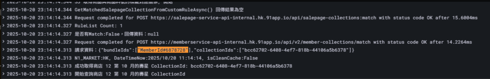
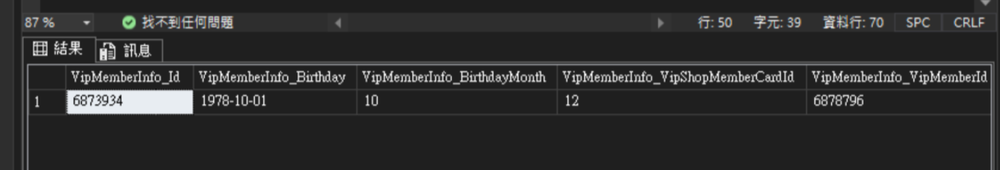
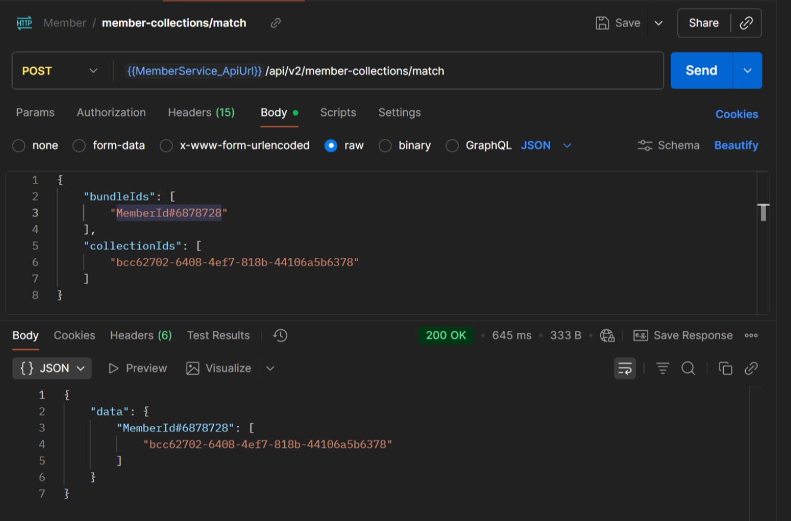

# Promotion FrontEnd 文件

## 目錄
1. [API](#api)
2. [菜籃計算](#菜籃計算)
3. [生日壽星貼標](#生日壽星貼標)
4. [加價購](#加價購)
5. [回饋活動加入全新的活動類型需實作](#回饋活動加入全新的活動類型需實作)
6. [計算過程發生錯誤 - salepage collection](#計算過程發生錯誤---salepage-collection)
7. [促購前台計算排序](#促購前台計算排序)
8. [確實為當月壽星應中沒中](#確實為當月壽星應中沒中)

<br>

---

## API

`https://promotion-api-frontend-internal.qa1.hk.91dev.tw`
`/api/cart-calculate`

<br>

---

## 菜籃計算

### Request Body 範例

**Qty 會被拆出來，-1 也會被改成 1**

<br>
SAMPLE1
```json
{
  "PromotionRuleId": 0,
  "PromotionRuleIds": [7286],
  "PromotionRules": [
    {
      "Id": 7286,
      "Type": "RewardReachPriceWithPoint2",
      "Rule": "{\"TypeFullName\":\"NineYi.Msa.Promotion.Rule.RewardReachPriceWithPoint2\",\"Id\":7286,\"Name\":\"回饋給點測試改的結果ALLEN\",\"Enabled\":true,\"Description\":\"回饋給點測試改的結果ALLEN\",\"Since\":\"2025-06-24T17:00:00+08:00\",\"Until\":\"2025-06-28T00:00:59.997+08:00\",\"UpdatedAt\":\"2025-06-24T15:33:24.443296+08:00\",\"Cyclable\":true,\"Accumulated\":false,\"IncludedProductScopes\":[{\"ProductScopeType\":\"NineYi.Msa.Promotion.Engine.AllProductScope\"}],\"ExcludedProductScopes\":null,\"IncludeRegionScopes\":[{\"RegionScopeType\":\"NineYi.Msa.Promotion.Engine.AllCountryRegionScope\"}],\"MatchedUserScopes\":[{\"UserScopeType\":\"NineYi.Msa.Promotion.Engine.AllUserScope\"}],\"VisibleUserScopes\":[{\"UserScopeType\":\"NineYi.Msa.Promotion.Engine.AllUserScope\"}],\"MatchedSalesChannels\":31,\"VisibleSalesChannels\":31,\"IncludedLocationScopes\":[{\"LocationScopeType\":\"NineYi.Msa.Promotion.Engine.AllLocationScope\"}],\"IsLimitedAddOnsPurchaseQty\":false,\"Thresholds\":{\"AllUserScope\":{\"ReachPricePointPairs\":[{\"ReachPrice\":10.0,\"Point\":6.0}]}},\"PointUntil\":{\"UntilType\":1,\"AfterDays\":10,\"UntilYearOffset\":0,\"UntilYearMonth\":12,\"FixedDate\":\"0001-01-01T00:00:00\"}}"
    }
  ],
  "CalculateDateTime": "2025-06-24T17:34:26.1891521+08:00",
  "PromotionSourceType": 0,
  "Shop": {
    "Id": 0,
    "Tags": []
  },
  "User": {
    "Id": "33671",
    "Tags": [
      "AllUserScope",
      "CrmShopMemberCard:24"
    ],
    "OuterId": "5500033674",
    "ShopMemberCode": "zoPVY9eLYe0vnBaSGUJETA=="
  },
  "Shipping": {
    "ShippingProfileTypeDef": null,
    "ShippingAreaId": 0,
    "CountryProfileId": 0,
    "LocationId": 35
  },
  "Payment": {
    "PayProfileTypeDef": null
  },
  "Channel": "InStore",
  "CurrencyDecimalDigits": 2,
  "SalepageSkuList": [
     {
      "SalepageId": 0,
      "SkuId": 0,
      "Price": 8,
      "SuggestPrice": 0,
      "Qty": 1,
      "Flags": [],
      "OuterId": "",
      "Tags": null,
      "OptionalTypeDef": "",
      "OptionalTypeId": 0,
      "CartExtendInfoItemGroup": 828042,
      "CartExtendInfoItemType": "TradesOrderSlaveId",
      "PointsPayPair": null,
      "CartExtendInfos": [],
      "CartId": 0
    },
    {
      "SalepageId": 0,
      "SkuId": 0,
      "Price": 7,
      "SuggestPrice": 0,
      "Qty": 1,
      "Flags": [],
      "OuterId": "",
      "Tags": null,
      "OptionalTypeDef": "",
      "OptionalTypeId": 0,
      "CartExtendInfoItemGroup": 828040,
      "CartExtendInfoItemType": "TradesOrderSlaveId",
      "PointsPayPair": null,
      "CartExtendInfos": [],
      "CartId": 0
    },
    {
      "SalepageId": 0,
      "SkuId": 0,
      "Price": 6,
      "SuggestPrice": 0,
      "Qty": 1,
      "Flags": [],
      "OuterId": "",
      "Tags": null,
      "OptionalTypeDef": "",
      "OptionalTypeId": 0,
      "CartExtendInfoItemGroup": 828038,
      "CartExtendInfoItemType": "TradesOrderSlaveId",
      "PointsPayPair": null,
      "CartExtendInfos": [],
      "CartId": 0
    },
    {
      "SalepageId": 0,
      "SkuId": 0,
      "Price": -6,
      "SuggestPrice": 0,
      "Qty": 1,
      "Flags": [],
      "OuterId": "",
      "Tags": null,
      "OptionalTypeDef": "",
      "OptionalTypeId": 0,
      "CartExtendInfoItemGroup": 828037,
      "CartExtendInfoItemType": "TradesOrderSlaveId",
      "PointsPayPair": null,
      "CartExtendInfos": [],
      "CartId": 0
    }
  ],
  "FeeList": [],
  "Promotion": {
    "Code": null,
    "PromoCodePoolGroupId": null,
    "SelectedDesignatePaymentPromotionId": 0
  },
  "CouponSetting": {
    "MultipleRedeem": {
      "Discount": {
        "IsMultiple": false,
        "Qty": 1
      },
      "Gift": {
        "IsMultiple": true,
        "Qty": 9999
      },
      "Shipping": {
        "IsMultiple": false,
        "Qty": 1
      }
    },
    "CouponList": [],
    "Options": {
      "IsVerbose": false,
      "IsCouponPreSelect": null,
      "IncludeRecordDetail": true
    },
    "LoyaltyPoint": {
      "CheckoutPoint": 0,
      "CheckoutDiscountPrice": null,
      "IsSelected": false,
      "IsSetDiscountPrice": false,
      "TotalPoint": 0
    }
  }
}
```

SAMPLE2
Request
```json
{
  "promotionRules": [
    {
      "id": 34656,
      "type": "RewardReachPriceWithRatePoint2",
      "rule": {
        "TypeFullName": "NineYi.Msa.Promotion.Rule.RewardReachPriceWithRatePoint2",
        "Id": 34656,
        "Name": "(新制)滿10訂單完成後4天贈120%，最多贈2345點",
        "Enabled": true,
        "Description": "(新制)滿10訂單完成後4天贈120%，最多贈2345點",
        "Since": "2025-07-17T18:00:00+08:00",
        "Until": "2025-09-06T00:00:59.997+08:00",
        "UpdatedAt": "2025-07-17T17:40:45.9425521+08:00",
        "Cyclable": false,
        "Accumulated": false,
        "IncludedProductScopes": [
          {
            "ProductScopeType": "NineYi.Msa.Promotion.Engine.AllProductScope"
          }
        ],
        "ExcludedProductScopes": null,
        "IncludeRegionScopes": [
          {
            "RegionScopeType": "NineYi.Msa.Promotion.Engine.AllCountryRegionScope"
          }
        ],
        "MatchedUserScopes": [
          {
            "UserScopeType": "NineYi.Msa.Promotion.Engine.AllUserScope"
          }
        ],
        "VisibleUserScopes": [
          {
            "UserScopeType": "NineYi.Msa.Promotion.Engine.AllUserScope"
          }
        ],
        "MatchedSalesChannels": 31,
        "VisibleSalesChannels": 31,
        "IncludedLocationScopes": [
          {
            "LocationScopeType": "NineYi.Msa.Promotion.Engine.AllLocationScope"
          }
        ],
        "IsLimitedAddOnsPurchaseQty": false,
        "Thresholds": {
          "AllUserScope": {
            "ReachPriceRatePointPairs": [
              {
                "ReachPrice": 10.0,
                "Rate": 1.2
              }
            ],
            "MaximumPoints": 2345.0
          },
          "PointUntil": {
            "UntilType": 2,
            "AfterDays": 0,
            "UntilYearOffset": 0,
            "UntilYearMonth": 8,
            "FixedDate": "0001-01-01T00:00:00"
          },
          "PointCalculateType": 1
        }
      }
    }
  ],
  "promotionSourceType": "Promotion",
  "channel": "InStore",
  "promotionRuleIds": [
    34656
  ],
  "options": {
    "isVerbose": false,
    "isCouponPreSelect": null,
    "includeRecordDetail": true
  },
  "calculateDateTime": "2025-08-28T18:17:00+08:00",
  "shipping": {
    "shippingProfileTypeDef": null,
    "shippingAreaId": 0,
    "countryProfileId": 0,
    "locationId": 9
  },
  "isMemberCollectionRequired": false,
  "user": {
    "id": "4190299",
    "tags": [
      "AllUserScope",
      "CrmShopMemberCard:10"
    ],
    "outerId": "5104190236",
    "shopMemberCode": "6bX6x2/YuowTUrdlVsHVSQ=="
  },
  "currencyDecimalDigits": 2,
  "salepageSkuList": [
    {
      "salepageId": 0,
      "skuId": 0,
      "price": 50,
      "suggestPrice": 0,
      "qty": 1,
      "flags": [],
      "outerId": "All02",
      "tags": null,
      "optionalTypeDef": "",
      "optionalTypeId": 0,
      "cartExtendInfoItemGroup": 85663282,
      "cartExtendInfoItemType": "TradesOrderSlaveId",
      "pointsPayPair": null,
      "isExcludedLoyaltyPoint": false
    },
    {
      "salepageId": 0,
      "skuId": 0,
      "price": 50,
      "suggestPrice": 0,
      "qty": 1,
      "flags": [],
      "outerId": "All02",
      "tags": null,
      "optionalTypeDef": "",
      "optionalTypeId": 0,
      "cartExtendInfoItemGroup": 85663282,
      "cartExtendInfoItemType": "TradesOrderSlaveId",
      "pointsPayPair": null,
      "isExcludedLoyaltyPoint": false
    },
    {
      "salepageId": 0,
      "skuId": 0,
      "price": 50,
      "suggestPrice": 0,
      "qty": 1,
      "flags": [],
      "outerId": "All02",
      "tags": null,
      "optionalTypeDef": "",
      "optionalTypeId": 0,
      "cartExtendInfoItemGroup": 85663282,
      "cartExtendInfoItemType": "TradesOrderSlaveId",
      "pointsPayPair": null,
      "isExcludedLoyaltyPoint": false
    },
    {
      "salepageId": 0,
      "skuId": 0,
      "price": 50,
      "suggestPrice": 0,
      "qty": 1,
      "flags": [],
      "outerId": "All02",
      "tags": null,
      "optionalTypeDef": "",
      "optionalTypeId": 0,
      "cartExtendInfoItemGroup": 85663282,
      "cartExtendInfoItemType": "TradesOrderSlaveId",
      "pointsPayPair": null,
      "isExcludedLoyaltyPoint": false
    },
    {
      "salepageId": 0,
      "skuId": 0,
      "price": 50,
      "suggestPrice": 0,
      "qty": 1,
      "flags": [],
      "outerId": "All02",
      "tags": null,
      "optionalTypeDef": "",
      "optionalTypeId": 0,
      "cartExtendInfoItemGroup": 85663282,
      "cartExtendInfoItemType": "TradesOrderSlaveId",
      "pointsPayPair": null,
      "isExcludedLoyaltyPoint": false
    },
    {
      "salepageId": 0,
      "skuId": 0,
      "price": -50,
      "suggestPrice": 0,
      "qty": 1,
      "flags": [],
      "outerId": "All02",
      "tags": null,
      "optionalTypeDef": "",
      "optionalTypeId": 0,
      "cartExtendInfoItemGroup": 85767130,
      "cartExtendInfoItemType": "TradesOrderSlaveId",
      "pointsPayPair": null,
      "isExcludedLoyaltyPoint": false
    },
    {
      "salepageId": 0,
      "skuId": 0,
      "price": -50,
      "suggestPrice": 0,
      "qty": 1,
      "flags": [],
      "outerId": "All02",
      "tags": null,
      "optionalTypeDef": "",
      "optionalTypeId": 0,
      "cartExtendInfoItemGroup": 85767130,
      "cartExtendInfoItemType": "TradesOrderSlaveId",
      "pointsPayPair": null,
      "isExcludedLoyaltyPoint": false
    },
    {
      "salepageId": 0,
      "skuId": 0,
      "price": -50,
      "suggestPrice": 0,
      "qty": 1,
      "flags": [],
      "outerId": "All02",
      "tags": null,
      "optionalTypeDef": "",
      "optionalTypeId": 0,
      "cartExtendInfoItemGroup": 85767130,
      "cartExtendInfoItemType": "TradesOrderSlaveId",
      "pointsPayPair": null,
      "isExcludedLoyaltyPoint": false
    },
    {
      "salepageId": 0,
      "skuId": 0,
      "price": -50,
      "suggestPrice": 0,
      "qty": 1,
      "flags": [],
      "outerId": "All02",
      "tags": null,
      "optionalTypeDef": "",
      "optionalTypeId": 0,
      "cartExtendInfoItemGroup": 85767130,
      "cartExtendInfoItemType": "TradesOrderSlaveId",
      "pointsPayPair": null,
      "isExcludedLoyaltyPoint": false
    },
    {
      "salepageId": 0,
      "skuId": 0,
      "price": -50,
      "suggestPrice": 0,
      "qty": 1,
      "flags": [],
      "outerId": "All02",
      "tags": null,
      "optionalTypeDef": "",
      "optionalTypeId": 0,
      "cartExtendInfoItemGroup": 85767130,
      "cartExtendInfoItemType": "TradesOrderSlaveId",
      "pointsPayPair": null,
      "isExcludedLoyaltyPoint": false
    },
    {
      "salepageId": 0,
      "skuId": 0,
      "price": 25,
      "suggestPrice": 0,
      "qty": 1,
      "flags": [],
      "outerId": "All01",
      "tags": null,
      "optionalTypeDef": "",
      "optionalTypeId": 0,
      "cartExtendInfoItemGroup": 85663281,
      "cartExtendInfoItemType": "TradesOrderSlaveId",
      "pointsPayPair": null,
      "isExcludedLoyaltyPoint": false
    },
    {
      "salepageId": 0,
      "skuId": 0,
      "price": 25,
      "suggestPrice": 0,
      "qty": 1,
      "flags": [],
      "outerId": "All01",
      "tags": null,
      "optionalTypeDef": "",
      "optionalTypeId": 0,
      "cartExtendInfoItemGroup": 85663281,
      "cartExtendInfoItemType": "TradesOrderSlaveId",
      "pointsPayPair": null,
      "isExcludedLoyaltyPoint": false
    },
    {
      "salepageId": 0,
      "skuId": 0,
      "price": 25,
      "suggestPrice": 0,
      "qty": 1,
      "flags": [],
      "outerId": "All01",
      "tags": null,
      "optionalTypeDef": "",
      "optionalTypeId": 0,
      "cartExtendInfoItemGroup": 85663281,
      "cartExtendInfoItemType": "TradesOrderSlaveId",
      "pointsPayPair": null,
      "isExcludedLoyaltyPoint": false
    },
    {
      "salepageId": 0,
      "skuId": 0,
      "price": 25,
      "suggestPrice": 0,
      "qty": 1,
      "flags": [],
      "outerId": "All01",
      "tags": null,
      "optionalTypeDef": "",
      "optionalTypeId": 0,
      "cartExtendInfoItemGroup": 85663281,
      "cartExtendInfoItemType": "TradesOrderSlaveId",
      "pointsPayPair": null,
      "isExcludedLoyaltyPoint": false
    },
    {
      "salepageId": 0,
      "skuId": 0,
      "price": 25,
      "suggestPrice": 0,
      "qty": 1,
      "flags": [],
      "outerId": "All01",
      "tags": null,
      "optionalTypeDef": "",
      "optionalTypeId": 0,
      "cartExtendInfoItemGroup": 85663281,
      "cartExtendInfoItemType": "TradesOrderSlaveId",
      "pointsPayPair": null,
      "isExcludedLoyaltyPoint": false
    },
    {
      "salepageId": 0,
      "skuId": 0,
      "price": 25,
      "suggestPrice": 0,
      "qty": 1,
      "flags": [],
      "outerId": "All01",
      "tags": null,
      "optionalTypeDef": "",
      "optionalTypeId": 0,
      "cartExtendInfoItemGroup": 85663281,
      "cartExtendInfoItemType": "TradesOrderSlaveId",
      "pointsPayPair": null,
      "isExcludedLoyaltyPoint": false
    },
    {
      "salepageId": 0,
      "skuId": 0,
      "price": -25,
      "suggestPrice": 0,
      "qty": 1,
      "flags": [],
      "outerId": "All01",
      "tags": null,
      "optionalTypeDef": "",
      "optionalTypeId": 0,
      "cartExtendInfoItemGroup": 85767129,
      "cartExtendInfoItemType": "TradesOrderSlaveId",
      "pointsPayPair": null,
      "isExcludedLoyaltyPoint": false
    },
    {
      "salepageId": 0,
      "skuId": 0,
      "price": -25,
      "suggestPrice": 0,
      "qty": 1,
      "flags": [],
      "outerId": "All01",
      "tags": null,
      "optionalTypeDef": "",
      "optionalTypeId": 0,
      "cartExtendInfoItemGroup": 85767129,
      "cartExtendInfoItemType": "TradesOrderSlaveId",
      "pointsPayPair": null,
      "isExcludedLoyaltyPoint": false
    },
    {
      "salepageId": 0,
      "skuId": 0,
      "price": -25,
      "suggestPrice": 0,
      "qty": 1,
      "flags": [],
      "outerId": "All01",
      "tags": null,
      "optionalTypeDef": "",
      "optionalTypeId": 0,
      "cartExtendInfoItemGroup": 85767129,
      "cartExtendInfoItemType": "TradesOrderSlaveId",
      "pointsPayPair": null,
      "isExcludedLoyaltyPoint": false
    },
    {
      "salepageId": 0,
      "skuId": 0,
      "price": -25,
      "suggestPrice": 0,
      "qty": 1,
      "flags": [],
      "outerId": "All01",
      "tags": null,
      "optionalTypeDef": "",
      "optionalTypeId": 0,
      "cartExtendInfoItemGroup": 85767129,
      "cartExtendInfoItemType": "TradesOrderSlaveId",
      "pointsPayPair": null,
      "isExcludedLoyaltyPoint": false
    },
    {
      "salepageId": 0,
      "skuId": 0,
      "price": -25,
      "suggestPrice": 0,
      "qty": 1,
      "flags": [],
      "outerId": "All01",
      "tags": null,
      "optionalTypeDef": "",
      "optionalTypeId": 0,
      "cartExtendInfoItemGroup": 85767129,
      "cartExtendInfoItemType": "TradesOrderSlaveId",
      "pointsPayPair": null,
      "isExcludedLoyaltyPoint": false
    }
  ]
}

```

SAMPLE Response
```json
{
  "code": "Success",
  "data": {
    "requestId": "b1338774-07e6-4d0d-9d10-e26d7e7e4e52",
    "salepageSkuList": [
      {
        "promotionDiscount": 0,
        "promoCodeDiscount": 0,
        "designatePaymentPromotionDiscount": 0,
        "couponDiscount": 0,
        "loyaltyPointDiscount": 0,
        "additionalDiscount": 0,
        "totalDiscount": 0,
        "totalPrice": 250,
        "totalPayment": 250,
        "tags": [],
        "loyaltyPointRedeemPoint": 0,
        "salepageId": 0,
        "skuId": 0,
        "price": 50,
        "suggestPrice": 0,
        "qty": 5,
        "flags": [
          "$matched_promotion:34656"
        ],
        "outerId": null,
        "optionalTypeDef": "",
        "optionalTypeId": 0,
        "cartExtendInfoItemGroup": 85663282,
        "cartExtendInfoItemType": "TradesOrderSlaveId",
        "pointsPayPair": null,
        "cartExtendInfos": [],
        "cartId": 0
      },
      {
        "promotionDiscount": 0,
        "promoCodeDiscount": 0,
        "designatePaymentPromotionDiscount": 0,
        "couponDiscount": 0,
        "loyaltyPointDiscount": 0,
        "additionalDiscount": 0,
        "totalDiscount": 0,
        "totalPrice": 150,
        "totalPayment": 150,
        "tags": [],
        "loyaltyPointRedeemPoint": 0,
        "salepageId": 0,
        "skuId": 0,
        "price": 25,
        "suggestPrice": 0,
        "qty": 6,
        "flags": [
          "$matched_promotion:34656"
        ],
        "outerId": null,
        "optionalTypeDef": "",
        "optionalTypeId": 0,
        "cartExtendInfoItemGroup": 85663281,
        "cartExtendInfoItemType": "TradesOrderSlaveId",
        "pointsPayPair": null,
        "cartExtendInfos": [],
        "cartId": 0
      },
      {
        "promotionDiscount": 0,
        "promoCodeDiscount": 0,
        "designatePaymentPromotionDiscount": 0,
        "couponDiscount": 0,
        "loyaltyPointDiscount": 0,
        "additionalDiscount": 0,
        "totalDiscount": 0,
        "totalPrice": -150,
        "totalPayment": -150,
        "tags": [],
        "loyaltyPointRedeemPoint": 0,
        "salepageId": 0,
        "skuId": 0,
        "price": -25,
        "suggestPrice": 0,
        "qty": 6,
        "flags": [
          "$matched_promotion:34656"
        ],
        "outerId": null,
        "optionalTypeDef": "",
        "optionalTypeId": 0,
        "cartExtendInfoItemGroup": 85767129,
        "cartExtendInfoItemType": "TradesOrderSlaveId",
        "pointsPayPair": null,
        "cartExtendInfos": [],
        "cartId": 0
      }
    ],
    "promotionInstructionList": [],
    "promotionRecordList": [
      {
        "purchasedItemSkuIds": [
          0
        ],
        "sourceType": "Promotion",
        "amount": 0,
        "point": 300,
        "gifts": null,
        "couponItems": null,
        "group": "Merged",
        "id": "PR-1069",
        "notes": null,
        "promotionRuleId": 34656,
        "purchasedItemIds": [
          17,
          16,
          15,
          14,
          13,
          12,
          11,
          10,
          9,
          8,
          7,
          6,
          5,
          4,
          3,
          2,
          1
        ],
        "instructions": null,
        "needAmortization": false,
        "feeItemIds": null,
        "serialNumber": null,
        "redeemPoint": 0,
        "subItemAmount": 0,
        "subItemRedeemPoint": 0
      }
    ],
    "promotionRecordDetailList": [
      {
        "cartId": 0,
        "amount": 0,
        "point": -30,
        "group": "Merged",
        "promotionRuleId": 34656,
        "sourceType": "Promotion",
        "purchasedItemId": 17,
        "purchasedItemSkuId": 0,
        "serialNumber": "85767129",
        "redeemPoint": 0
      },
      {
        "cartId": 0,
        "amount": 0,
        "point": -30,
        "group": "Merged",
        "promotionRuleId": 34656,
        "sourceType": "Promotion",
        "purchasedItemId": 16,
        "purchasedItemSkuId": 0,
        "serialNumber": "85767129",
        "redeemPoint": 0
      },
      {
        "cartId": 0,
        "amount": 0,
        "point": -30,
        "group": "Merged",
        "promotionRuleId": 34656,
        "sourceType": "Promotion",
        "purchasedItemId": 15,
        "purchasedItemSkuId": 0,
        "serialNumber": "85767129",
        "redeemPoint": 0
      },
      {
        "cartId": 0,
        "amount": 0,
        "point": -30,
        "group": "Merged",
        "promotionRuleId": 34656,
        "sourceType": "Promotion",
        "purchasedItemId": 14,
        "purchasedItemSkuId": 0,
        "serialNumber": "85767129",
        "redeemPoint": 0
      },
      {
        "cartId": 0,
        "amount": 0,
        "point": -30,
        "group": "Merged",
        "promotionRuleId": 34656,
        "sourceType": "Promotion",
        "purchasedItemId": 13,
        "purchasedItemSkuId": 0,
        "serialNumber": "85767129",
        "redeemPoint": 0
      },
      {
        "cartId": 0,
        "amount": 0,
        "point": -30,
        "group": "Merged",
        "promotionRuleId": 34656,
        "sourceType": "Promotion",
        "purchasedItemId": 12,
        "purchasedItemSkuId": 0,
        "serialNumber": "85767129",
        "redeemPoint": 0
      },
      {
        "cartId": 0,
        "amount": 0,
        "point": 30,
        "group": "Merged",
        "promotionRuleId": 34656,
        "sourceType": "Promotion",
        "purchasedItemId": 11,
        "purchasedItemSkuId": 0,
        "serialNumber": "85663281",
        "redeemPoint": 0
      },
      {
        "cartId": 0,
        "amount": 0,
        "point": 30,
        "group": "Merged",
        "promotionRuleId": 34656,
        "sourceType": "Promotion",
        "purchasedItemId": 10,
        "purchasedItemSkuId": 0,
        "serialNumber": "85663281",
        "redeemPoint": 0
      },
      {
        "cartId": 0,
        "amount": 0,
        "point": 30,
        "group": "Merged",
        "promotionRuleId": 34656,
        "sourceType": "Promotion",
        "purchasedItemId": 9,
        "purchasedItemSkuId": 0,
        "serialNumber": "85663281",
        "redeemPoint": 0
      },
      {
        "cartId": 0,
        "amount": 0,
        "point": 30,
        "group": "Merged",
        "promotionRuleId": 34656,
        "sourceType": "Promotion",
        "purchasedItemId": 8,
        "purchasedItemSkuId": 0,
        "serialNumber": "85663281",
        "redeemPoint": 0
      },
      {
        "cartId": 0,
        "amount": 0,
        "point": 30,
        "group": "Merged",
        "promotionRuleId": 34656,
        "sourceType": "Promotion",
        "purchasedItemId": 7,
        "purchasedItemSkuId": 0,
        "serialNumber": "85663281",
        "redeemPoint": 0
      },
      {
        "cartId": 0,
        "amount": 0,
        "point": 60,
        "group": "Merged",
        "promotionRuleId": 34656,
        "sourceType": "Promotion",
        "purchasedItemId": 6,
        "purchasedItemSkuId": 0,
        "serialNumber": "85663282",
        "redeemPoint": 0
      },
      {
        "cartId": 0,
        "amount": 0,
        "point": 60,
        "group": "Merged",
        "promotionRuleId": 34656,
        "sourceType": "Promotion",
        "purchasedItemId": 5,
        "purchasedItemSkuId": 0,
        "serialNumber": "85663282",
        "redeemPoint": 0
      },
      {
        "cartId": 0,
        "amount": 0,
        "point": 60,
        "group": "Merged",
        "promotionRuleId": 34656,
        "sourceType": "Promotion",
        "purchasedItemId": 4,
        "purchasedItemSkuId": 0,
        "serialNumber": "85663282",
        "redeemPoint": 0
      },
      {
        "cartId": 0,
        "amount": 0,
        "point": 60,
        "group": "Merged",
        "promotionRuleId": 34656,
        "sourceType": "Promotion",
        "purchasedItemId": 3,
        "purchasedItemSkuId": 0,
        "serialNumber": "85663282",
        "redeemPoint": 0
      },
      {
        "cartId": 0,
        "amount": 0,
        "point": 60,
        "group": "Merged",
        "promotionRuleId": 34656,
        "sourceType": "Promotion",
        "purchasedItemId": 2,
        "purchasedItemSkuId": 0,
        "serialNumber": "85663282",
        "redeemPoint": 0
      },
      {
        "cartId": 0,
        "amount": 0,
        "point": 60,
        "group": "Merged",
        "promotionRuleId": 34656,
        "sourceType": "Promotion",
        "purchasedItemId": 1,
        "purchasedItemSkuId": 0,
        "serialNumber": "85663282",
        "redeemPoint": 0
      }
    ],
    "promotionRecordDetailSummaryList": [
      {
        "cartId": 0,
        "amount": 0,
        "promotionRuleId": 34656,
        "sourceType": "Promotion",
        "purchasedItemSkuId": 0,
        "qty": 0,
        "purchasedItemIds": []
      }
    ],
    "promotionRecordFeeDetailSummaryList": [],
    "ruleList": [
      {
        "ruleId": 34656,
        "sourceType": "LoyaltyPoint",
        "typeDef": "RewardReachPriceWithRatePoint2"
      }
    ],
    "serviceErrorList": [],
    "customizedInfo": {
      "orderMaxDiscountList": []
    },
    "loyaltyPoint": null,
    "user": {
      "id": "4190299",
      "tags": [
        "AllUserScope",
        "CrmShopMemberCard:10"
      ],
      "outerId": "5104190236",
      "shopMemberCode": "6bX6x2/YuowTUrdlVsHVSQ=="
    }
  },
  "_lvl": "Information",
  "_srctx": "Nine1.Promotion.Console.Common.Utils.Handler.LoggingHandler",
  "_lt": "Common",
  "_hid": "promotion-console-nmqv3worker-group4-864d7cb5d9-db2cb",
  "_props": {
    "HttpMethod": "POST",
    "Uri": "https://promotion-api-frontend-internal.hk.91app.io/api/basket-calculate"
  }
}
```

沒中
```json
{
  "code": "Success",
  "data": {
    "requestId": "4cc55808-6f81-43be-83f9-d1f06921789e",
    "salepageSkuList": [
      {
        "promotionDiscount": 0,
        "promoCodeDiscount": 0,
        "designatePaymentPromotionDiscount": 0,
        "couponDiscount": 0,
        "loyaltyPointDiscount": 0,
        "additionalDiscount": 0,
        "totalDiscount": 0,
        "totalPrice": 250,
        "totalPayment": 250,
        "tags": [],
        "loyaltyPointRedeemPoint": 0,
        "salepageId": 0,
        "skuId": 0,
        "price": 50,
        "suggestPrice": 0,
        "qty": 5,
        "flags": [],
        "outerId": null,
        "optionalTypeDef": "",
        "optionalTypeId": 0,
        "cartExtendInfoItemGroup": 85663282,
        "cartExtendInfoItemType": "TradesOrderSlaveId",
        "pointsPayPair": null,
        "cartExtendInfos": [],
        "cartId": 0
      },
      {
        "promotionDiscount": 0,
        "promoCodeDiscount": 0,
        "designatePaymentPromotionDiscount": 0,
        "couponDiscount": 0,
        "loyaltyPointDiscount": 0,
        "additionalDiscount": 0,
        "totalDiscount": 0,
        "totalPrice": -250,
        "totalPayment": -250,
        "tags": [],
        "loyaltyPointRedeemPoint": 0,
        "salepageId": 0,
        "skuId": 0,
        "price": -50,
        "suggestPrice": 0,
        "qty": 5,
        "flags": [],
        "outerId": null,
        "optionalTypeDef": "",
        "optionalTypeId": 0,
        "cartExtendInfoItemGroup": 85767130,
        "cartExtendInfoItemType": "TradesOrderSlaveId",
        "pointsPayPair": null,
        "cartExtendInfos": [],
        "cartId": 0
      },
      {
        "promotionDiscount": 0,
        "promoCodeDiscount": 0,
        "designatePaymentPromotionDiscount": 0,
        "couponDiscount": 0,
        "loyaltyPointDiscount": 0,
        "additionalDiscount": 0,
        "totalDiscount": 0,
        "totalPrice": 150,
        "totalPayment": 150,
        "tags": [],
        "loyaltyPointRedeemPoint": 0,
        "salepageId": 0,
        "skuId": 0,
        "price": 25,
        "suggestPrice": 0,
        "qty": 6,
        "flags": [],
        "outerId": null,
        "optionalTypeDef": "",
        "optionalTypeId": 0,
        "cartExtendInfoItemGroup": 85663281,
        "cartExtendInfoItemType": "TradesOrderSlaveId",
        "pointsPayPair": null,
        "cartExtendInfos": [],
        "cartId": 0
      },
      {
        "promotionDiscount": 0,
        "promoCodeDiscount": 0,
        "designatePaymentPromotionDiscount": 0,
        "couponDiscount": 0,
        "loyaltyPointDiscount": 0,
        "additionalDiscount": 0,
        "totalDiscount": 0,
        "totalPrice": -150,
        "totalPayment": -150,
        "tags": [],
        "loyaltyPointRedeemPoint": 0,
        "salepageId": 0,
        "skuId": 0,
        "price": -25,
        "suggestPrice": 0,
        "qty": 6,
        "flags": [],
        "outerId": null,
        "optionalTypeDef": "",
        "optionalTypeId": 0,
        "cartExtendInfoItemGroup": 85767129,
        "cartExtendInfoItemType": "TradesOrderSlaveId",
        "pointsPayPair": null,
        "cartExtendInfos": [],
        "cartId": 0
      }
    ],
    "promotionInstructionList": [
      {
        "promotionRuleId": 34656,
        "sourceType": "Promotion",
        "state": {
          "fulfilment": {
            "reachPrice": 10,
            "rate": 1.2
          },
          "lackOfPrice": 10,
          "lackSalesChannel": 0
        }
      }
    ],
    "promotionRecordList": [],
    "promotionRecordDetailList": [],
    "promotionRecordDetailSummaryList": [],
    "promotionRecordFeeDetailSummaryList": [],
    "ruleList": [
      {
        "ruleId": 34656,
        "sourceType": "LoyaltyPoint",
        "typeDef": "RewardReachPriceWithRatePoint2"
      }
    ],
    "serviceErrorList": [],
    "customizedInfo": {
      "orderMaxDiscountList": []
    },
    "loyaltyPoint": null,
    "user": {
      "id": "4190299",
      "tags": [
        "AllUserScope",
        "CrmShopMemberCard:10"
      ],
      "outerId": "5104190236",
      "shopMemberCode": "6bX6x2/YuowTUrdlVsHVSQ=="
    }
  }
}

```

---

## 生日壽星貼標

### DDB Table

<br>

**Table Name:** HK_QA_OSM_MemberCollectionMapping
**Key:** System_BirthdayMonth_5
**說明:** 該 shop 的 12 個 Birthday CollectionIds
**組成:** Name / Month / CollectionId

<br>

### 程式碼路徑

<br>

```
C:\91APP\Promotion\frontEnd\nine1.promotion.web.api.frontend\src\BusinessLogic\Nine1.Promotion.BL.Services\Rules\Repositories\PromotionRuleRepository.cs
```

<br>

### GetRuleInfoListAsync

<br>

以活動是否有 "rule.IsBirthdayMonthEnabled" 來確認是否為當月壽星

<br>

拉訂單對應的時間 promotionCollectionId + birthdayCollectionId + memberId 送去打 memberCollection，有 match 的會貼標在 context.Calculate.User.Tags
，壽星要置換成純文字 CurrentBirthdayMonth

<br>

### 時間判斷

<br>

- **cart-calculate:** context.Cart.Now.Month
- **basket-calculate:** basketCalculateRequest.CalculateDateTime.Value

<br>

### MatchedUserScopes 範例

<br>

```json
"MatchedUserScopes": [
  {
    "UserScopeType": "NineYi.Msa.Promotion.Engine.AllUserScope"
  },
  {
    "UserScopeType": "NineYi.Msa.Tagging.TagUserScope",
    "Tag": "CurrentBirthdayMonth"
  }
]
```

<br>

### 引擎判斷邏輯

<br>

引擎會看 IsBirthdayMonthEnabled + CurrentBirthdayMonth有貼才中

<br>

---

## 加價購

### Request 處理流程

**request 進來**

<br>

```csharp
entity.SalepageSkuList
```

<br>

**mapping ProcessContext**

<br>

```csharp
salePageSkuItemList.Add(
    new SalepageSkuItemEntity
    {
        Index = index++,
        SalepageId = salePage.SalepageId,
        SkuId = salePage.SkuId,
        Price = salePage.Price,
        Payment = salePage.Price,
        // ...
    });
```

<br>

**建立 CreateShoppingCartContext**

<br>

```csharp
foreach (var item in context.SalepageSkuItemList)
{
    var productItem = new ProductItem
    {
        Id = item.SalepageId,
        SkuId = item.SkuId,
        ListPrice = item.Payment,
        // ...
    };
}
```

<br>

**引擎作法**

<br>

```csharp
public bool Purchase(long id, ProductItem item, ISet<string> flags = null)
{
    PurchasedItem purchasedItem = new PurchasedItem(id, item, flags)
    {
        SalePrice = item.ListPrice,
        // ...
    };
}
```

<br>

### 5.2 商品範例

**加購品：** 60393 貓腿
**主商品：** 62227 有 SKU
**當下的 Request Data**
**主商品：** 4.5 * 14 = 63，Flag：`"AddOnsSalepageMajor"`
**加購品：** 6.66，Flags：`"AddOnsSalepageSub"`

<br>

### 完整 Request 範例

```json
{
  "Shop": {
    "Id": 11,
    "Tags": ["EnableAddOns"]
  },
  "User": {
    "Id": "33502",
    "Tags": [
      "AllUserScope",
      "CrmShopMemberCard:24",
      "FirstPurchase"
    ],
    "OuterId": null,
    "ShopMemberCode": "97+Gy73RMbUYz5ZqI4EuEA=="
  },
  "Shipping": {
    "ShippingProfileTypeDef": "Home",
    "ShippingAreaId": 0,
    "CountryProfileId": 85,
    "LocationId": 0
  },
  "Payment": {
    "PayProfileTypeDef": "TwoCTwoP"
  },
  "Channel": "AppIOS",
  "CurrencyDecimalDigits": 2,
  "SalepageSkuList": [
    {
      "SalepageId": 62227,
      "SkuId": 86642,
      "Price": 4.5,
      "SuggestPrice": 10000.0,
      "Qty": 14,
      "Flags": ["AddOnsSalepageMajor"],
      "OuterId": "123",
      "Tags": null,
      "OptionalTypeDef": "",
      "OptionalTypeId": 0,
      "CartExtendInfoItemGroup": 1748912653812,
      "CartExtendInfoItemType": "Major",
      "PointsPayPair": null,
      "CartExtendInfos": [
        {
          "RuleTypeDef": "AddOnsSalepageExtraPurchase",
          "RuleId": 10000050,
          "RelatedItemCartIds": [45514],
          "RelatedSubItemCount": 0
        }
      ],
      "CartId": 45513
    },
    {
      "SalepageId": 60393,
      "SkuId": 84109,
      "Price": 6.66,
      "SuggestPrice": 100.0,
      "Qty": 1,
      "Flags": ["AddOnsSalepageSub"],
      "OuterId": "",
      "Tags": null,
      "OptionalTypeDef": "",
      "OptionalTypeId": 0,
      "CartExtendInfoItemGroup": 1748912653812,
      "CartExtendInfoItemType": "Sub",
      "PointsPayPair": null,
      "CartExtendInfos": [
        {
          "RuleTypeDef": "AddOnsSalepageExtraPurchase",
          "RuleId": 10000050,
          "RelatedItemCartIds": [],
          "RelatedSubItemCount": 0
        }
      ],
      "CartId": 45514
    }
  ],
  "FeeList": [
    {
      "Id": 221,
      "Type": "ShippingFee",
      "Price": 0,
      "Payment": 0,
      "ExtendInfo": {
        "ShippingProfileTypeDef": "Home",
        "IsDomesticWeightPricing": false,
        "TemperatureTypeDef": "Normal",
        "ShippingType": "221",
        "ShippingAreaId": 84,
        "IsLocal": true
      }
    }
  ],
  "Promotion": {
    "Code": null,
    "PromoCodePoolGroupId": null,
    "SelectedDesignatePaymentPromotionId": 0
  },
  "CouponSetting": {
    "MultipleRedeem": {
      "Discount": {
        "IsMultiple": false,
        "Qty": 1
      },
      "Gift": {
        "IsMultiple": true,
        "Qty": 9999
      },
      "Shipping": {
        "IsMultiple": false,
        "Qty": 1
      }
    },
    "CouponList": [],
    "Options": {
      "IsVerbose": false,
      "IsCouponPreSelect": true,
      "IncludeRecordDetail": false
    },
    "LoyaltyPoint": {
      "CheckoutPoint": 0,
      "CheckoutDiscountPrice": 0,
      "IsSelected": false,
      "IsSetDiscountPrice": false,
      "TotalPoint": 0.0
    }
  }
}
```

<br>

### Collection 資訊

**62227：**

<br>

- `"Collection:d_320231983465890560"`
- `"Collection:d_320479663883691264"`

<br>

**60393：**

<br>

- `"Collection:d_320231983465890560"`
- `"Collection:d_320479663883691264"`

<br>

### 5.5 排除邏輯實作

**RuleInitProcess**

<br>

```csharp
/// <summary>
/// The RuleInitProcess
/// </summary>
public override void RuleInitProcess()
{
    this.ExclusiveTags ??= new HashSet<string>();
    this.ExclusiveTags.Add(FlagConstants.AddOnsSalepageSub);
    this.ExclusiveTags.Add(FlagConstants.CouponExcludedByOrder);
}
```

<br>

促購前台有一步 LoadRules，每個活動 Init 流程實作需要排除哪些 Flag 的商品

<br>

**PurchasedItems 排除機制**

<br>

PurchasedItems 會需要把該 Tags vs Flag 交集有結果要排除掉

<br>

```csharp
/// <summary>
/// Gets the PurchasedItems
/// </summary>
public IEnumerable<PurchasedItem> PurchasedItems =>
    this._currentRule == null ?
        this._purchasedItems :
        this._purchasedItems.Where(x => ((this._currentRule.ExclusiveTags ?? new HashSet<string>()).Union(this.ExclusiveTags))
                                       .Intersect(x.Flags).Any() == false
                                        && (this._currentRule.GlobalExcludedProductIds == null ? true : this._currentRule.GlobalExcludedProductIds.Contains(x.Product.Id) == false)
                                   );
```

<br>
<br>

## 回饋活動加入全新的活動類型需實作

新增回饋活動類型時需要實作的檔案列表

<br>

- **PromotionConditionTypeEnum.cs**
- **PromotionEngineTypeDefEnum.cs**
- **PromotionEngineForCartEntity.cs**
- **PromotionEngineRuleEntity.cs**
- **新增 PromotionRewardCouponRuleEntity.cs**
- **套件升級**
- **ProcessRepository.cs**
- **S3LocationRepository.cs**
- **PromotionEngineService.cs**
- **新增 RewardReachPriceWithCouponRuleService.cs**
- **PromotionRuleRepository.cs**
- **Program.cs**
- **PromotionTagOuterIdRepository.cs**
- **S3OuterIdRepository.cs**

<br>

---

## 計算過程發生錯誤 - salepage collection

### 錯誤日誌範例

<br>

```
2025-09-26T03:23:42.4021843Z [Information] Start processing HTTP request "POST" https://promotion-api-frontend-internal.qa1.hk.91dev.tw/api/basket-calculate

2025-09-26T03:23:42.8605746Z [Error] 回收活動回饋優惠券 9230_CrmSalesOrder:330481 發生錯誤System.Net.Http.HttpRequestException: Response status code does not indicate success: 500 (Internal Server Error).

2025-09-26T03:23:42.8602800Z [Information] Response content: {"errorCode":"SalepageCollectionException","message":"HttpRequestException","data":"Response status code does not indicate success: 400 (Bad Request)."}
```

<br>

### 問題排查步驟

<br>

- 到 shoppingcart-loki 搜尋 salepage-service
- 打 POST {{host}}api/salepage-collections:match 測試

<br>

### 相關 API 文件

<br>

[Tag API Swagger](https://tag-api.qa1.my.91dev.tw/swagger/index.html)
[Salepage Collection SWAGGER](https://salepage-service-api-internal.qa1.hk.91dev.tw/swagger/index.html#/)

<br>

## 促購前台計算排序

### Group 處理流程

**GetProcessGroupList**：拉出 group list 會有 priority，最後面是 bottom group

<br>

**CalculateByProcessGroupAsync**：會 order by priority 依序計算

<br>

**CreateGroupContext**：每個 group 會 GetProcessRuleList，把每個 group 的活動類型都拉出來，且活動類型也都有 priority，到引擎處理步驟，這邊會先設定進去 `groupContext.ProcessRuleList`

<br>

### 中間處理流程

**商品貼標處理**：中間就是一系列 salepage 貼標等等

<br>

### Rule 處理流程

**UpdateProcessRuleListAsync**：

<br>

`PromotionRuleRepository.GetRuleInfoListAsync` 會把商品有 match 到的 promotionIds 都拉出來，並一個個塞進 `context.ProcessRuleList`（用活動類型匹配），所以維持原順序

<br>

**LoadRuleAndModifyPriority**：

<br>

會把 RuleList 丟進：

<br>

```csharp
_promotionEngine.LoadRules(RuleLoader.AssemblyFullName, ruleList.Select(i => i.Rule).ToList());
```

<br>

**Priority 設定**：

<br>

這邊會依據活動類型設定的 priority 設定 `rule.Priority`，最後促購引擎依據 priority 排序 如果排序相同就依據 Id , for loop 依序計算

<br>

---

## 確實為當月壽星應中沒中

### 案例背景

**會員註冊時間**: 2025-10-20 23:04:58.270  
**訂單成立時間**: 2025-10-20 23:13:35.756  
**回饋執行時間**: 2025-10-20 23:14:14.386

<br>

### 問題分析

<br>

#### 📸 問題截圖記錄





#### ✅ MemberCollection 驗證結果

現在 MemberCollection 打 10月 Tag 會中：



<br>

### 🔍 根本原因

<br>

**時間順序分析**：
- 會員於 **23:04** 註冊
- 訂單於 **23:13** 成立  
- 回饋於 **23:14** 執行
- 會員於 **23:22** 才填寫生日資訊（下單後才操作）

**問題核心**: 由於會員是在下單後才填寫生日，在訂單成立當下並不符合當月壽星條件，因此此筆訂單應該維持不中。

<br>

### 🛠️ 處理方案

<br>

#### 📋 DDB 資料修正

**原 DDB Key 修正**：
```
原: 36974_TG251020Z00028_VSTS540944  
改為: TG251020Z00028_VSTS540944
```

**GroupCode 處理**：
- groupCode 為空
- 此檔活動沒有佔額，不須解除佔額

**Detail 資料修正**：
- 原 DDB Detail TG 共有 7 筆
- 改為: `TG251020Z00028_VSTS540944`

<br>

#### ✅ 最終處理結果

1. **MemberService 協助查詢確認**: 會員 23:22 才填生日，是下單後才操作的
2. **維持原判定**: 此筆訂單應維持不中
3. **資料還原**: 手動還原該資料，並將新資料刪除

<br>

### 💡 經驗總結

<br>

- **時間點很重要**: 壽星貼標需以下單當下的會員資訊為準
- **資料完整性**: 確保會員生日資訊在下單前已完整填寫
- **追溯處理**: 後續補填的資訊不應影響已成立的訂單判定