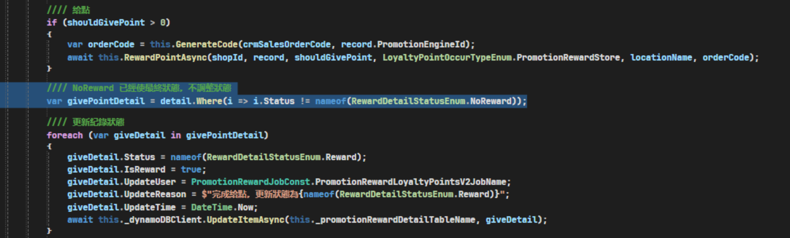

# 正逆流程案例釐清

## 目錄
1. [舊制攤提給點線下訂單跑給點時未排除 Cancel 子單](#1-舊制攤提給點線下訂單跑給點時未排除-cancel-子單)

<br>

---

## 1. 舊制攤提給點線下訂單跑給點時未排除 Cancel 子單

### 問題描述

VSTS : https://91appinc.visualstudio.com/G11n/_workitems/edit/504374

<br>

### 時序說明

**6/25 下午** - 正負向都匯入

<br>

**6/26 14:00** - PromotionRewardLoyaltyPointsV2 將 3 張正向子單計入 DDB，並預期給點 49, 49, 12

<br>

**6/26 14:03** - RecycleLoyaltyPointsV2 將 test0001 Status 壓成 Cancel (49)

<br>

**6/27 01:01** - PromotionRewardLoyaltyPointsV2，3張子單仍拉出來全部給點

<br>

### 問題原因

後續確認程式碼線下子單只有篩掉 NoReward (沒中)的狀態，因此子單若有 Cancel 狀態並不會排除掉

<br>



<br>

### 子單狀態資料

```json
[
  {
    "LoyaltyPoint": 49,
    "InsufficientPoints": 0,
    "PromotionEngineId_TradesOrderGroupCode_TradesOrderSlaveCode_Seq": "752_CrmSalesOrder:1753_test0001_0",
    "ShopId": 4,
    "PromotionEngineId": 752,
    "TradesOrderGroupCode": "CrmSalesOrder:1753",
    "TradesOrderSlaveCode": "test0001",
    "CrmSalesOrderSlaveId": 0,
    "Seq": 0,
    "VipMemberId": 1872,
    "MemberId": 1847,
    "Status": "Cancel",
    "IsReward": false,
    "IsRecycle": false,
    "UpdateUser": "RecycleLoyaltyPointsV2Job",
    "UpdateReason": "訂單取消，取消給點",
    "UpdateTime": "2025-06-26T14:03:16.9542815+08:00",
    "SalesOrderSlaveStatusDef": null,
    "SalesOrderSlaveStatusUpdatedDateTime": "2025-06-25T21:30:00+08:00",
    "RewardType": "LoyaltyPoints"
  },
  {
    "LoyaltyPoint": 49,
    "InsufficientPoints": 0,
    "PromotionEngineId_TradesOrderGroupCode_TradesOrderSlaveCode_Seq": "752_CrmSalesOrder:1753_test0002_0",
    "ShopId": 4,
    "PromotionEngineId": 752,
    "TradesOrderGroupCode": "CrmSalesOrder:1753",
    "TradesOrderSlaveCode": "test0002",
    "CrmSalesOrderSlaveId": 0,
    "Seq": 0,
    "VipMemberId": 1872,
    "MemberId": 1847,
    "Status": "WaitToReward",
    "IsReward": false,
    "IsRecycle": false,
    "UpdateUser": "PromotionRewardLoyaltyPointsV2",
    "UpdateReason": "活動給點:752",
    "UpdateTime": "2025-06-26T14:03:09.3936418+08:00",
    "SalesOrderSlaveStatusDef": null,
    "SalesOrderSlaveStatusUpdatedDateTime": "2025-06-25T21:30:00+08:00",
    "RewardType": "LoyaltyPoints"
  },
  {
    "LoyaltyPoint": 12,
    "InsufficientPoints": 0,
    "PromotionEngineId_TradesOrderGroupCode_TradesOrderSlaveCode_Seq": "752_CrmSalesOrder:1753_test0003_0",
    "ShopId": 4,
    "PromotionEngineId": 752,
    "TradesOrderGroupCode": "CrmSalesOrder:1753",
    "TradesOrderSlaveCode": "test0003",
    "CrmSalesOrderSlaveId": 0,
    "Seq": 0,
    "VipMemberId": 1872,
    "MemberId": 1847,
    "Status": "WaitToReward",
    "IsReward": false,
    "IsRecycle": false,
    "UpdateUser": "PromotionRewardLoyaltyPointsV2",
    "UpdateReason": "活動給點:752",
    "UpdateTime": "2025-06-26T14:03:09.3936425+08:00",
    "SalesOrderSlaveStatusDef": null,
    "SalesOrderSlaveStatusUpdatedDateTime": "2025-06-25T21:30:00+08:00",
    "RewardType": "LoyaltyPoints"
  }
]
```

<br>