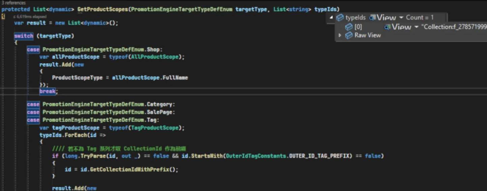

# 規則文件

## 目錄
1. [適用商品](#1-適用商品)
2. [門市](#2-門市)
3. [會員卡等級](#3-會員卡等級)
4. [通路](#4-通路)
5. [料號](#5-料號)
6. [活動類型](#6-活動類型)
7. [Thresholds門檻定義](#7-thresholds門檻定義)
8. [Rule 範例](#8-rule-範例)
9. [RewardPointConditions](#9-rewardpointconditions)
10. [UserScope](#10-userscope)

<br>

---

## 1. 適用商品

### 1.1 TargetType 判斷表格

| TargetType | ExcludeTargetType | 說明 |
|------------|-------------------|------|
| Shop | None | 全店活動 / 不排除 |
| Shop | SalePage | 全店活動 / 有排除 |
| SalePage | None | 指定商品或料號 |

<br>

### 1.2 設定ProductScopes 跑進來的 Collection 長相



<br>

---

## 2. 門市

**TargetLocationTypeDef**

<br>

- 所有門市 (All)：All
- 指定門市 (Location)：Location

<br>

**IncludeTargetLocationIdList**

<br>

- 所有 (All)：[] (空陣列)
- 指定門市 (Location)：門市 Ids

<br>

**PromotionTargetLocationTypeDefEnum**

<br>

- 所有門市 = All
- 指定門市 = Location

<br>

**PromotionEngine**

<br>

PromotionEngine_TargetLocationTypeDef：活動門市類型

<br>

**PromotionTag**

<br>

PromotionTagId：每個 LocationId 對應一個 PromotionTagSlave_TargetTypeId = targetId

<br>

**Rule**

<br>

includedLocationScopes

<br>

- TargetLocationType = All → LocationScopeType = AllLocationScope
- TargetLocationType = Location → TagLocationScope = LocationScopeType + TagId

<br>

---

## 3. 會員卡等級

Query CrmShopMemberCard

<br>

---

## 4. 通路

SMS 使用 ChannelType 溝通通路，促購後台拆解如下

<br>

| 通路類型 | Web | AppAndroid | AppIOS | LocationWizard | InStore |
|---------|-----|------------|--------|----------------|---------|
| APP/官網/門市 (All) | ✓ | ✓ | ✓ | ✓ | ✓ |
| APP/門市 (AppAndInStore) |  | ✓ | ✓ | ✓ | ✓ |
| APP (App) |  | ✓ | ✓ |  |  |
| 官網/App (WebAndApp) | ✓ | ✓ | ✓ |  |  |
| 門市 (InStore) |  |  |  | ✓ | ✓ |

<br>

**PromotionEnginePlatformTypeEnum(DB) / SalesChannelEnum(RuleRecord)**

<br>

- Web (官網)
- AppIOS (iOS)
- AppAndroid (Android)
- LocationWizard (店員幫手)
- InStore (門市)

<br>

**儲存方式**

<br>

GetPlatformTypeDiction

<br>

**適用**

<br>

- isWeb
- isAndroid
- isiOS
- isInStore
- isLocationWizard

<br>

**可見**

<br>

- isWebVisible
- isAndroidVisible
- isiOSVisible
- isLocationWizardVisible

<br>

**PromotionEngineSetting**

<br>

適用：

<br>

- PromotionEngineSetting_IsWeb
- PromotionEngineSetting_IsAndroidApp
- PromotionEngineSetting_IsiOSApp
- PromotionEngineSetting_IsLocationWizard
- PromotionEngineSetting_IsInStore

<br>

可見：

<br>

- PromotionEngineSetting_IsWebVisible
- PromotionEngineSetting_IsAndroidAppVisible
- PromotionEngineSetting_IsiOSAppVisible
- PromotionEngineSetting_IsLocationWizardVisible

<br>

**PromotionEngine Rule**

<br>

- MatchedSalesChannels：TargetPlatformTypeList
- VisibleSalesChannels：VisiblePlatformTypeList

<br>

**類型 (Type)**

<br>

- Web
- AppIOS
- AppAndroid
- LocationWizard
- InStore

<br>

**可視通路邏輯**

<br>

有 APP：

<br>

- isWebVisible
- isAndroidVisible
- isiOSVisible

<br>

門市：

<br>

- isWebVisible
- isLocationWizardVisible
- isAndroidVisible
- isiOSVisible

<br>

---

## 5. 料號

**關鍵字**

<br>

- OuterIdTagConstants
- PromotionProductSkuOuterIdModifyTypeDefEnum
- ModifyPromotionProductSkuOuterIds
- UpdateExcludeProductSkuIdScopes
- CreatePromotionSlaveTagForTargetTypeCode

<br>

**解析 OuterTagId**

<br>

```csharp
var ruleService = this.GetRuleService(promotion.PromotionEngine_TypeDef);

//// 反序列化Rule
var ruleEntity = ruleService.ParsePromotionEngineRuleObject(promotion.PromotionEngine_Rule);

ruleEntity.ProductScopes;

var outerIdTags = result.ProductScopes?.Where(a => a.Value.IsFullOuterIdTag()).Select(a => a.Value).ToList();
var outerIdTag = outerIdTags.FirstOrDefault();
if (outerIdTag != null)
{
    result.TargetTypeProductSkuOuterIdTag = outerIdTag;
    if (long.TryParse(outerIdTag.GetTagIdWithOuterIdTag(), out long promotionTagId))
        var tagSlaveCount = this._promotionEngineRepository.GetPromotionTagSlaveCount(promotionTagId, nameof(PromotionTagSlaveTargetTypeDefEnum.SalePage));
        var tagSlaveList = this._promotionEngineRepository.GetPromotionTagSlaveList(promotionTagId, nameof(PromotionTagSlaveTargetTypeDefEnum.SalePage)).ToList();
        var outerIds = tagSlaveList.Select(p => p.PromotionTagSlave_TargetTypeCode).ToList();
}
```

<br>

**限制**

<br>

關鍵字：OuterId / ProductSkuOuterId

<br>

- 每個料號字元上限：30
- 批次作業 EXCEL 行數限制：500 (對應 500 檔活動)
- UI 介面每次圈選數量：500
- 批次料號每筆限制：5000 (by promotion)
- 每個活動料號上限：100000
- 批次更新活動料號 BatchUploadType：BatchModifyPromotionOuterId
- 料號檢查：僅接受英數字 / 重複料號
- 新增料號數量限制：10000
- 編輯最高數量限制：100000

<br>

**商品頁 / 料號 / Tag 資料儲存關係**

<br>

- 商品頁：PromotionTagSlave_TargetTypeId = targetId
- 料號：PromotionTagSlave_TargetTypeCode = productSkuCode

<br>

**舊 PromotionTag 邏輯**

<br>

使用檔案上傳實作

<br>

---

## 6. 活動類型

- RewardReachPriceWithRatePoint2
- RewardReachPriceWithPoint2
- RewardReachPriceWithCoupon
- DiscountReachPriceWithFreeGift

<br>

---

## 7. Thresholds門檻定義

**指定客群給券**

<br>

```json
"Thresholds": {
  "AllUserScope": {
    "ReachPriceCouponPairs": [
      {
        "ReachPrice": 1.0,
        "Coupons": [
          {
            "Id": "2702",
            "Qty": 1
          }
        ]
      }
    ],
    "MaximumCouponQty": null
  }
}
```

<br>

**會員等級**

<br>

```json
"Thresholds": {
  "CrmShopMemberCard:5": {
    "ReachPriceCouponPairs": [
      {
        "ReachPrice": 100.0,
        "Coupons": [
          {
            "Id": "2212",
            "Qty": 1
          }
        ]
      }
    ]
  },
  "CrmShopMemberCard:32": {
    "ReachPriceCouponPairs": [
      {
        "ReachPrice": 100.0,
        "Coupons": [
          {
            "Id": "2212",
            "Qty": 1
          }
        ]
      }
    ]
  }
}
```

<br>

---

## 8. Rule 範例

<br>

```json
{
   "TypeFullName":"NineYi.Msa.Promotion.Rule.RewardReachPriceWithPoint2",
   "Id":5768,
   "Name":"Api 新增給點活動0205_Local_測支援料號_003",
   "Enabled":true,
   "Description":"心動心動新活動好好笑",
   "Since":"2025-02-06T00:00:00",
   "Until":"2025-02-08T00:00:00",
   "UpdatedAt":"2025-02-05T16:49:11.5640258+08:00",
   "Cyclable":true,
   "Accumulated":false,
   "IncludedProductScopes":null,
   "ExcludedProductScopes":[
      {
         "ProductScopeType":"NineYi.Msa.Tagging.TagProductScope",
         "Tag":"Collection:f_277843067517669376"
      },
      {
         "ProductScopeType":"NineYi.Msa.Tagging.TagProductScope",
         "Tag":"4964"
      }
   ],
   "IncludeRegionScopes":[
      {
         "RegionScopeType":"NineYi.Msa.Promotion.Engine.AllCountryRegionScope"
      }
   ],
   "MatchedUserScopes":[
      {
         "UserScopeType":"NineYi.Msa.Promotion.Engine.AllUserScope"
      }
   ],
   "VisibleUserScopes":[
      {
         "UserScopeType":"NineYi.Msa.Promotion.Engine.AllUserScope"
      }
   ],
   "MatchedSalesChannels":31,
   "VisibleSalesChannels":31,
   "IncludedLocationScopes":[
      {
         "LocationScopeType":"NineYi.Msa.Tagging.TagLocationScope",
         "Tag":4965
      }
   ],
   "IsLimitedAddOnsPurchaseQty":false,
   "Thresholds":{
      "CrmShopMemberCard:5":{
         "ReachPricePointPairs":[
            {
               "ReachPrice":100.0,
               "Point":10.0
            }
         ]
      },
      "CrmShopMemberCard:30":{
         "ReachPricePointPairs":[
            {
               "ReachPrice":200.0,
               "Point":20.0
            }
         ]
      }
   },
   "PointUntil":{
      "UntilType":1,
      "AfterDays":15,
      "UntilYearOffset":0,
      "UntilYearMonth":12,
      "FixedDate":"0001-01-01T00:00:00"
   }
}
```

<br>

---

## 9. RewardPointConditions

### 條件設定節點

<br>

| 項目名稱 | 欄位名稱 | 說明 |
|---------|----------|------|
| 訂單來源 | SourceTypeDef | 來源如：APP、Web、POS等 |
| 配送方式 | DeliveryMethod | 宅配、自取、超商取貨等 |
| 訂單狀態 | StatusDef | 如已付款、已完成、取消等 |
| 給點天數 | RewardDays | 訂單成立後 N 天給點 |
| 指定時間 | RewardDateTime | 指定時間(線下前端會帶整點時間) |
| 贈與時間點類型 | RewardTimingType | RewardTimingTypeEnum (ByDays, ByDateTime) |

<br>

### 資料儲存方式

<br>

**1. 儲存在資料庫中**

<br>

對應欄位：PromotionEngineSetting.PromotionEngineSetting_ExtendInfo

<br>

格式：JSON 序列化字串

<br>

儲存內容：

<br>

```csharp
setting.PromotionEngineSetting_ExtendInfo = JsonSerializer.Serialize(entity.RewardPointConditions);
```

<br>

**2. 備份至 S3 的 Key 結構**

<br>

儲存節點：RewardPointConditions

<br>

S3 Key 範本：{環境}/Promotion/Reward/{ShopId}/{PromotionEngineId}/{Identity}_{PromotionEngineDateTime}.json

<br>

範例：Prod/Promotion/Reward/9999/12345/PromoA_2506111230.json

<br>

PromotionEngineDateTime:yyMMddHHmmss 是日期時間格式（例如：2506111230 表示 2025/06/11 12:30）

<br>

**註記**

<br>

- 正流程會拿最新的資料 => ExtendInfo
- 逆流程追朔舊資料會拿 S3

<br>

---

## 10. UserScope

### MatchedUserScopes / VisibleUserScopes 節點說明

<br>

用來定義這檔活動要「對哪些會員卡等級」生效或顯示，與 Thresholds 配對使用。

<br>

```json
"MatchedUserScopes": [
  {
    "UserScopeType": "NineYi.Msa.Tagging.TagUserScope",
    "Tag": "CrmShopMemberCard:1"
  }
]
```

<br>

解釋：若 UserScopeType 是 TagUserScope 且 Tag 為 CrmShopMemberCard:{id}，則表示對應該會員卡生效。該 id 也必須存在於 Thresholds 內的 key。

<br>

### UserScope 邏輯

<br>

targetType = MemberTier 才設定以下

<br>

```json
{
  "UserScopeType": "TagUserScope",
  "Tag": "CrmShopMemberCard:{id}"
}
```

<br>

### TargetMemberType 驗證邏輯

<br>

TargetMemberType = MemberTier 做以下檢查

<br>

- CrmShopMemberCardIds 不得為空
- 新給點活動 CrmShopMemberCardId 只能有一張

<br>