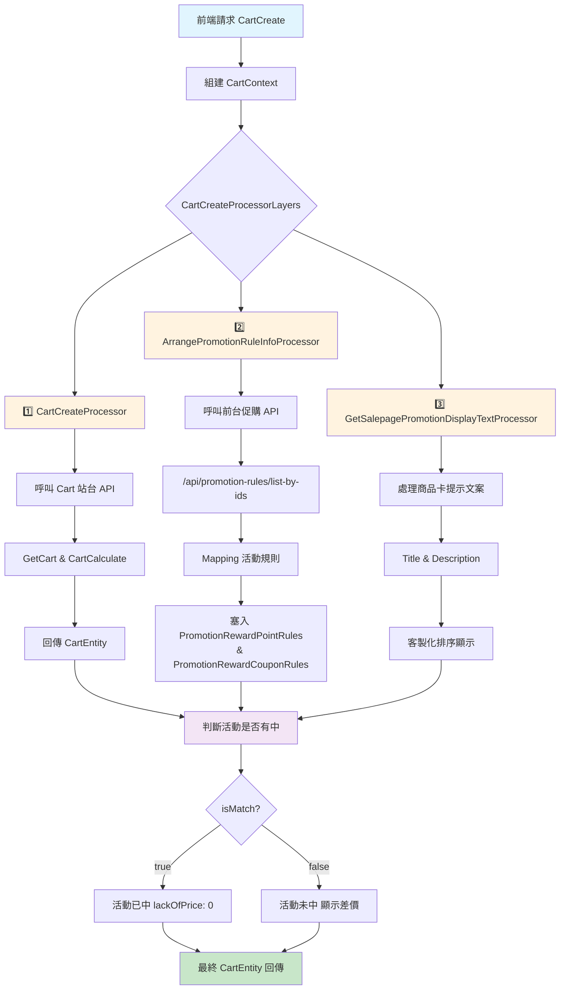
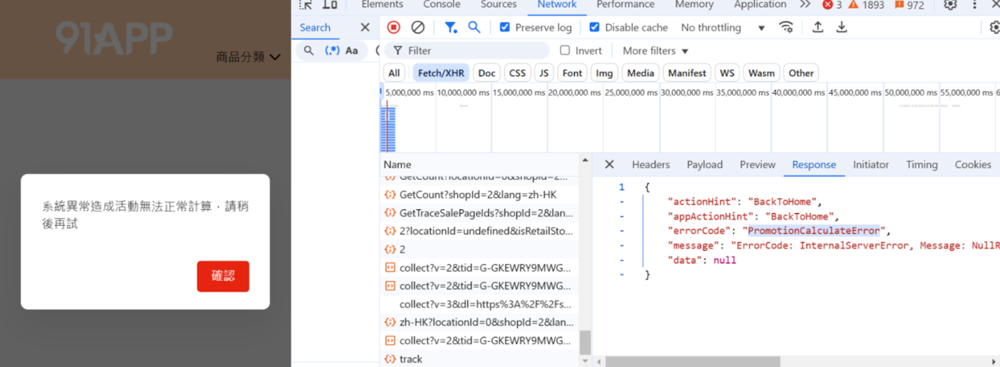
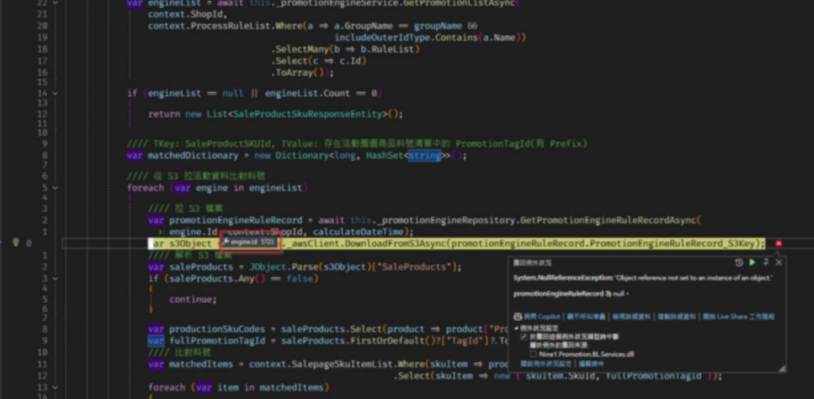

# 購物車文件

## 目錄
1. [CartCreate](#1-cartcreate)
2. [給券回饋活動為甚麼排除了加價購子商品？](#2-給券回饋活動為甚麼排除了加價購子商品)
3. [點加金為什麼不顯示活動文案？](#3-點加金為什麼不顯示活動文案)
4. [APP／門市購物車中應避免顯示回饋活動](#4-app門市購物車中應避免顯示回饋活動)
5. [購物車異常_活動無 RuleRecord 導致 S3 拉資料未提供 S3Key](#5-購物車異常_活動無-rulerecord-導致-s3-拉資料未提供-s3key)

<br>

---

## 1. CartCreate

url：https://shop2.shop.qa1.hk.91dev.tw/shopping/api/carts/create?lang=zh-HK&shopId=2

<br>

### 1.1 怎麼判斷活動是否有中

promotionInfoList

<br>

- isMatch：true (判斷該商品是否中活動)
- lackOfPrice：0 (判斷差多少錢)

<br>

### 1.2 流程總覽

#### 1.2.1 🗂️ 前端傳入的欄位

source："Web"，並用來組建 CartContext

<br>

| 區塊 | 欄位說明 |
|------|----------|
| 會員與裝置資訊 | - MemberId<br>- UnloginId<br>- IsP1Guest<br>- ShopId |
| 使用者追蹤 | - UserClientTrack<br>  - Source (例如 "Web")<br>  - Channel<br>  - Device<br>  - Version<br>  - IsMobile |
| 活動代碼 | - PromoCodeDispatch.PromoCode |
| 瀏覽器資訊 | - UserAgent<br>- HttpReferer |
| 商店與位置 | - LocationId |

<br>

#### 1.2.2 🧩 CartCreateProcessorLayers 流程組成

| Processor | 功能 |
|-----------|------|
| 1️⃣ CartCreateProcessor | - 由 CartService 呼叫，打 Cart 站台的 api/carts/create<br>- 會呼叫 GetCart 與 CartCalculate 處理流程<br>- 回傳 CartEntity，包含正確 PromotionEngineTypeDefEnum |
| 2️⃣ ArrangePromotionRuleInfoProcessor | - 整理促購活動規則資訊<br>- 呼叫前台促購 API /api/promotion-rules/list-by-ids<br>- 將回傳結果 promotionsfromFrontendPromotionAPI 與 CartEntity.PromotionInfoList 做對應 Mapping<br>- 活動規則對應節點：<br>  - PromotionRewardPointRules<br>  - PromotionRewardCouponRules |
| 3️⃣ GetSalepagePromotionDisplayTextProcessor | - 處理購物車 P1 商品卡上的活動提示文案 (Title / Description)<br>- 可客製化提示文案顯示與排序 |

<br>

#### 1.2.3 📝 重點細節說明

🔹 **1️⃣ 呼叫前台促購 API**

<br>

```csharp
var promotionsfromFrontendPromotionAPI = await _promotionService.GetPromotionsAsync(promotionIds);
```

<br>

呼叫 /api/promotion-rules/list-by-ids

<br>

與 CartEntity.PromotionInfoList 做 Mapping

<br>

塞入：

<br>

- PromotionRewardPointRules
- PromotionRewardCouponRules

<br>

🔹 **2️⃣ 活動排序邏輯**

<br>

若需要客製化活動排序，使用：PromotionTypeComparer

<br>

🔹 **3️⃣ 商品卡提示文案（Salepage Promotion Display）**

<br>

主要進入點：

<br>

```csharp
AssignPromotionDisplayText(context.Data);
```

<br>

修改 Title：需實作對應的 GetPromotionTitleText

<br>

範例：

<br>

```csharp
public string GetPromotionTitleText(CartPromotionInfoEntity promotionInfo)
{
    return "你的自訂標題";
}
```

<br>

範例：RewardReachPriceWithCouponDisplayService

<br>

修改 Description：

<br>

ArrangePromotionDisplayTextAsync 會分別處理：

<br>

- MatchedPromotion
- MismatchedPromotion

<br>

GetDisplayTypeDescription(promotion, displayTypeEnum).DisplayTypeDescription

<br>

是否顯示：要將文案加到 SalepageDiscountDisplayEntity.DisplayText 才能顯示

<br>

確認有將活動類型加入 _salepageDisplayPromotionType

<br>

若要新增活動顯示服務：需新增對應的 DisplayService

<br>

範例：RewardReachPriceWithCouponDisplayService

<br>

**4️⃣ 是否顯示活動規則**

<br>

查 ShopStaticSetting 設定是否顯示：

<br>

```sql
select *
from ShopStaticSetting(nolock)
where ShopStaticSetting_ValidFlag = 1
  and ShopStaticSetting_GroupName = 'ShoppingCartSalepage'
  and ShopStaticSetting_Key = 'IsSalepagePromotionRule'
```

<br>

HKQA 商店大多設為 FALSE

<br>

節點：SalepageDiscountDisplayEntity.DisplayText

<br>

開關：isShowPromotionRuleTask => isShowPromotionRule

<br>

#### 1.2.4 🗒️ 補充：活動名稱顯示

預設多為 promotion.Name

<br>

#### 1.2.5 🏷️ 附註

若後續要擴充新的活動型態，記得：

<br>

- Promotion Engine TypeDef Enum 要正確對應
- API /api/promotion-rules/list-by-ids 要有對應資料
- 文案與排序要同步調整

<br>

#### 1.2.6 📂 需要修改的檔案

- PromotionEngineTypeDefEnum.cs
- GetSalepagePromotionDisplayTextProcessor.cs
- PromotionBaseDisplayService.cs
- GetPromotionEngineResponseEntity.cs
- ArrangePromotionRuleInfoProcessor.cs
- ServiceCollectionExtension.cs

<br>

#### 1.2.7 流程圖



```text
flowchart TD
    A[前端請求 CartCreate] --> B[組建 CartContext]
    B --> C{CartCreateProcessorLayers}
    
    C --> D[1️⃣ CartCreateProcessor]
    C --> E[2️⃣ ArrangePromotionRuleInfoProcessor]
    C --> F[3️⃣ GetSalepagePromotionDisplayTextProcessor]
    
    D --> G[呼叫 Cart 站台 API]
    G --> H[GetCart & CartCalculate]
    H --> I[回傳 CartEntity]
    
    E --> J[呼叫前台促購 API]
    J --> K["/api/promotion-rules/list-by-ids"]
    K --> L[Mapping 活動規則]
    L --> M[塞入 PromotionRewardPointRules<br/>& PromotionRewardCouponRules]
    
    F --> N[處理商品卡提示文案]
    N --> O[Title & Description]
    O --> P[客製化排序顯示]
    
    I --> Q[判斷活動是否有中]
    M --> Q
    P --> Q
    
    Q --> R{isMatch?}
    R -->|true| S[活動已中 lackOfPrice: 0]
    R -->|false| T[活動未中 顯示差價]
    
    S --> U[最終 CartEntity 回傳]
    T --> U
    
    style A fill:#e1f5fe
    style U fill:#c8e6c9
    style D fill:#fff3e0
    style E fill:#fff3e0
    style F fill:#fff3e0
    style Q fill:#f3e5f5
```

#### 1.2.8 GetCartProcessorLayers 詳細說明

**CartCreateProcessor (取得購物車流程)**

<br>

單純用簡單的資訊建立車的基本資訊，與 Promotion 較無關係

<br>

**ExecuteLogisticCalculateProcessor<CartEntity> (執行計算購物車的流程)**

<br>

```csharp
cartContext.Data.IsCartCalculate = true;
```

<br>

LogisticCalculateProcessorLayers > CalculatePromotionProcessor (計算促購流程) ListById > 打促購前台購物車計算 API

<br>

```csharp
//// 方法入口
var requestData = await this._promotionService.ArrangePromotionPayloadAsync(context);

//// 打促購前台購物車計算 API
var promotionResult = await this._promotionService.CalculateAsync(requestData);
```

<br>

打 /api/cart-calculate

<br>

```csharp
//// 如果 log 拿到以下訊息表示 SalepageSkulist, PromotionRecordList, PromotionInstructionList 是空的 (沒有促購相關資訊)
折扣活動計算回傳空的SkuList, requestId: {promotionResult!.RequestId}
```

<br>

將活動計算結果更新回 CartEntity (PromotionInfoList)

<br>

```csharp
//// 方法入口
await MappingPromotionToCartAsync(context, promotionResult);

//// 方法內會排除目前不支援的活動，這裡會篩選掉無法mapping的enum
allRuleIds = promotionResult.RuleList
                .Where(x =>
                    x.SourceType == SourceTypeEnum.Promotion &&
                    allRuleIds.Contains(x.RuleId) &&
                    PromotionHelper.ExtractPromotionEngineTypeDef(x.TypeDef).HasValue)
                .Select(x => x.RuleId).ToList();
```

<br>

```csharp
//// 取得活動資訊,打促購前台 list-by-ids API
GetPromotionsAsync 
/api/promotion-rules/list-by-ids
```

<br>

```csharp
//// 未達門檻多少的資訊寫在這
promotionInstruction.State 節點

//////// 未中的活動處理
if (promotionInfo.IsMatch == false)

//// 將活動計算更新回購物車商品頁
MappingPromotionSkuToCart(context, promotionResult);
```

<br>

### 1.3 相關快取

Cache:QA:Cart:Core:CartEntity-20230207:2:33132:06b830f4-f4c8-4fa3-974c-5d4793a06025

<br>

### 1.4 測試資料

**點加金**

<br>

- promotionId：6502, 6970
- salepageId：62146

<br>

### 1.5 加價購

要先建立加價購活動

<br>

---

## 2. 給券回饋活動為甚麼排除了加價購子商品？

### 2.1 Bug 案例的 Request

確認 Bug 案例的 Request

<br>

主商品 62227 帶 Flag AddOnsSalepageMajor

<br>

子商品 60393 帶 Flag AddOnsSalepageSub

<br>

```json
{
   "Shop":{
      "Id":11,
      "Tags":[
         "EnableAddOns"
      ]
   },
   "User":{
      "Id":"33502",
      "Tags":[
         "AllUserScope",
         "CrmShopMemberCard:24",
         "FirstPurchase"
      ],
      "OuterId":null,
      "ShopMemberCode":"97+Gy73RMbUYz5ZqI4EuEA=="
   },
   "Shipping":{
      "ShippingProfileTypeDef":"Home",
      "ShippingAreaId":0,
      "CountryProfileId":85,
      "LocationId":0
   },
   "Payment":{
      "PayProfileTypeDef":"TwoCTwoP"
   },
   "Channel":"AppIOS",
   "CurrencyDecimalDigits":2,
   "SalepageSkuList":[
      {
         "SalepageId":62227,
         "SkuId":86642,
         "Price":4.5,
         "SuggestPrice":10000.0,
         "Qty":14,
         "Flags":[
            "AddOnsSalepageMajor"
         ],
         "OuterId":"123",
         "Tags":null,
         "OptionalTypeDef":"",
         "OptionalTypeId":0,
         "CartExtendInfoItemGroup":1748912653812,
         "CartExtendInfoItemType":"Major",
         "PointsPayPair":null,
         "CartExtendInfos":[
            {
               "RuleTypeDef":"AddOnsSalepageExtraPurchase",
               "RuleId":10000050,
               "RelatedItemCartIds":[
                  45514
               ],
               "RelatedSubItemCount":0
            }
         ],
         "CartId":45513
      },
      {
         "SalepageId":60393,
         "SkuId":84109,
         "Price":6.66,
         "SuggestPrice":100.0,
         "Qty":1,
         "Flags":[
            "AddOnsSalepageSub"
         ],
         "OuterId":"",
         "Tags":null,
         "OptionalTypeDef":"",
         "OptionalTypeId":0,
         "CartExtendInfoItemGroup":1748912653812,
         "CartExtendInfoItemType":"Sub",
         "PointsPayPair":null,
         "CartExtendInfos":[
            {
               "RuleTypeDef":"AddOnsSalepageExtraPurchase",
               "RuleId":10000050,
               "RelatedItemCartIds":[
                  
               ],
               "RelatedSubItemCount":0
            }
         ],
         "CartId":45514
      }
   ],
   "FeeList":[
      {
         "Id":221,
         "Type":"ShippingFee",
         "Price":0,
         "Payment":0,
         "ExtendInfo":{
            "ShippingProfileTypeDef":"Home",
            "IsDomesticWeightPricing":false,
            "TemperatureTypeDef":"Normal",
            "ShippingType":"221",
            "ShippingAreaId":84,
            "IsLocal":true
         }
      }
   ],
   "Promotion":{
      "Code":null,
      "PromoCodePoolGroupId":null,
      "SelectedDesignatePaymentPromotionId":0
   },
   "CouponSetting":{
      "MultipleRedeem":{
         "Discount":{
            "IsMultiple":false,
            "Qty":1
         },
         "Gift":{
            "IsMultiple":true,
            "Qty":9999
         },
         "Shipping":{
            "IsMultiple":false,
            "Qty":1
         }
      },
      "CouponList":[
         
      ],
      "Options":{
         "IsVerbose":false,
         "IsCouponPreSelect":true,
         "IncludeRecordDetail":false
      },
      "LoyaltyPoint":{
         "CheckoutPoint":0,
         "CheckoutDiscountPrice":0,
         "IsSelected":false,
         "IsSetDiscountPrice":false,
         "TotalPoint":0.0
      }
   }
}
```

<br>

### 2.2 問題分析

確認促購前台流程計算前做 LoadRules，細項會做 RuleInit

<br>

追到引擎程式碼後，發現回饋活動給券會有加上排除的 Tag

<br>

```csharp
public override void RuleInitProcess()
{
    this.ExclusiveTags ??= new HashSet<string>();
    this.ExclusiveTags.Add(FlagConstants.AddOnsSalepageSub);
    this.ExclusiveTags.Add(FlagConstants.CouponExcludedByOrder);
}
```

<br>

確認新舊給點都沒有這個 ExclusiveTags，因此回饋給券移除 FlagConstants.AddOnsSalepageSub

<br>

---

## 3. 點加金為什麼不顯示活動文案？

**站台**：Shopping

<br>

**處理器**：GetSalepagePromotionDisplayTextProcessor

<br>

既有判斷式僅限 DiscountReachPriceWithFreeGift 可以顯示點加金商品，否則該活動賦值為 null

<br>

```csharp
//// 點加金商品可以顯示活動資訊，但目前只開放滿額贈
if (salepage.IsPointsPayPair && promotion?.Type != PromotionEngineTypeDefEnum.DiscountReachPriceWithFreeGift)
{
    promotion = null;
}
```

<br>

因此修正加入 3 個回饋活動

<br>

---

## 4. APP／門市購物車中應避免顯示回饋活動

包含：

<br>

新舊點數回饋活動

<br>

回饋券活動

<br>

整理說明

<br>

目前購物車功能會同時在 APP / 官網上共用，但實作上會將帶有 LackSalesChannel 的「有線下通路」活動有帶上 ➡️ 實際上此邏輯不合理

<br>

技術調整說明

<br>

**所屬模組**

<br>

**站台**：Shopping

<br>

**處理器**：GetSalepagePromotionDisplayTextProcessor

<br>

**原問題點**

<br>

在 FilteredPromotion 篩選中，當活動類型為 回饋活動 且條件 mismatch 時

<br>

系統未排除 LackSalesChannel 帶有線下通路的活動

<br>

**實際影響**

<br>

僅 APP / LocationWizard / InStore 類型的活動，在購物車中會顯示

<br>

調整方向

<br>

調整判斷邏輯，使「回饋活動」在購物車中顯示時排除 LackSalesChannel 有 LocationWizard / InStore 的條件

<br>

APP / 門市購物車能正不顯示對應促銷活動

<br>

**PR**：https://gitlab.91app.com/commerce-cloud/nine1.shopping/-/merge_requests/1739/diffs

<br>

---

## 5. 購物車異常_活動無 RuleRecord 導致 S3 拉資料未提供 S3Key

https://91app.slack.com/archives/C63SH8G3D/p1740995912013989

<br>

**Cart**：/api/carts/creat

<br>

**Promotion**：/api/cart-calculate

<br>



<br>

該筆活動 (Id : 5723 )因後台還在開發中導致髒資料出現, 該活動無 RuleRecord, 促購前台做 CartCreate PromotionCalculate時, 欲從 S3 取得資料 , 但因無提供 RuleRecord S3Key 導致 Amazon NullReference

<br>



<br>

=> 需要檢查 RuleRecord

<br>