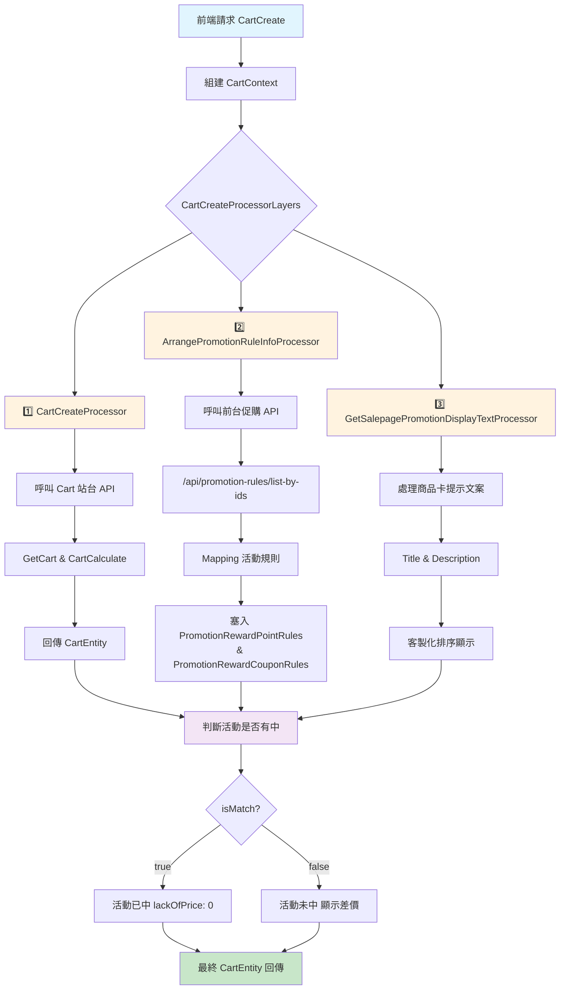

# 購物車文件

## 目錄
1. [CartCreate](#1-cartcreate)

<br>

---

## 1. CartCreate

url：https://shop2.shop.qa1.hk.91dev.tw/shopping/api/carts/create?lang=zh-HK&shopId=2

<br>

### 1.1 怎麼判斷活動是否有中

promotionInfoList

<br>

- isMatch：true (判斷該商品是否中活動)
- lackOfPrice：0 (判斷差多少錢)

<br>

### 1.2 流程總覽

#### 1.2.1 🗂️ 前端傳入的欄位

source："Web"，並用來組建 CartContext

<br>

| 區塊 | 欄位說明 |
|------|----------|
| 會員與裝置資訊 | - MemberId<br>- UnloginId<br>- IsP1Guest<br>- ShopId |
| 使用者追蹤 | - UserClientTrack<br>  - Source (例如 "Web")<br>  - Channel<br>  - Device<br>  - Version<br>  - IsMobile |
| 活動代碼 | - PromoCodeDispatch.PromoCode |
| 瀏覽器資訊 | - UserAgent<br>- HttpReferer |
| 商店與位置 | - LocationId |

<br>

#### 1.2.2 🧩 CartCreateProcessorLayers 流程組成

| Processor | 功能 |
|-----------|------|
| 1️⃣ CartCreateProcessor | - 由 CartService 呼叫，打 Cart 站台的 api/carts/create<br>- 會呼叫 GetCart 與 CartCalculate 處理流程<br>- 回傳 CartEntity，包含正確 PromotionEngineTypeDefEnum |
| 2️⃣ ArrangePromotionRuleInfoProcessor | - 整理促購活動規則資訊<br>- 呼叫前台促購 API /api/promotion-rules/list-by-ids<br>- 將回傳結果 promotionsfromFrontendPromotionAPI 與 CartEntity.PromotionInfoList 做對應 Mapping<br>- 活動規則對應節點：<br>  - PromotionRewardPointRules<br>  - PromotionRewardCouponRules |
| 3️⃣ GetSalepagePromotionDisplayTextProcessor | - 處理購物車 P1 商品卡上的活動提示文案 (Title / Description)<br>- 可客製化提示文案顯示與排序 |

<br>

#### 1.2.3 📝 重點細節說明

🔹 **1️⃣ 呼叫前台促購 API**

<br>

```csharp
var promotionsfromFrontendPromotionAPI = await _promotionService.GetPromotionsAsync(promotionIds);
```

<br>

呼叫 /api/promotion-rules/list-by-ids

<br>

與 CartEntity.PromotionInfoList 做 Mapping

<br>

塞入：

<br>

- PromotionRewardPointRules
- PromotionRewardCouponRules

<br>

🔹 **2️⃣ 活動排序邏輯**

<br>

若需要客製化活動排序，使用：PromotionTypeComparer

<br>

🔹 **3️⃣ 商品卡提示文案（Salepage Promotion Display）**

<br>

主要進入點：

<br>

```csharp
AssignPromotionDisplayText(context.Data);
```

<br>

修改 Title：需實作對應的 GetPromotionTitleText

<br>

範例：

<br>

```csharp
public string GetPromotionTitleText(CartPromotionInfoEntity promotionInfo)
{
    return "你的自訂標題";
}
```

<br>

範例：RewardReachPriceWithCouponDisplayService

<br>

修改 Description：

<br>

ArrangePromotionDisplayTextAsync 會分別處理：

<br>

- MatchedPromotion
- MismatchedPromotion

<br>

GetDisplayTypeDescription(promotion, displayTypeEnum).DisplayTypeDescription

<br>

是否顯示：要將文案加到 SalepageDiscountDisplayEntity.DisplayText 才能顯示

<br>

確認有將活動類型加入 _salepageDisplayPromotionType

<br>

若要新增活動顯示服務：需新增對應的 DisplayService

<br>

範例：RewardReachPriceWithCouponDisplayService

<br>

**4️⃣ 是否顯示活動規則**

<br>

查 ShopStaticSetting 設定是否顯示：

<br>

```sql
select *
from ShopStaticSetting(nolock)
where ShopStaticSetting_ValidFlag = 1
  and ShopStaticSetting_GroupName = 'ShoppingCartSalepage'
  and ShopStaticSetting_Key = 'IsSalepagePromotionRule'
```

<br>

HKQA 商店大多設為 FALSE

<br>

節點：SalepageDiscountDisplayEntity.DisplayText

<br>

開關：isShowPromotionRuleTask => isShowPromotionRule

<br>

#### 1.2.4 🗒️ 補充：活動名稱顯示

預設多為 promotion.Name

<br>

#### 1.2.5 🏷️ 附註

若後續要擴充新的活動型態，記得：

<br>

- Promotion Engine TypeDef Enum 要正確對應
- API /api/promotion-rules/list-by-ids 要有對應資料
- 文案與排序要同步調整

<br>

#### 1.2.6 📂 需要修改的檔案

- PromotionEngineTypeDefEnum.cs
- GetSalepagePromotionDisplayTextProcessor.cs
- PromotionBaseDisplayService.cs
- GetPromotionEngineResponseEntity.cs
- ArrangePromotionRuleInfoProcessor.cs
- ServiceCollectionExtension.cs

<br>

#### 1.2.7 流程圖



```text
flowchart TD
    A[前端請求 CartCreate] --> B[組建 CartContext]
    B --> C{CartCreateProcessorLayers}
    
    C --> D[1️⃣ CartCreateProcessor]
    C --> E[2️⃣ ArrangePromotionRuleInfoProcessor]
    C --> F[3️⃣ GetSalepagePromotionDisplayTextProcessor]
    
    D --> G[呼叫 Cart 站台 API]
    G --> H[GetCart & CartCalculate]
    H --> I[回傳 CartEntity]
    
    E --> J[呼叫前台促購 API]
    J --> K["/api/promotion-rules/list-by-ids"]
    K --> L[Mapping 活動規則]
    L --> M[塞入 PromotionRewardPointRules<br/>& PromotionRewardCouponRules]
    
    F --> N[處理商品卡提示文案]
    N --> O[Title & Description]
    O --> P[客製化排序顯示]
    
    I --> Q[判斷活動是否有中]
    M --> Q
    P --> Q
    
    Q --> R{isMatch?}
    R -->|true| S[活動已中 lackOfPrice: 0]
    R -->|false| T[活動未中 顯示差價]
    
    S --> U[最終 CartEntity 回傳]
    T --> U
    
    style A fill:#e1f5fe
    style U fill:#c8e6c9
    style D fill:#fff3e0
    style E fill:#fff3e0
    style F fill:#fff3e0
    style Q fill:#f3e5f5
```

### 1.3 相關快取

Cache:QA:Cart:Core:CartEntity-20230207:2:33132:06b830f4-f4c8-4fa3-974c-5d4793a06025

<br>

### 1.4 測試資料

**點加金**

<br>

- promotionId：6502, 6970
- salepageId：62146

<br>

### 1.5 加價購

要先建立加價購活動

<br>