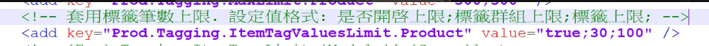

# 角標文件

## 目錄
1. [OSM 批次貼標作業](#1-osm-批次貼標作業)
2. [發生單個商品頁角標達到上限](#2-發生單個商品頁角標達到上限)

<br>

---

## 1. OSM 批次貼標作業

API : https://sms.qa1.my.91dev.tw/Api/BatchUpload/CreateBatchTask

<br>

Request:

```json
{
    "FileName": "44test1.xlsx",
    "FileGuid": "0ce7ddbb-0d1a-4684-b015-49ec0c00e4b4",
    "BatchUploadType": 129,    // BatchApplyProductBadge
    "NeedAdvancedVerify": false,
    "ShopId": 44,
    "ScheduleDateTime": null,
    "ExtensionData": "{\"ProductBadgeId\":166}"
}
```

<br>

BatchApplyProductBadgeTask

<br>

---

## 2. 發生單個商品頁角標達到上限

康是美(2131)反應從商品頁按下儲存跳出商品頁標籤到達上限，但商品本身沒有設定商品標籤

<br>

商品頁序號：9170467、9170468、9236733、9236722

<br>

Tag Service 服務正常，我目前查看這幾個商品頁上的標籤都是角標

<br>

此4個商品頁都貼了105檔角標

<br>



<br>