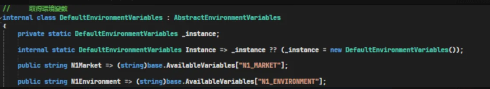
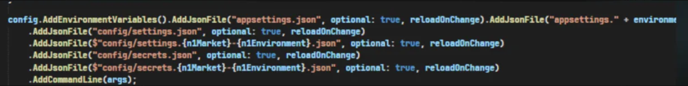

# ⚙️ Config 設定文件

> 📚 這是系統設定檔案的完整管理指南，包含位置確認、設計原則和使用方法等重要資訊

<br>

## 📖 目錄

- [⚙️ Config 設定文件](#️-config-設定文件)
  - [📍 MachineConfig 確認位置](#-machineconfig-確認位置)
  - [💭 使用 Config 前的思考](#-使用-config-前的思考)
  - [🔄 Config 檢查重要性](#-config-檢查重要性)
  - [🎛️ Config 功能開關設計](#️-config-功能開關設計)
  - [🔍 Config 對應機器查詢](#-config-對應機器查詢)
  - [🌳 91 根](#-91-根)
  - [🗃️ DB 定義的 Config](#️-db-定義的-config)
  - [🚫 不要寫死市場判斷](#-不要寫死市場判斷)

<br>

---

## 📍 MachineConfig 確認位置

**主要設定檔位置**：
<br>
```
C:\Windows\Microsoft.NET\Framework64\v4.0.30319\Config
```

<br>

**應用程式設定檔位置**：

<br>

```
C:\Windows\Microsoft.NET\Framework64\v4.0.30319\Config\AppSettings.config
```

<br>

---

## 💭 使用 Config 前的思考

**設計考量重點**：

<br>

功能性還是 Domain 為第一個節點要考慮未來好不好拔

<br>

**架構設計原則**：

<br>

在設計 Config 結構時，需要考慮功能模組的獨立性和未來的可維護性，確保配置項目能夠輕易地進行調整或移除

<br>

---

## 🔄 Config 檢查重要性

**重要提醒**：

<br>

永遠要記得 CONFIG 要檢查是否帶對

<br>

**檢查要點**：

<br>

確保在不同環境間部署時，配置檔案的內容與目標環境相符，避免因配置錯誤導致的系統異常

<br>

---

## 🎛️ Config 功能開關設計

**開關設計範例**：

<br>

```xml
<!-- 新版滿額贈商店清單-->
<!--全關："false|none|none"、全開："true|none|none"、部份開啟："true|0,8,233,236|none"、"true|none|20-40,50-55"、"true|0,8,233,236|20-40,50-55-->
<add key="Dev.Promotion.DiscountReachPriceWithFreeGift.Enabled" value="true|2|none"/>
```

<br>

**程式碼使用方式**：

<br>

```csharp
var settings = this.ConfigService.GetAppSetting("Promotion.DiscountReachPriceWithFreeGift.Enabled");
bool isDiscountReachPriceWithFreeGiftEnabled = AppSetting.GetIsEnabledInSettingByShopId(shopId, settings);
```

<br>

**開關狀態說明**：

<br>

- **全關**：`"false|none|none"`
- **全開**：`"true|none|none"`
- **部份開啟（依商店）**：`"true|0,8,233,236|none"`
- **部份開啟（依範圍）**：`"true|none|20-40,50-55"`
- **混合條件**：`"true|0,8,233,236|20-40,50-55"`

<br>

---

## 🔍 Config 對應機器查詢

**查詢 Config 對應機器的方法**：

<br>

**參考網址**：

<br>

https://bitbucket.org/nineyi/nineyi.configuration/src/master/serverMaps.json

<br>

**使用說明**：

<br>

透過此連結可以查看各個設定檔案對應到哪些伺服器機器，有助於確認配置的部署範圍和影響範圍

<br>

---

## 🌳 91 根




<br>

---

## 🗃️ DB 定義的 Config

**儲存過程讀取**：

<br>

```sql
csp_GetConfigDBAppSettingValue
```

<br>

**說明**：

<br>

透過資料庫儲存過程來讀取設定值，提供動態配置管理功能

<br>

---

## 🚫 不要寫死市場判斷

**設計原則**：

<br>

不要有市場判斷寫死在程式碼中，應抽成 Config 來處理

<br>

**實作建議**：

<br>

將市場相關的邏輯判斷統一透過設定檔管理，確保系統的彈性和可維護性

<br>

---