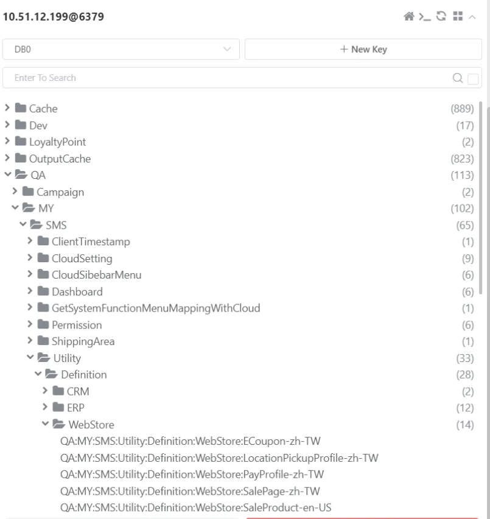

# 異常處理紀錄

## 目錄
- [多語系不更新問題](#多語系不更新問題)
- [Redis 資料遭無差別清除](#redis-資料遭無差別清除)
- [程式碼語系鍵值設定未上線](#程式碼語系鍵值設定未上線)
- [商品頁付款方式語系無法更新](#商品頁付款方式語系無法更新)
- [頁面出現大量 Key 值問題](#頁面出現大量-key-值問題)
- [會員禮發送通知信文案問題](#會員禮發送通知信文案問題)

---

## 多語系不更新問題


- 程式組出來的 : PayProfile_TypeDef_CreditCardInstallment_Razer 符合預期,問題是他怎麼會找不到 key 值

- 已確認 清除 redisCache, webapi fetch, r=t, ctrl + f5

- s3 有資料- "PayProfile_TypeDef_CreditCardInstallment_Razer": "信用卡分期付款"
- 是否需要上code 理論上不用 他是從client抓的
- debug url
https://moiicrm.shop.qa1.my.91dev.tw/webapi/translations/debug/backend.definition.PayProfile.PayProfile_TypeDef_CreditCardInstallment_Razer/en-US
"TextFromFetch": "#ERROR: Translation file or key was not found.", ==> why!!!?????
"TextFromRemote": "Credit card installments" (edited) 


**解法** : 清除 menifest redis cache 的 ETag 讓 fetch 可以 work


## Redis 資料遭無差別清除

可能引發線上語系顯示問題
理論上不應該有問題，系統會自動回退到其他快取層級

<br>

## 程式碼語系鍵值設定未上線

程式碼中的語系鍵值已上線，但對應的語系設定尚未發布
系統會顯示語系鍵值的預設值而非翻譯內容


**解法** : 確保語系設定與程式碼同步發布上線

<br>

## 商品頁付款方式語系無法更新

新增商品頁遇到付款方式的語系一直無法更新成想要的語系
```
https://sms.qa1.my.91dev.tw/Api/SalePage/GetShopPayShippingType
```

Property 上會掛一個 Attribute：
```csharp
[RequireDefinition(Table = "ShopPayType", Column = "ShopPayType_TypeDef")]
```

執行套件：https://bitbucket.org/nineyi/nineyi.common.utility/src/master/

<br>

```csharp
this._definitionService.FillDefinitions(Common.Utility.DefinitionsEf6.Models.DatabaseEnum.WebStore, payTypeList);
```

Definition 會有另外的 Cache，且設定時間較長



**解法** : 

1. 清除 Definition Cache
2. 重新執行 Fetch 操作
3. 重新整理該頁面

- **Module**：backend.definition.ShopPayType
- **Key 值範例**：ShopPayType_TypeDef_TNG_AsiaPay
- **資料庫**：WebstoreDB
- **資料表**：ShopPayType
- **欄位**：ShopPayType_TypeDef
- **Code**：TNG_AsiaPay
- **Desc**：AsiaPay Touch 'n Go

<br>

## 頁面出現大量 Key 值問題

HK QA 環境的多語系 Cache 被刪除


**解法**

重新呼叫 Fetch API
Ctrl + F5
刪除 i18n.manifest 檔案後重新執行 Fetch
驗證 API

https://shop2.shop.qa1.hk.91dev.tw/webapi/translations/getClientLocale/ShoppingCart/zh-HK?ts=638707327910655368&lang=zh-HK&shopId=2


<br>

## 會員禮發送通知信文案問題

https://91appinc.visualstudio.com/DailyResource/_workitems/edit/354411
會員禮發送通知信文案異常

**主要服務**：`ShopMemberPresentNotificationMailService.DoMailDataProcess`
```csharp
//// Mail Subject
this.EmailEntity.Subject = this.GetEmailSubject(shopItem, shopMemberPresentNotification);
```

```csharp
case "Birthday":
  var birthdayMonth = this.GetBirthdayMonth(shopMemberPresentNotification.Month.ToString());
  wording = string.Format(NineYi.NMQV2.Translation.Backend.Template.ShopMemberPresentNotification.HelloHappyBirthday, birthdayMonth, shopItem.ShopName);
  break;
```

```csharp
/// <summary>
/// 生日禮
/// </summary>
public static string EnumBirthday { get { return GetString("enum_birthday"); } }
```

`SendTemplateMailShopMemberPresent` → `SendTemplateMailProcess`

1. `SendTemplateMailProcess.DoJob{DoMailDataProcess}`
2. 由 `SendVipMemberPresentAlertByFixedTimeOfferService` 實作 `DoMailDataProcess`
3. 透過 `LifetimeScope.ResolveNamed<ITemplateMailService>` 解析對應實作
4. 執行 `GetSubject` → `GetBirthdayMonth`

語系內容設定錯誤：December 被設定成中文「2月」
- **Module**：NineYi.NMQV2
- **Category**：scm.service.email.supplier_notice
- **Key**：december

**解法**

修正多語系設定，將 December 對應的中文翻譯設定為正確的「12月」