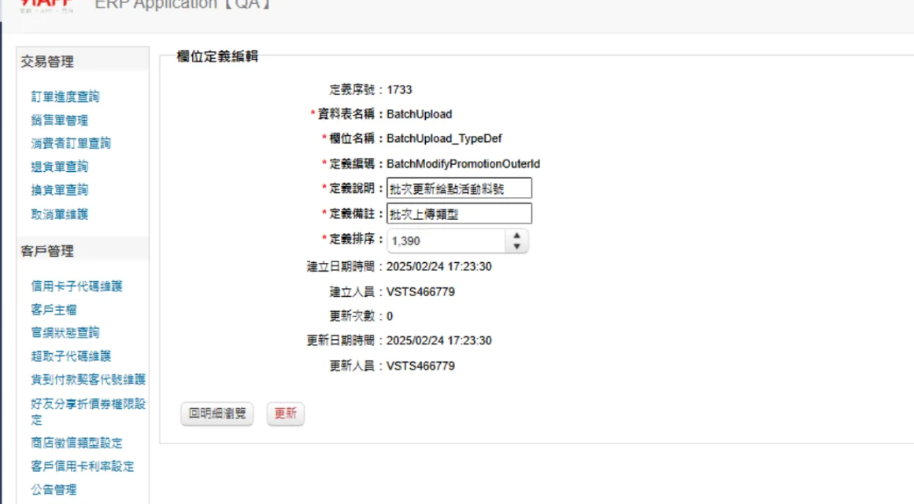

# 🗃️ Definition 套用邏輯

<br>

## 📖 目錄
  - [🏷️ Attribute 設定](#️-attribute-設定)
  - [🔧 Definition Service 呼叫](#-definition-service-呼叫)
  - [📊 資料類型分析](#-資料類型分析)
  - [🔍 Property 屬性取得](#-property-屬性取得)
  - [🗂️ Definition 對應資料建立](#️-definition-對應資料建立)
  - [📋 Definition 資料取得流程](#-definition-資料取得流程)
  - [🌐 多語系處理機制](#-多語系處理機制)
  - [🗄️ 資料庫查詢與組裝](#️-資料庫查詢與組裝)
  - [💳 金流相關 Definition 查詢範例](#-金流相關-definition-查詢範例)
  - [⚙️ ERP Definition 管理](#️-erp-definition-管理)
  - [🆕 新增 Definition 功能範例](#-新增-definition-功能範例)

<br>

---

## 🏷️ Attribute 設定

在 Property 上掛載 RequireDefinition Attribute 來標記需要套用 Definition 的欄位：

<br>

```csharp
/// <summary>
/// TypeDefDesc
/// </summary>
[RequireDefinition(Table = "ShopPayType", Column = "ShopPayType_TypeDef")]
public string TypeDefDesc { get; set; }
```

<br>

---

## 🔧 Definition Service 呼叫

呼叫 Definition Service 並傳入資料庫名稱與資料清單：

<br>

```csharp
this._definitionService.FillDefinitions(Common.Utility.DefinitionsEf6.Models.DatabaseEnum.WebStore, payTypeList);
```

<br>

**參數說明**：

<br>

- **DB Name**：資料庫識別名稱
- **資料**：需要處理的資料清單（例如：`List<ShopPayTypeEntity>`）

<br>

**處理流程**：

<br>

取得 connectionString 後往下一層傳遞，繼續處理資料：

<br>

```csharp
return FillDefinitions(connectionStringNameByDatabase, data, cleanCache);
```

<br>

---

## 📊 資料類型分析

系統會分析傳入的資料類型以取得相關資訊：

<br>

```csharp
Type dataType = GetDataType<T>();  // 取得 List<ShopPayTypeEntity> 的類型
```

<br>

---

## 🔍 Property 屬性取得

取得該類型所有的 Properties 資訊：

<br>

```csharp
PropertyDescriptorCollection properties = new AssociatedMetadataTypeTypeDescriptionProvider(dataType)
    .GetTypeDescriptor(dataType)
    .GetProperties();
```

<br>

接著分析 Properties 中的 Definition 對應關係：

<br>

```csharp
IEnumerable<DefinitionMappingData> definitionMappingDatas = GetDefinitionMappingDatas(properties, dataType);
```

<br>

---

## 🗂️ Definition 對應資料建立

系統會檢查每個 Property 是否有掛載 RequireDefinitionAttribute：

<br>

```csharp
RequireDefinitionAttribute requireDefinitionAttribute = property.Attributes
    .OfType<RequireDefinitionAttribute>()
    .FirstOrDefault();
```

<br>

**建立對應資料**：

<br>

```csharp
DefinitionMappingData definitionMappingData = new DefinitionMappingData();

// 取得 table name (ShopPayType)
definitionMappingData.TableName = requireDefinitionAttribute.Table ?? property.Name.Split('_').First();

// 取得 column name (ShopPayType_TypeDef)
definitionMappingData.ColumnName = requireDefinitionAttribute.Column ?? property.Name.Replace("Desc", string.Empty);

// 取得 property 名稱 (TypeDefDesc)
definitionMappingData.PropertyName = property.Name;

// 取得 property descriptor
definitionMappingData.PropertyDescriptor = property;
```

<br>

---

## 📋 Definition 資料取得流程

系統會根據不同的 TableName 取得對應的 Definition 資料：

<br>

```csharp
foreach (string item in definitionMappingDatas.Select((DefinitionMappingData i) => i.TableName).Distinct())
{
    IEnumerable<Definition> definitionByTableName = GetDefinitionByTableName(connectionStringName, item, cleanCache);
    list.AddRange(definitionByTableName);
}
```

<br>

---

## 🌐 多語系處理機制

**快取機制設定**：

<br>

```csharp
// 設定 feature 為 Definition
string feature = "Definition";

// 組合快取 key（包含語系資訊）
string key = string.Join("-", tableName, _translationClient.GetLocale());

// 組合完整的 feature 識別
string arg = connectionStringName.Split('.').LastOrDefault();
feature = $"Definition:{arg}";
```

<br>

---

## 🗄️ 資料庫查詢與組裝

**資料庫查詢**：

<br>

```csharp
IEnumerable<Definition> definitionsByTableName = DefinitionRepository.GetDefinitionsByTableName(connectionStringName, tableName);
```

<br>

**多語系模組組裝**：

<br>

```csharp
// 組合多語系模組名稱：.backend.definition.ShopPayType
string module = string.Join(".", "backend.definition", tableName);

// 組合多語系 key 並取得翻譯內容
string key2 = string.Join("_", item.Definition_ColumnName, item.Definition_Code);
item.Definition_Desc = _translationClient.GetString(module, key2, item.Definition_Desc);
```

<br>

---

## 💳 金流相關 Definition 查詢範例

以下提供金流相關的 Definition 表格查詢與維護範例：

<br>

### 🏦 PayProfile 支付設定檔

**查詢 GrabPay_AsiaPay 設定**：

<br>

```sql
-- 查詢 GrabPay_AsiaPay 的 Definition 設定
SELECT Definition_Desc, Definition_Code, *
FROM Definition (NOLOCK)
WHERE Definition_TableName = 'PayProfile'
    AND Definition_ColumnName = 'PayProfile_TypeDef'
    AND Definition_Code = 'GrabPay_AsiaPay'
```

<br>

**查詢 TNG_Razer 設定**：

<br>

```sql
-- 查詢 TNG_Razer 的 Definition 設定
SELECT Definition_Desc, Definition_Code, *
FROM Definition (NOLOCK)
WHERE Definition_TableName = 'PayProfile'
    AND Definition_ColumnName = 'PayProfile_TypeDef'
    AND Definition_Code = 'TNG_Razer'
```

<br>

**更新 TNG_Razer 描述**：

<br>

```sql
-- 更新 TNG_Razer 的顯示名稱
UPDATE Definition
SET Definition_Desc = 'Razer Touch ''n Go'
WHERE Definition_TableName = 'PayProfile'
    AND Definition_ColumnName = 'PayProfile_TypeDef'
    AND Definition_Code = 'TNG_Razer'
```

<br>

### 🛒 ShopPayType 商店支付類型

**查詢商店支付類型定義**：

<br>

```sql
USE WebStoreDB

-- 查詢所有有效的 ShopPayType Definition
SELECT *
FROM Definition (NOLOCK)
WHERE Definition_ValidFlag = 1
    AND Definition_TableName = 'ShopPayType'
    AND Definition_ColumnName = 'ShopPayType_TypeDef'
```

<br>

**查詢商店支付類型資料**：

<br>

```sql
-- 查詢 ShopPayType 表格資料
SELECT ShopPayType_TypeDef, *
FROM ShopPayType (NOLOCK)
WHERE SupplierPayType_ValidFlag = 1
```

<br>

### 🏪 SalesOrderThirdPartyPayment 第三方支付訂單

**查詢第三方支付狀態定義**：

<br>

```sql
USE ERPDB

-- 查詢第三方支付狀態 Definition
SELECT *
FROM dbo.Definition (NOLOCK)
WHERE Definition_ColumnName = 'SalesOrderThirdPartyPayment_StatusDef'
    -- AND Definition_TableName = 'SalesOrderThirdPartyPayment'
    -- AND Definition_Code = 'TwoCTwoP'
    -- Definition_Note = N'第三方支付類型'
```

<br>

### 💰 RefundRequest_TypeDef 退款請求類型

**查詢 GrabPay_AsiaPay 退款類型**：

<br>

```sql
USE ERPDB

-- 查詢 GrabPay_AsiaPay 退款類型設定
SELECT *
FROM Definition (NOLOCK)
WHERE Definition_ValidFlag = 1
    AND Definition_ColumnName = 'RefundRequest_TypeDef'
    AND Definition_TableName = 'RefundRequest'
    AND Definition_Code = 'GrabPay_AsiaPay'
```

<br>

**更新 GrabPay_AsiaPay 退款類型描述**：

<br>

```sql
-- 更新 GrabPay_AsiaPay 退款類型的顯示名稱
UPDATE Definition
SET Definition_Desc = 'AsiaPay GrabPay',
    Definition_UpdatedDateTime = GETDATE(),
    Definition_UpdatedUser = 'VSTS348114',
    Definition_UpdatedTimes = Definition_UpdatedTimes + 1
WHERE Definition_ValidFlag = 1
    AND Definition_ColumnName = 'RefundRequest_TypeDef'
    AND Definition_TableName = 'RefundRequest'
    AND Definition_Code = 'GrabPay_AsiaPay'
```

<br>

**驗證更新結果**：

<br>

```sql
-- 確認更新後的 GrabPay_AsiaPay 設定
SELECT *
FROM Definition (NOLOCK)
WHERE Definition_ValidFlag = 1
    AND Definition_ColumnName = 'RefundRequest_TypeDef'
    AND Definition_TableName = 'RefundRequest'
    AND Definition_Code = 'GrabPay_AsiaPay'
```

<br>

---

## ⚙️ ERP Definition 管理

**管理位置**：

<br>

可以在 ERP 系統中直接更新 Definition 設定：

<br>

透過 ERP 介面進行 Definition 的新增、修改、刪除等維護作業，無需直接操作資料庫。

<br>


---

## 🆕 新增 Definition 功能範例

### 📋 批次作業 Definition 設定

**範例：BatchUpload_TypeDef_BatchModifyPromotionSalePage**

<br>

**專案資訊**：

<br>

- **Epic**：回饋活動_02
- **Project Name**：sms
- **Page Name**：tw
- **功能描述**：批次更新折扣活動商品

<br>

**程式碼實作**：

<br>

```csharp
// 取得 BatchUpload TypeDef 描述
var batchUploadTypeDesc = this._definitionService.GetDefinitions(
    Common.Utility.DefinitionsEf6.Models.DatabaseEnum.WebStore, 
    "BatchUpload", 
    "BatchUpload_TypeDef")
    .Where(d => d.Definition_Code == batchUploadTypeEnum.ToString())
    .Select(d => d.Definition_Desc)
    .FirstOrDefault()
    ?.Replace(' ', '_');
```

<br>

**多語系模組設定**：

<br>

```csharp
// 組合多語系模組名稱
string module = string.Join(".", "backend.definition", tableName); 
// 結果：backend.definition.BatchUpload

// 組合多語系 key
string key2 = string.Join("_", item.Definition_ColumnName, item.Definition_Code);
// Column：BatchUpload_TypeDef
// Code：對應的 type
// 結果：BatchUpload_TypeDef_{對應的type}

// 取得翻譯內容
item.Definition_Desc = _translationClient.GetString(module, key2, item.Definition_Desc);
// Desc：取得資料庫中的中文描述
```

<br>

**設定說明**：

<br>

| 項目 | 值 | 說明 |
|------|-----|------|
| **TableName** | BatchUpload | Definition 表格名稱 |
| **ColumnName** | BatchUpload_TypeDef | Definition 欄位名稱 |
| **Code** | BatchModifyPromotionSalePage | Definition 程式碼 |
| **Module** | backend.definition.BatchUpload | 多語系模組路徑 |
| **Key** | BatchUpload_TypeDef_{Code} | 多語系索引鍵 |
| **Desc** | 批次更新折扣活動商品 | 中文描述（從資料庫取得） |

<br>
