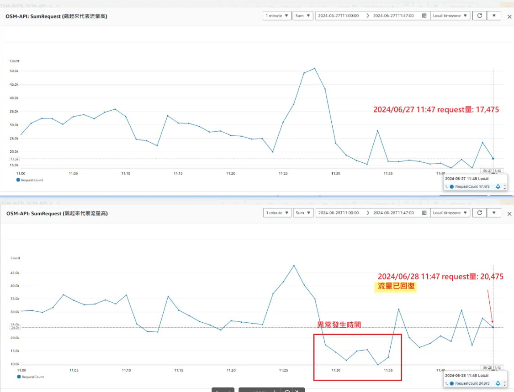

# ☁️ CloudWatch 監控文件

> 📚 這是 CloudWatch 監控系統的完整使用指南，包含站台狀態查詢和監控面板導航等重要資訊

<br>

## 📖 目錄

- [☁️ CloudWatch 監控文件](#️-cloudwatch-監控文件)
  - [📖 目錄](#-目錄)
  - [📊 站台狀態查詢](#-站台狀態查詢)
  - [🔗 Dashboard 路徑導航](#-dashboard-路徑導航)
  - [](#)

<br>

---

## 📊 站台狀態查詢

**監控面板存取**：

<br>

透過 CloudWatch Dashboard 可以查詢各站台的即時狀態和效能指標

<br>

**查詢步驟**：

<br>

1. 登入 AWS CloudWatch 控制台
2. 導航至 Dashboards 區域
3. 選擇對應的站台監控面板
4. 查看即時監控數據和告警狀態

<br>

**監控指標**：

<br>

- CPU 使用率
- 記憶體使用情況
- 網路流量
- 應用程式回應時間
- 錯誤率統計

<br>

---

## 🔗 Dashboard 路徑導航

**HK OSM 站台監控**：

<br>

查找 HK OSM 站台狀態的路徑範例：

<br>

```
CloudWatch/Dashboards/HK-OSM
```

<br>

---