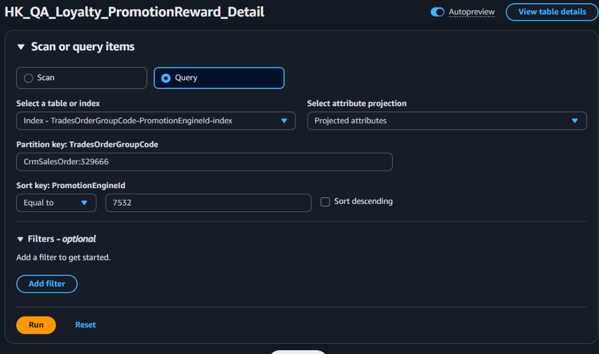

# DynamoDB 操作指南

## 目錄
1. [DDB 查詢](#1-ddb-查詢)
2. [資料表快速導航](#2-資料表快速導航)
3. [給點主單](#3-給點主單)
4. [給點子單](#4-給點子單)
5. [BookingTime 設定時機](#5-bookingtime-設定時機)
6. [UpdateReason 彙總關鍵字](#6-updatereason-彙總關鍵字)

---

## 1. DDB 查詢

### 一次查詢所有子單的方法

利用 Index 進行查詢操作

  

---

## 2. 資料表快速導航

### 2.1 主單資料

**Table Name:** `HK_QA_Loyalty_PromotionReward`

**Key 格式:**
- 線上訂單：`25037_TG240710Q00025`
- 線下訂單：`31207_CrmSalesOrder:405587`

 

### 2.2 子單資料

**Table Name:** `HK_Prod_Loyalty_PromotionReward_Detail`

**Key 格式:**
- 線上訂單：`25721_TG250228N00007_TS250228N000025_1`
- 線下訂單：`31207_CrmSalesOrder:405587_test0003_0`

 

### 2.3 給券道具資料

**Table Name:** `HK_QA_Coupon_PromotionReward_Info`

**Key 格式:** `2_7292_2504`

  

---

## 3. 給點主單

### 3.1 時間相關欄位

| 欄位名稱 | 說明 |
|---------|------|
| `BookingTimeUTC` | 指定日期：日期 0:00 + N 天：orderTime + rewardDays 0:00 |
| `ExpireDateTimeUTC` | 點數效期 |
優惠券到期日不是這邊計算，以優惠券設定為主
| `OrderTimeUTC` | 線上：OrderCreated Event 觸發時間 線下：CrmSalesOrderTradesOrderFinishDateTime |
| `RewardTimeUTC` | 指定日期 |
| `RewardDays` | N 天 |
| `UpdateTimeUTC` | 表更新時間 |
| `ValidDateTimeUTC` | 預計點數生效時間但可能會被更新 |
優惠券生效日期是看優惠券設定為主

 

### 3.2 給點狀態相關欄位

- `GivingPoints`
- `RecyclePoints`
- `RewardStatus`
根據計算結果 

isMatch = false : Unmatch
isMatch = true : WaitingToReward

- `RewardType`
- `TotalLoyaltyPoint`
- `UpdateReason`
- `RewardHistory`
包含
    RewardStatus
    RewardTime
    TotalLoyaltyPoint
    GivingPoints
    RecyclePoints
    UpdateUser
    UpdateReason
    UpdateTime

 

### 3.3 會員相關欄位

- `MemberId`
- `VipMemberId`
- `ShopMemberCardEndDate`

 

### 3.4 訂單相關欄位

- `RewardSalesOrderSlaveStatus` : 
1.為規則制定
2.`Finish` 訂單完成給點 `WaitingToShipping` 訂單成立給點
3.線下訂單都是訂單完成
4.線上訂單若抓到規則為 WaitingToShipping 表示立即給點,不會 + N 天

- `TradesOrderGroupCode`

  

---

## 4. 給點子單

### 4.1 給點狀態相關欄位

- `InsufficientPoints`
- `IsRecycle`
- `IsReward`
- `LoyaltyPoint`
- `Status`
根據攤提計算結果
LoyaltyPoint = 0 且 IsRewardPoint = false : NoReward
否則 : WaitToReward

- `UpdateReason`

 

### 4.2 會員相關欄位

- `MemberId`
- `VipMemberId`

 

### 4.3 訂單相關欄位

| 欄位名稱 | 說明 |
|---------|------|
| `SalesOrderSlaveStatusDef` | 訂單狀態定義 |
| `SalesOrderSlaveStatusUpdateTimeUTC` | 線下訂單：order.CrmSalesOrderTradesOrderCreateDateTime 線上訂單：salesOrderSlave.SalesOrderSlaveStatusUpdatedDateTime |
| `TradesOrderGroupCode` | 交易訂單群組代碼 |
| `TradesOrderSlaveCode` | 交易訂單子單代碼 |

 

### 4.4 表相關欄位

- `UpdateUser`
- `ShopId`
- `Seq`
- `PromotionEngineld`

  

---

## 5. BookingTime 設定時機

### 1. 第一次建表

#### 1.1 線上訂單

分為以下三種情況：

**1.1.1 立即**
- 規則為 `WaitingToShipping`

 

**1.1.2 指定日期**
- 按照指定的特定日期設定

 

**1.1.3 + N 天**
- 訂單時間加上 N 天

 

#### 1.2 線下訂單

分為以下兩種情況：

**1.2.1 指定日期**
- 按照指定的特定日期設定

 

**1.2.2 + N 天**
- 訂單時間加上 N 天

 

### 2. 線上訂單看 Finish 才給點 則會看子單狀態判斷

**2.1 若未完全出貨**
- 以下時間加 N 天為下次執行時間

 

**2.2 若已完全出貨**
- 以出貨時間加 N 天為最終給點時間

 

### 3. 線上訂單看逆流程進行中

則 + 1 天

  

---

## 6. UpdateReason 彙總關鍵字

### 主表

- 因訂單已全部取消，更新狀態為
- 因活動給予
- 給券異常，本次已給予
- 訂單逆流程進行中，順延一天
- 設定BookingDataTime:
- 活動優惠券回饋:
- 重新計算後優惠券數量為

 

### 子表

- 整張訂單取消，更新狀態為
- 完成優惠券回饋，更新狀態為
- 給券異常，更新狀態為

  