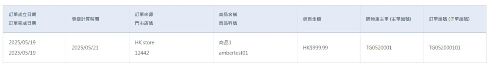

# 訂單觸發行為指南

## 目錄
1. [回饋行為觸發 Event](#1-回饋行為觸發-event)
2. [等級計算](#2-等級計算)
3. [訂單匯入確認](#3-訂單匯入確認)
4. [POSAPI 建立訂單](#4-posapi-建立訂單)

---

## 1. 回饋行為觸發 Event

### 觸發事件說明

**線上訂單：** `OrderCreated`

<br>

**線下訂單：** `Internal_MemberTierCalculateFinished`

監控連結：https://nmqv3-dashboard.qa1.hk.91dev.tw/event-monitor#eventName=Internal_MemberTierCalculateFinished

<br><br>

---

## 2. 等級計算

### 計算機制

每天 400 計算等級，以當下匯入等級為基準計算回饋

<br>

### Job 資訊

**Job Name：** `CalculateTierByMember`

**Task Data：**
```json
{
  "PoolId": 272582,
  "CrmMemberId": 33574,
  "TierDailyVerifyId": 4394,
  "ShopId": 2,
  "ShopType": "Normal",
  "CalculateDate": "2025-05-20T00:00:00",
  "TotalShopCount": 2,
  "TotalPoolCount": 8
}
```

**Service：** `hk-qa-membership`

**Event：** `Internal_MemberTierCalculateFinished`

<br>

### 設定值確認

商店需要建立設定值才會計算：

```sql
SELECT *
FROM CrmShopMemberTierRuleSetting(NOLOCK)
WHERE CrmShopMemberTierRuleSetting_ValidFlag = 1
```

<br><br>

---

## 3. 訂單匯入確認

### 3.1 SFTP 是否有吃檔

檢查 SFTP 檔案處理狀態

<br><br>

---

## 4. POSAPI 建立訂單

### Job 資訊

**JOB Name：** `CreateOfflineOrder`

**Queue：** `offlineorder.group1`

**執行檔：** `Nine1.Offline.Order.Service.Console.NMQv3Worker.dll`

<br>

### 訂單圖



<br><br>