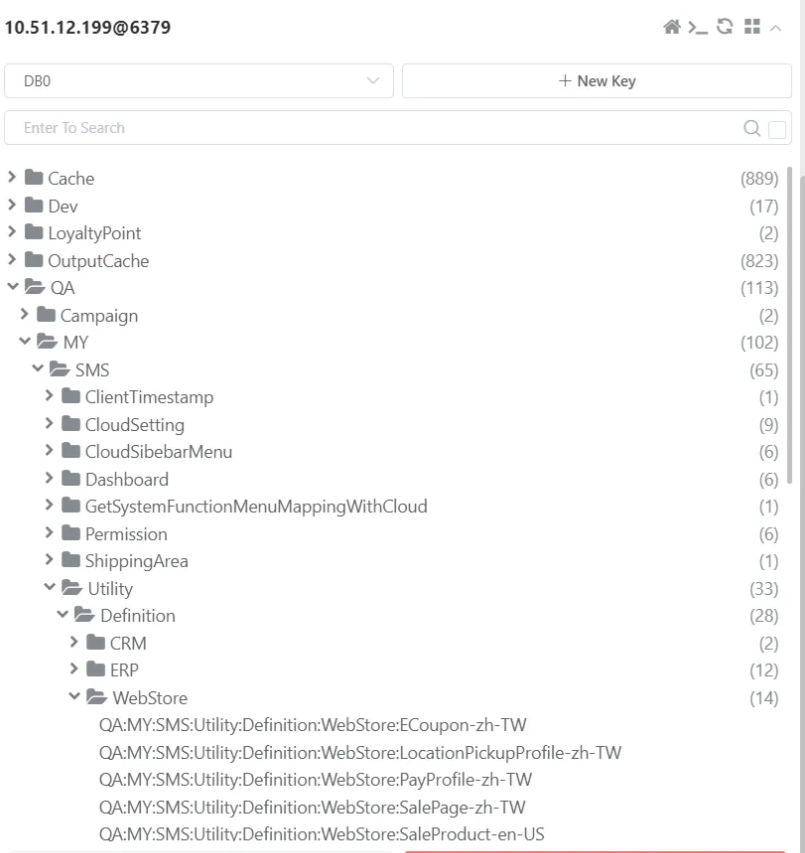

# 🌐 多語系

<br>

## 📖 目錄
  - [⚙️ 系統多語系背後機制](#️-系統多語系背後機制)
    - [S3 資料確認方式](#s3-資料確認方式)
    - [Fetch 機制驗證](#fetch-機制驗證)
    - [前後台 Fetch API](#前後台-fetch-api)
  - [🚨 系統多語系異常紀錄](#-系統多語系異常紀錄)
    - [案例 1：Redis 資料無差別清除](#案例-1redis-資料無差別清除)
    - [案例 2：程式碼語系鍵值設定未上線](#案例-2程式碼語系鍵值設定未上線)
    - [案例 3：商品頁付款方式語系無法更新](#案例-3商品頁付款方式語系無法更新)
    - [案例 4：頁面出現大量 Key 值問題](#案例-4頁面出現大量-key-值問題)
    - [案例 5：會員禮發送通知信文案問題](#案例-5會員禮發送通知信文案問題)
  - [🔍 語系的特殊作法探討](#-語系的特殊作法探討)
    - [案例 1：商店隱私條款多語系 DB 設計](#案例-1商店隱私條款多語系-db-設計)
    - [案例 2：商店火星文語系支援確認](#案例-2商店火星文語系支援確認)
    - [案例 3：商店預設語系設定管理](#案例-3商店預設語系設定管理)
  - [🛠️ 專案開發時多語系機制使用流程](#️-專案開發時多語系機制使用流程)
    - [3 中心站台多語系更新方式](#3-中心站台多語系更新方式)
    - [頁面語系測試方式](#頁面語系測試方式)

<br>

---

## ⚙️ 系統多語系背後機制

**核心服務**：Translations API Service

<br>

**管理介面**：

<br>

```
https://translation.qa.91dev.tw/web/NineYi.WebStore.MallAndApi/search?=%E3%80%81
```

<br>

**資料流機制**：

<br>

1. Publish API 會將資料推送到 S3 儲存
2. 專案系統都是從 S3 拉取語系資料
3. 中間透過 Redis 快取機制提升效能

<br>

**快取層級機制**：

<br>

```
In Memory Cache ⇒ Redis Cache ⇒ 直接回傳 Key 值
```

<br>

**環境同步機制**：

<br>

透過 Jenkins 工具可將 QA 環境的多語系內容直接同步到其他環境

<br>

**專案整合方式**：

<br>

- **SDK 名稱**：Translations Client
- **前端 API**：提供 Fetch API 讓瀏覽器拉取最新語系資料
- **程式碼產生**：執行 Auto Code Generation 從 S3 抓取資料轉換成 .cs 檔案

<br>

### S3 資料確認方式

可透過以下 URL 直接確認 S3 上的語系資料：

<br>

```
https://s3-ap-northeast-1.amazonaws.com/91dev-ap-northeast-1-translation-service/NineYi.Sms/backend.definition.BatchUpload/zh-TW.json
```

<br>

### Fetch 機制驗證

確認系統是否真的有執行 Fetch 操作，需檢查以下檔案的 ETag 更新狀況：

<br>

```
C:\Files\i18n\NineYi.WebStore.MallAndApi/i18n.manifest
```

<br>

只有當此檔案的 ETag 有更新時，系統才會重新進行 Fetch 操作

<br>

### 前後台 Fetch API

**MWeb**：

<br>

```
https://shop2.shop.qa1.hk.91dev.tw/webapi/translations/fetch
```

<br>

**SMS**：

<br>

```
https://sms.dev.91dev.tw/api/translations/fetch
```

<br>

---

## 🚨 系統多語系異常紀錄

### 案例 1：Redis 資料無差別清除

**異常描述**：Redis 快取資料被無差別清除

<br>

**潛在影響**：可能引發線上語系顯示問題

<br>

**實際狀況**：理論上不應該有問題，系統會自動回退到其他快取層級

<br>

### 案例 2：程式碼語系鍵值設定未上線

**異常描述**：程式碼中的語系鍵值已上線，但對應的語系設定尚未發布

<br>

**影響結果**：系統會顯示語系鍵值的預設值而非翻譯內容

<br>

**解決方式**：確保語系設定與程式碼同步發布上線

<br>

### 案例 3：商品頁付款方式語系無法更新

**異常描述**：新增商品頁遇到付款方式的語系一直無法更新成想要的語系

<br>

**相關 API**：

<br>

```
https://sms.qa1.my.91dev.tw/Api/SalePage/GetShopPayShippingType
```

<br>

**程式碼分析**：

<br>

Property 上會掛一個 Attribute：

<br>

```csharp
[RequireDefinition(Table = "ShopPayType", Column = "ShopPayType_TypeDef")]
```

<br>

**套件執行邏輯**：

<br>

執行套件：https://bitbucket.org/nineyi/nineyi.common.utility/src/master/

<br>

```csharp
this._definitionService.FillDefinitions(Common.Utility.DefinitionsEf6.Models.DatabaseEnum.WebStore, payTypeList);
```

<br>

**快取機制問題**：

<br>

Definition 會有另外的 Cache，且設定時間較長

<br>

**解決方法**：

<br>

1. 清除 Definition Cache
2. 重新執行 Fetch 操作
3. 重新整理該頁面

<br>

**多語系模組對應**：

<br>

- **Module**：backend.definition.ShopPayType
- **Key 值範例**：ShopPayType_TypeDef_TNG_AsiaPay

<br>

**Definition 資料庫對應**：

<br>

- **資料庫**：WebstoreDB
- **資料表**：ShopPayType
- **欄位**：ShopPayType_TypeDef
- **Code**：TNG_AsiaPay
- **Desc**：AsiaPay Touch 'n Go

<br>

### 案例 4：頁面出現大量 Key 值問題

**異常描述**：頁面顯示大量多語系 Key 值而非翻譯內容

<br>

**問題原因**：HK QA 環境的多語系 Cache 被刪除

<br>

**解決方法**：

<br>

1. **重新呼叫 Fetch API**

<br>

2. **強制重新整理頁面**：

<br>

```
Ctrl + F5
```

<br>

3. **清除 i18n.manifest 檔案**：

<br>

刪除 i18n.manifest 檔案後重新執行 Fetch

<br>

**驗證 API**：

<br>

```
https://shop2.shop.qa1.hk.91dev.tw/webapi/translations/getClientLocale/ShoppingCart/zh-HK?ts=638707327910655368&lang=zh-HK&shopId=2
```

<br>

**處理完成後**：頁面即可正常顯示翻譯內容

<br>

### 案例 5：會員禮發送通知信文案問題

**工單連結**：

<br>

https://91appinc.visualstudio.com/DailyResource/_workitems/edit/354411

<br>

**問題描述**：會員禮發送通知信文案異常

<br>

**程式碼追蹤**：

<br>

**主要服務**：`ShopMemberPresentNotificationMailService.DoMailDataProcess`

<br>

```csharp
//// Mail Subject
this.EmailEntity.Subject = this.GetEmailSubject(shopItem, shopMemberPresentNotification);
```

<br>

**生日禮處理邏輯**：

<br>

```csharp
case "Birthday":
  var birthdayMonth = this.GetBirthdayMonth(shopMemberPresentNotification.Month.ToString());
  wording = string.Format(NineYi.NMQV2.Translation.Backend.Template.ShopMemberPresentNotification.HelloHappyBirthday, birthdayMonth, shopItem.ShopName);
  break;
```

<br>

**多語系處理**：

<br>

```csharp
/// <summary>
/// 生日禮
/// </summary>
public static string EnumBirthday { get { return GetString("enum_birthday"); } }
```

<br>

**服務繼承關係**：

<br>

`SendTemplateMailShopMemberPresent` → `SendTemplateMailProcess`

<br>

**處理流程**：

<br>

1. `SendTemplateMailProcess.DoJob{DoMailDataProcess}`
2. 由 `SendVipMemberPresentAlertByFixedTimeOfferService` 實作 `DoMailDataProcess`
3. 透過 `LifetimeScope.ResolveNamed<ITemplateMailService>` 解析對應實作
4. 執行 `GetSubject` → `GetBirthdayMonth`

<br>

**根本原因**：

<br>

語系內容設定錯誤：December 被設定成中文「2月」

<br>

**問題 Key 值**：

<br>

- **Module**：NineYi.NMQV2
- **Category**：scm.service.email.supplier_notice
- **Key**：december

<br>

**解決方式**：

<br>

修正多語系設定，將 December 對應的中文翻譯設定為正確的「12月」

<br>

---

## 🔍 語系的特殊作法探討

### 案例 1：商店隱私條款多語系 DB 設計

**實作方式**：在資料庫的 ShopDefault 資料表中處理多語系

<br>

**討論要點**：

<br>

**為何不使用內容多語系機制**：

<br>

- 涉及法律問題考量
- 可設定不對外開放
- 節省開發時間成本
- 直接更新資料庫資料表較為簡便

<br>

**法務審核流程**：

<br>

需要內部法務審核，因為涉及個人資料蒐集相關規範

<br>

**技術考量問題**：

<br>

1. **空值處理**：Value 為空白時的系統行為
2. **預設語系變更**：商店變更預設語系時的影響
3. **語系缺失處理**：切換到不存在的語系時的回退機制
4. **特殊命名規則**：如預設語系改為 Privacy_zh-CN 時，系統會使用預設模板還是特定語系版本
5. **工具限制**：無法使用 ERP 小工具進行管理

<br>

### 案例 2：商店火星文語系支援確認

**使用場景**：確認商店是否支援火星文（kok-IN）等特殊語系

<br>

**查詢商店合約語系**：

<br>

```sql
use WebStoreDB
select ShopDefault_Value,*
from ShopDefault(nolock)
where ShopDefault_ValidFlag = 1
and ShopDefault_Key = 'Contract'
and ShopDefault_GroupTypeDef = 'Language'
```

<br>

**查詢商店設定語系**：

<br>

```sql
use WebStoreDB
select ShopDefault_Value,*
from ShopDefault(nolock)
where ShopDefault_ValidFlag = 1
and ShopDefault_Key = 'Setting'
and ShopDefault_GroupTypeDef = 'Language'
and ShopDefault_ShopId = 15
and ShopDefault_Value like '%kok%'
```

<br>

**火星文支援判斷**：

<br>

如果 ShopDefault_Value 包含以下內容，表示支援火星文：

<br>

```
zh-TW,en-US,zh-HK,kok-IN,xh-ZA,zu-ZA
```

<br>

**測試範例**：

<br>

目前可參考 MY 15 號店進行測試：

<br>

```
https://shop15.shop.qa1.my.91dev.tw/?lang=kok-IN
```

<br>

**相關說明文件**：

<br>

https://wiki.91app.com/pages/viewpage.action?pageId=77586580

<br>

### 案例 3：商店預設語系設定管理

**管理介面**：

<br>

商店預設相關語系設定可透過以下 ERP 介面確認：

<br>

```
https://erp.qa1.hk.91dev.tw/V2/ShopDefault/List
```

<br>

**查找方式**：

<br>

**ERP 路徑**：ERP 商店自訂開關設定

<br>

**關鍵字搜尋**：language

<br>

**語系設定類型**：

<br>

**Language-Setting-設定語系**：

<br>

前台消費者於通知相關設定可以選擇的語系

<br>

**Language-Contract-合約語系**：

<br>

商店可於後台語言顯示設定是否要顯示在前台官網的語系

<br>

**設定一致性問題**：

<br>

**問題描述**：HKQA-2 原本這兩個設定不一致，導致前後台對不上

<br>

**解決方案**：統一設定為港中、繁中、英文、馬來文

<br>

---

## 🛠️ 專案開發時多語系機制使用流程

**步驟 1：新增模組**

<br>

在 Language Tool 中加入新的 Module

<br>

**步驟 2：發布設定**

<br>

執行 Publish 操作，將語系資料推送到 S3

<br>

**步驟 3：本機程式碼產生**

<br>

回到本機專案執行 `generate.tt` 和 `run custom tool`

<br>

**步驟 4：檔案整合**

<br>

產生的新 .cs 檔案需要手動設定為 Included

<br>

**步驟 5：建構專案**

<br>

執行 Build Solution 確保編譯成功

<br>

**步驟 6：瀏覽器驗證**

<br>

透過 Fetch API 驗證多語系資料可正常取得

<br>

### 3 中心站台多語系更新方式

當 3 中心站台需要抽取多語系或更新多語系內容時的處理方式

<br>

**Solution 專案配置**：

<br>

```
Common >> Common.Translations >> i18n >> Nine1.Cart
```

<br>

專案內會包含相關的多語系 Key 值

<br>

**Pipeline Dockerfile 配置**：

<br>

```dockerfile
WORKDIR /src
COPY ./src .
RUN dotnet new tool-manifest
RUN dotnet tool install Cake.Tool --version 2.3.0
RUN dotnet cake "./translation.cake" --Target="Sync Translation" --buildEnv="${DOTNET_BUILD_CONFIG}" --verbosity=diagnostic
RUN dotnet cake "./translation.cake" --Target="Init Translation" --buildEnv="${DOTNET_BUILD_CONFIG}" --verbosity=diagnostic
```

<br>

**更新方式**：

<br>

重新執行一次 Pipeline 即可完成多語系內容更新

<br>

### 頁面語系測試方式

可直接在 URL 上帶入語系參數進行不同語系的測試

<br>

**測試參數格式**：

<br>

```
&lang=語系代碼
```

<br>

**支援的語系代碼**：

<br>

- `zh-HK`：繁體中文（香港）
- `en-US`：英文（美國）
- 其他語系代碼...

<br>

**測試範例**：

<br>

```
http://shop2.shop.dev.91dev.tw/webapi//PromotionEngine/GetDetail/2/4799?source=Web&lang=zh-HK&shopId=2&r=t
```

<br>
