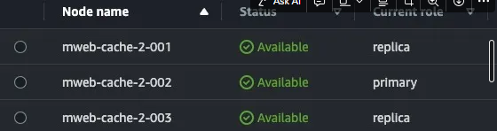

## 活動資訊

**商店**：(41571) Adidas
**活動時間**：2/23 11:00
**活動名稱**：PNS SUPERSTAR x CLOT聯名搶購
**活動連結**：https://www.adidas.com.tw/SalePage/Index/9470643
**商品頁序號**：9470643
**庫存**：50雙
**導流來源**：品牌社群、廣編稿
**銷售通路**：官網獨賣（門市、平台都不會賣，有放貨給部分經銷商）

 
 

## 機器升級

三中心 明早10點提升等級
**G1**：30, c6i.4xlarge
**G2**：10, c6i.4xlarge
**mweb-cache**: @macsung 協助加開 replication Node 加到 2

 
 

## 開啟商品選項清快取

目前商品選項是隱藏的，因為其中幾個sku沒貨，為不讓消費者，品牌希望10:58 開啟商品選項，開啟後會需要團隊清快取

==> 想讓消費者覺得沒貨是因為搶購嗎?

 
 

## 監控

- 三中心
- 前台
- Salepage Collection Service
- Tag Service
- Member Service

 
 

## 確認訂單狀態

查看 OSM 訂單都是已成立
沒有待付款訂單
IMS 在確認訂單是否都有進 IMS

 
 

## IMS 確認

確認訂單都有進 IMS，IMS 啟動可賣量滾算同步，排程預計10分執行