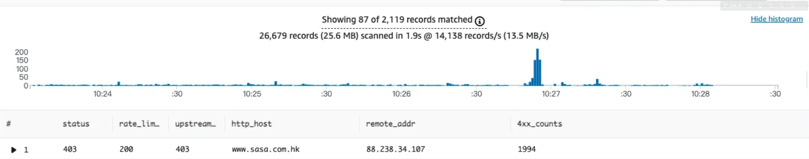

## 前台

@icot [HK Prod] 前台監控到有 IP 試圖攻擊，請協助阻擋
目前監控到蠻多Elmah錯誤

**IP**：88.238.34.107
**Host**：https://www.sasa.com.hk/
HTTP_X_REAL_IP：88.238.34.107q

https://91app.slack.com/archives/G06A3GDC7/p1721874185486219

**監控**



## Shopping

**針對 Nine1HttpLog 4xx 的解析特定欄位**

{service=~"prod-shopping-service"}
|=`Nine1HttpLog`
|=`\"ProtocolStatus\":\"4`
|json
| line_format "{{._msg}}"
| json
| line_format "{{.Host}} {{.Referer}}"


```json
{
  "LogType": "Nine1HttpLog",
  "Date": "2025-12-11",
  "Time": "00:11:34",
  "ServerName": "shopping-web-api-primary-7b857dd665-9z56h",
  "ClientIpAddress": "::ffff:10.32.231.215",
  "ServerIpAddress": "::ffff:10.32.232.215",
  "ServerPort": "5566",
  "ProtocolVersion": "HTTP/1.1",
  "Method": "GET",
  "UriStem": "/api/carts/salepage-add-ons",
  "UriQuery": "?cartUniqueKey=313999c8-5375-464d-bed6-05870ef8b4ba&skuId=3893820&salepageId=530487&optionalTypeDef=&optionalTypeId=0&cartExtendInfoItemGroup=0&lang=zh-HK&shopId=17",
  "Host": "shopping-api.hk.91app.io",
  "UserAgent": "Amazon CloudFront",
  "UserName": "",
  "ProtocolStatus": "400",
  "TimeTaken": "8.6243"
}
```

**看到 Referer** : \":\"https://www.google.com/search?hl=en\\u0026q=testing\
**看攻擊 ip** : https://www.abuseipdb.com/
**訊息**

HK Prod Shopping 服務受到攻擊
185.225.234.107 (HK)
經由 hk.melvita.com 發動，可以阻擋嗎?
