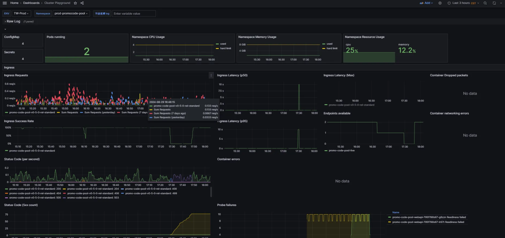

## Grafana 看該服務狀態

prod-promocode-pool

 

## Grafana - 細節

https://monitoring-dashboard.91app.io/explore?schemaVersion=1&panes=%7B%22clc%22:%7B%22data[…]om%22:%22now-1h%22,%22to%22:%22now%22%7D%7D%7D&orgId=2

`Amazon.Runtime.AmazonClientException: Error calling AssumeRole for role arn:aws:iam::941374844028:role/Prod-TW-NKP-eks-promocode-pool`

 

## Elmah

三個市場都有 許多 500 error

HK：http://elmahdashboard.91app.hk/Log/Details/21c12d5a-f3f7-46e7-ae7d-57458a967d58

TW：http://elmahdashboard.qa.91dev.tw/Log/0/Details/a635ad2f-c1f6-48e9-a7ca-38d62fc8e60e

 

## 錯誤時間

- TW /Api/ECoupon/InsertECoupon 17:47:15.640 最後一筆相同錯誤
- HK /Api/ECoupon/InsertECoupon 17:43 最後一筆相同錯誤