## DB CPU High

**確認時間區間**
**確認 QUERY**
**確認 Elmah**

<br>

## 頁面時間比平常時間久

**後台狀況是否穩定?**
**測試不同商店**
**APP / Web 是否都正常**
**詢問操作情境**
**CloudWatch / Dashboards / HK-OSM**

<br>

## Pod Memory High

[Dashboard](https://monitoring-dashboard.91app.io/d/kJHAWhwVk/promotion-service-monitor?orgId=2&refresh=10s&from=now-24h&to=now&viewPanel=182)

TW-Prod-Prometheus / prod-promotion-service / TW-Prod-CloudWatch / backend-redis-2-001

**觀察 backend-redis-001 Pod memory 約 55%**

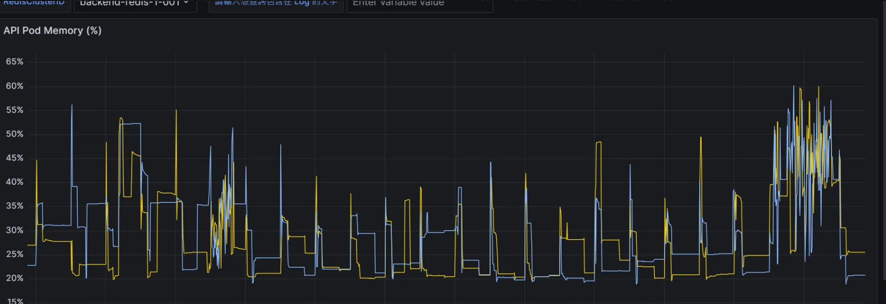

**哪個 group api**

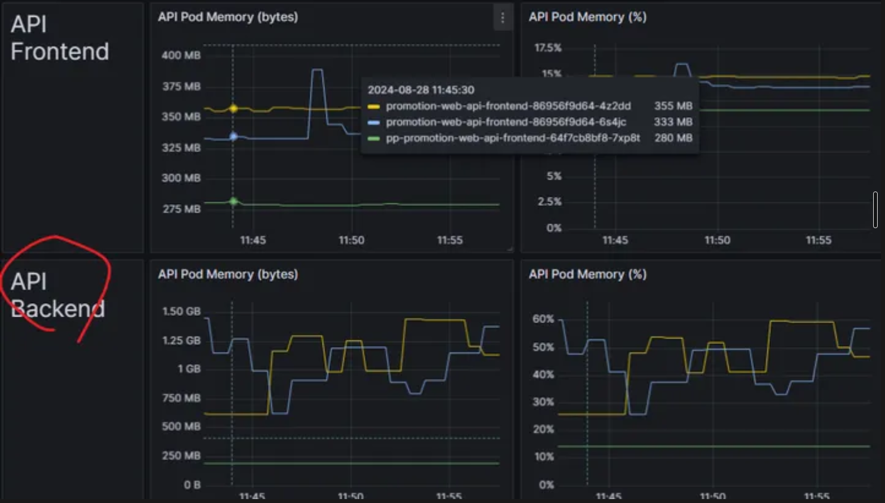

**確認時間區間 哪隻 api**

大宗都是 "/api/promotion-rules/get"

```
sum by(_props_RequestPath) ( count_over_time(
{service="prod-promotion-service",container="promotion-web-api"}
| json
|  line_format "{{._props_RequestPath}}" [1m])
)
```

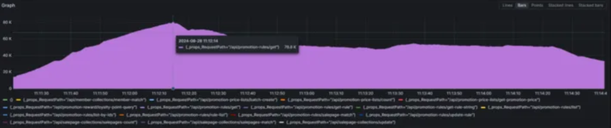

<br>

---

## SG-MY-OSMWEB3 Low-Availability-Memory

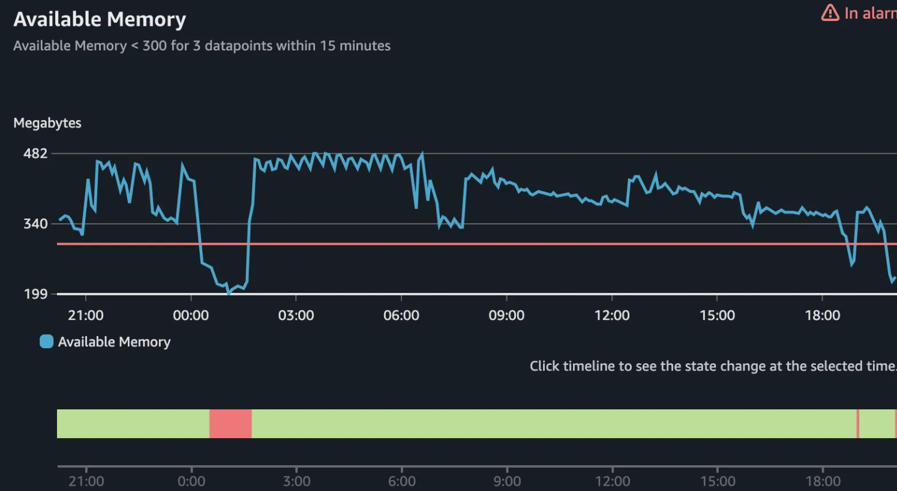

**目前是 SMS IIS 吃最多資源**

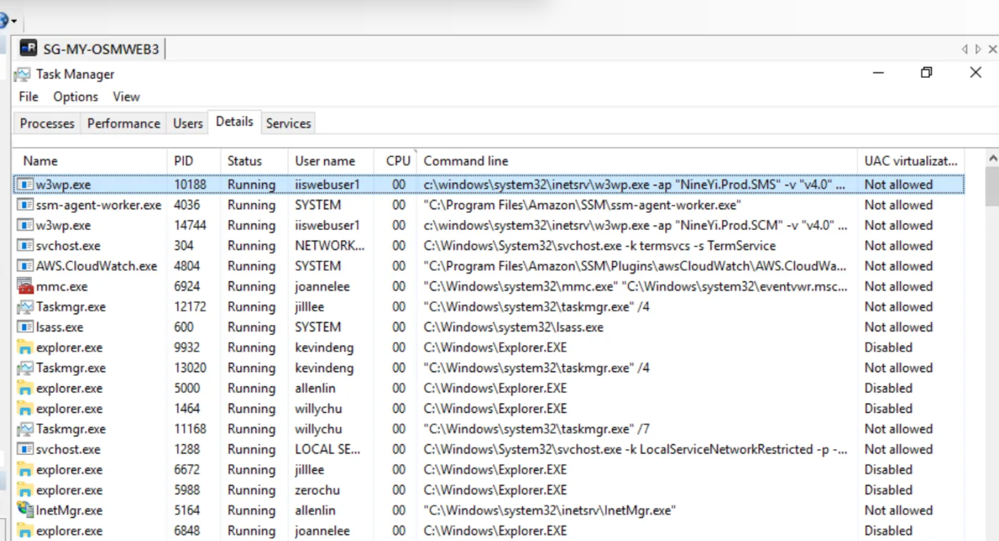

**OSM Web CPU CloudWatch**

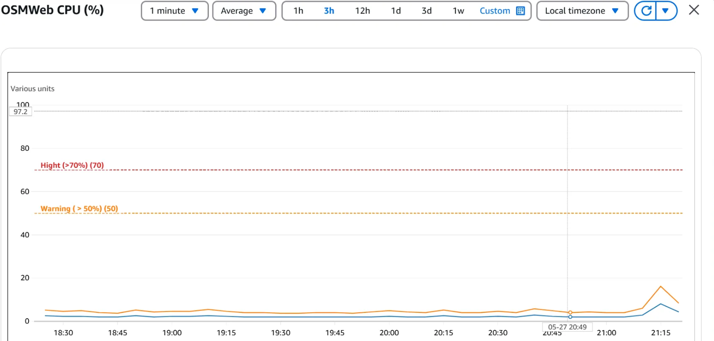

**處理**

OSM Web ASG 調整由1->2
OSM Web3 下服務重啟後再上線

---

## 機器記憶體非常低

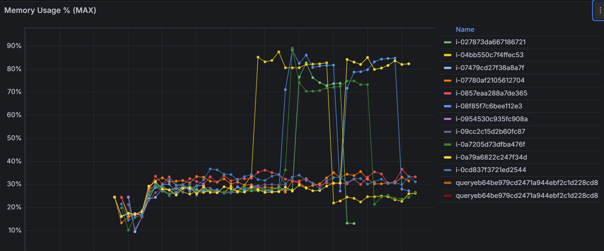
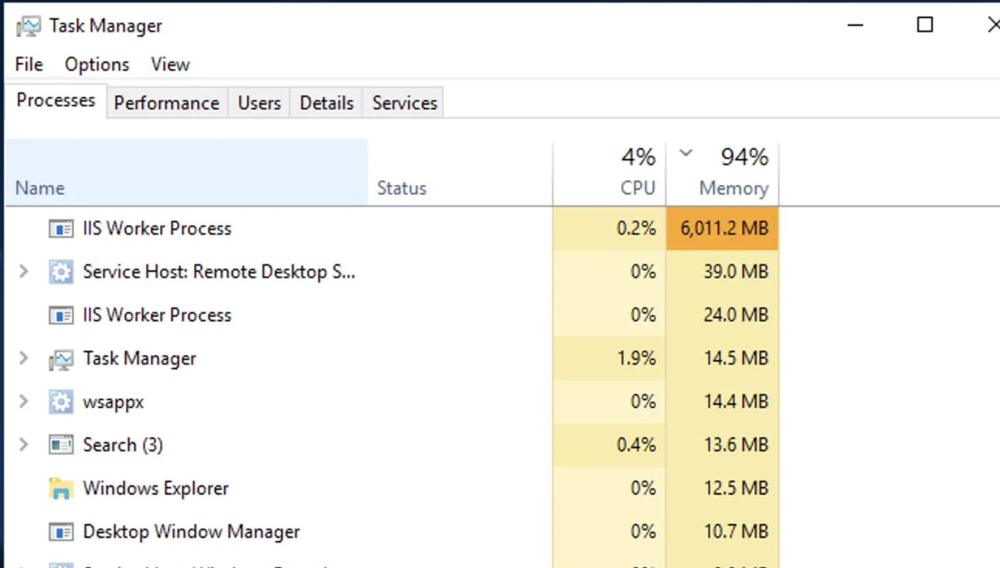

**檔案路徑**

`\\10.50.12.51\qa`

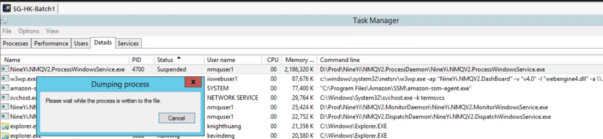
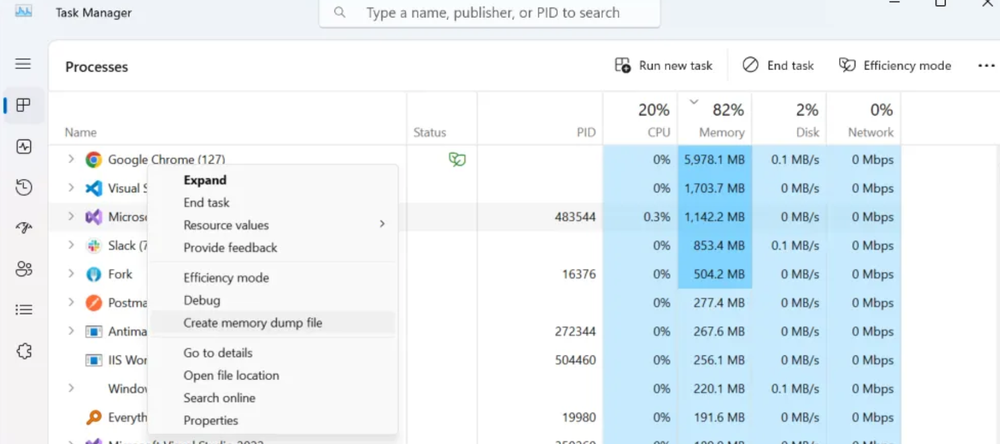

**後續分析**

OSMWeb3 重啟服務後再上 alb，並把 ASG 還原由 2->1
IIS 重啓後正常

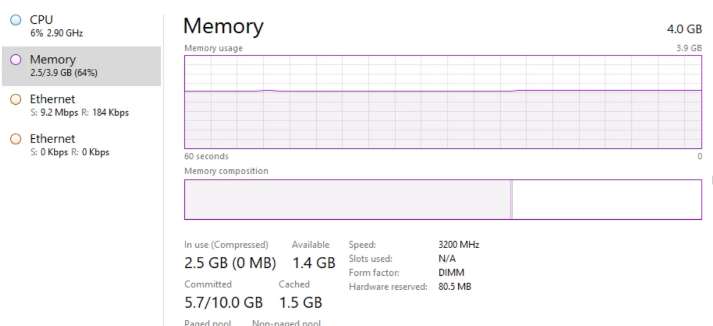