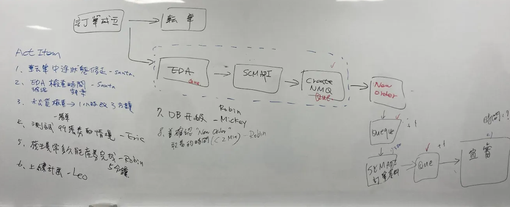
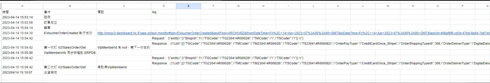
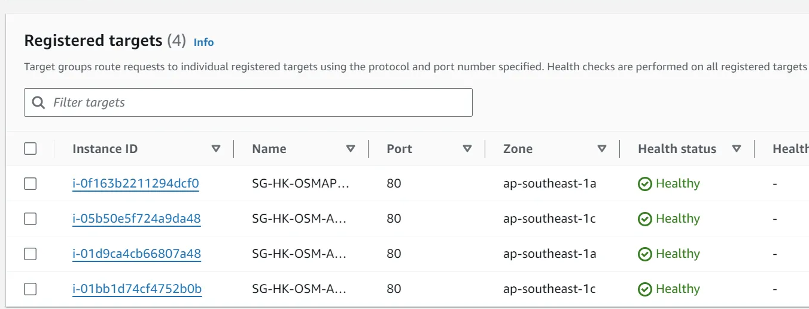
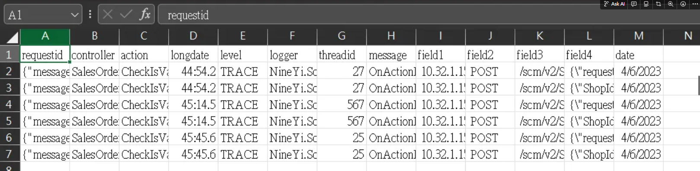
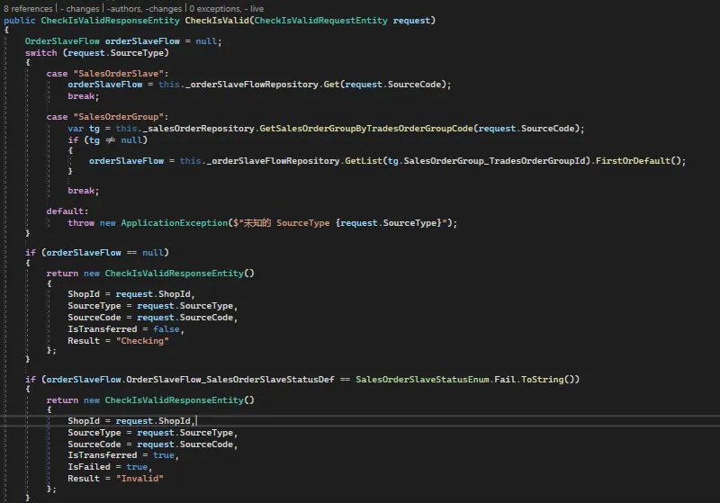
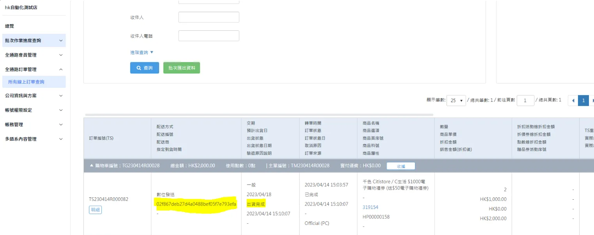

## 票券商品資訊

**活動連結**：https://www.cuapp.com/page/CNY_eRedPacket_ProductCoupon
**商店**：28 CUAPP
**商品A**
    - $1000電子購物禮券 ($500X2張) 送$88電子購物禮券
    - Page ID：370490
    - 開賣時間：2024/01/25 10:00:00 起 2024/02/09 23:59:00 止
    - 庫存：4,800
**商品B**
    - $1000電子購物禮券 ($100X10張) 送$88電子購物禮券
    - Page ID：370480
    - 開賣時間：2024/01/25 10:00:00 起 2024/02/09 23:59:00 止
    - 庫存：7,200
**商品C**：$500電子購物禮券 ($100X5張) 送$38電子購物禮券
    - Page ID：370478
    - 開賣時間：2024/01/25 10:00:00 起 2024/02/09 23:59:00 止
    - 庫存：4,500

<br>

## 活動預估

16 天的活動期間共預留 1 萬 6 千套票券, 最高營業額可達 $17,000,000 港幣，且只供 CUAPP 線上購買，連結 / 宣傳：15 間門市店內宣傳 / Facebook / 會員app push / CU APP front page update

<br>

## 票券發送機制

EDA：OrderCreated —> EVoucherOrderCreated

<br>




<br>

---

## 機器配置

調整 SCM API 機器配置
固*1+ASG*1 -> 固*1+ASG*3


<br>

## 定式回報

監控開賣當下流量無明顯增加。
CPU 大約10-20%
第一筆交易 於 2024-01-25 10:02:26 進來
且已完成取票
目前監控只有賣出 1 張券
$500 電子購物禮券 ($100X5張) 送$38電子購物禮券

<br>

## 回報格式

[HK] CUAPP電子票券監控回報
MWeb CPU 平均: x %
SCMAPI CPU 平均: x %
Elmah: 無特殊錯誤

<br>

## Athena 查詢

#### 查詢 /SalesOrder/Get 狀態

可查詢 VipMemberInfo 問題
```sql
SELECT * FROM "hk_prod_osm"."osm_api_nlog" 
WHERE controller = 'SalesOrder'
and date = '2023/04/14'
and action = 'Get'
and field4 like '%TG230414R00028%'
--and requestid = '{"message":"202209262311209082'
```

<br>

## 錯誤處理

### 6.1 超過一小時訂單未出貨完成異常

1. 通報請 owner 協助確認 超過一小時訂單未出貨完成異常電子票券：TS230406P000113
2. Grafana 確認付款 paymentmiddleware 過程
3. 確認Order API : https://api.91app.hk/scm/v2/SalesOrder/CheckIsValid 

這支 API 來確認，沒有紀錄你們 api 的 response，但從結果可以推論當時你們的 api 應該是回覆 Result: "Invaild"
判斷 Result 是 Invalid 就會發送 OrderFailed 的事件，之後就會中斷流程處理

Athena 可查


程式碼


<br>

## 轉單中斷處理 (看 EVoucherOrderCreated)

NMQV3 就不會建 EVoucherOrderCreated 繼續後面的流程，因此要走上面第二步手動執行

- 若大表狀態 OrderSlaveFlow_StatusForUserDef,OrderSlaveFlow_StatusForSCMDef 皆為  WaitingToShipping, 須執行 EVoucherOrderCreatedProcess 的程式邏輯

- 若 OrderSlaveFlow_StatusForUserDef,OrderSlaveFlow_StatusForSCMDef 皆為 ConfirmedToShipping ，代表已經打了 Request API 給 Robin Che,可使用 TGCode 去反查 NMQV3 EVoucherOrderCreated Task Log，並附上執行時間及 log

## OSM 介面查詢訂單(確認票券已出貨)

